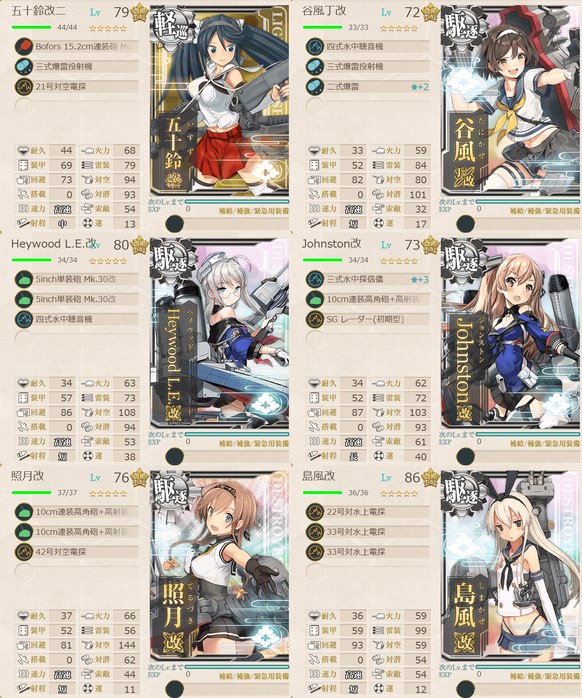

# 2026夏イベE1ゲージ1-戦力

## 目次
<details>
<summary>クリックで展開</summary>

- [2026夏イベE1ゲージ1-戦力](#2026夏イベe1ゲージ1-戦力)
  - [目次](#目次)
  - [E1の順番（短縮リンク）](#e1の順番短縮リンク)
  - [難易度](#難易度)
  - [基地航空隊編成](#基地航空隊編成)
  - [艦隊編成](#艦隊編成)
    - [I](#i)
      - [所感](#所感)
  - [参考文献(Reference)](#参考文献reference)
</details>

---

## E1の順番（短縮リンク）
1. [ギミック1](./[1]ギミック1.md)  
2. [ゲージ1-戦力](./[2]ゲージ1-戦力.md)  ←今ここ
3. [ギミック2](./[3]ギミック2.md)
4. [ゲージ2-輸送](./[4]ゲージ2-輸送.md)
5. [ゲージ3-戦力](./[5]ゲージ3-戦力.md)

---

## 難易度
乙

---

## 基地航空隊編成
```yaml
E1ゲージ1-戦力基地航空隊:
  - number: 1
    mode: 防空
    squadrons:
      - 試製 秋水 
      - 試製 秋水 
      - 紫電二一型 紫電改
      - 紫電二一型 紫電改
```

---

## 艦隊編成
### I



```yaml
E1ゲージ1-戦力I:
  - name: 五十鈴改二
    level: 79
    equipments:
      - Bofors 15.2cm連装砲 Model 1930
      - 三式爆雷投射機
      - 21号対空電探

  - name: 谷風丁改
    level: 72
    equipments: 
      - 四式水中聴音機
      - 三式爆雷投射機
      - 二式爆雷☆2

  - name: Heywood L.E.改
    level: 80
    equipments:
      - 5inch単装砲 Mk.30改
      - 5inch単装砲 Mk.30改
      - 四式水中聴音機

  - name: Johnston改
    level: 73
    equipments:
      - 三式水中探信儀☆2
      - 10cm連装高角砲+高射装置
      - SG レーダー(初期型)

  - name: 照月改二
    level: 76
    equipments:
      - 10cm連装高角砲+高射装置
      - 10cm連装高角砲+高射装置
      - 42号対空電探

  - name: 島風改
    level: 86
    equipments:
      - 22号対水上電探
      - 33号対水上電探
      - 33号対水上電探

```

> 軽巡1駆逐5【第三十一戦隊】
> 
> 【ABEGHI】(A:潜水 E:潜水空襲 G:通常 H:空襲 I:ボス)
> 
> 陣形：単横陣→警戒陣→警戒陣→輪形陣→単縦陣
> 
> ※要高速統一。要索敵。33式分岐点係数4で索敵値約75以上必要

(引用元:四腕『【夏イベ】E1-1 戦力ゲージ1 第三十一戦隊駆逐艦の出撃 【反撃！第三十一戦隊の戦い】』,2026)

#### 所感
陣形は単横陣→**輪形陣**→警戒陣→輪形陣→単縦陣のほうが良さそう。ボスマスにネ級が2体とか出てくるし普通に大破もさせられるけど案外削り切ることは可能。
索敵値が足りなくて島風に電探3積みさせてるが、その他の子が削り切れるし、昼戦でも（これは島風が強いだけの可能性もあるが）駆逐艦を撃沈してくれたり、そもそも夜戦で島風まで行くことがあんまりない。
ボスマス単縦陣で、道中の警戒陣でもそこまで並び順を気にしなくても大丈夫そう。

詳しくはこちらを参照
- [陣形](https://wikiwiki.jp/kancolle/%E9%99%A3%E5%BD%A2)

---

## 参考文献(Reference)
- 四腕[『【夏イベ】E1-1 戦力ゲージ1 第三十一戦隊駆逐艦の出撃 【反撃！第三十一戦隊の戦い】』](https://zekamashi.net/202607-event/dai31sentai-syutugeki-2/), 2026年
- 艦隊これくしょん -艦これ- 攻略 Wiki*[『陣形』](https://wikiwiki.jp/kancolle/%E9%99%A3%E5%BD%A2)

---

- △[一番上に戻る](#2026夏イベe1ゲージ1-戦力)
- [イベントトップ](../../README.md)

|前の記事|次の記事|
|---|---|
|[ギミック1](./[1]ギミック1.md)|[ギミック2](./[3]ギミック2.md)|