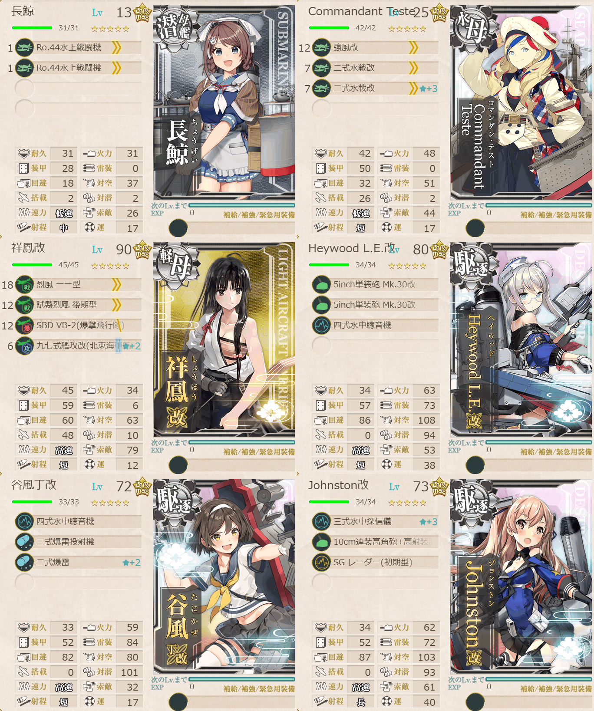

# 2026夏イベE1ギミック2

## 目次
<details>
<summary>クリックで展開</summary>

- [2026夏イベE1ギミック2](#2026夏イベe1ギミック2)
  - [目次](#目次)
  - [E1の順番（短縮リンク）](#e1の順番短縮リンク)
  - [難易度](#難易度)
  - [対象マス](#対象マス)
  - [基地航空隊編成](#基地航空隊編成)
  - [編成](#編成)
    - [L](#l)
      - [所感](#所感)
  - [参考文献(Reference)](#参考文献reference)
</details>

---

## E1の順番（短縮リンク）
1. [ギミック1](./[1]ギミック1.md)  
2. [ゲージ1-戦力](./[2]ゲージ1-戦力.md)  
3. [ギミック2](./[3]ギミック2.md)   ←今ここ
4. [ゲージ2-輸送](./[4]ゲージ2-輸送.md)
5. [ゲージ3-戦力](./[5]ゲージ3-戦力.md)

---

## 難易度
乙

---

## 対象マス

|マス＼難易度|甲|乙|丙|丁|
|---|---|---|---|---|
|Lマス|到達×2回|到達×2回|到達×1回|到達×1回|
|基地防空|航空優勢×2回|航空優勢×1回|航空優勢×1回|-|

(引用元:四腕『【夏イベ】E1 ギミック2 第三十一戦隊駆逐艦の出撃 【反撃！第三十一戦隊の戦い】』,2026)

---

## 基地航空隊編成
```yaml
E1ギミック2基地航空隊:
  - number: 1
    mode: 防空
    squadrons:
      - 試製 秋水 
      - 試製 秋水 
      - 紫電二一型 紫電改
      - 紫電二一型 紫電改
```

---

## 編成
### L


```yaml
E1ギミック2L:
  - name: 長鯨            
    level: 13          
    equipments:      
      - Ro.44水上戦闘機
      - Ro.44水上戦闘機

  - name: Commandant Teste            
    level: 25          
    equipments:      
      - 強風改
      - 二式水戦改
      - 二式水戦改☆3

  - name: 祥鳳改
    level: 90
    equipments:
      - 烈風 一一型
      - 試製烈風 後期型
      - SBD VB-2(爆撃飛行隊)
      - 九七式艦攻改(北東海軍航空隊)

  - name: Heywood L.E.改
    level: 80
    equipments:
      - 5inch単装砲 Mk.30改
      - 5inch単装砲 Mk.30改
      - 四式水中聴音機

  - name: 谷風丁改
    level: 72
    equipments:
      - 四式水中聴音機
      - 三式爆雷投射機
      - 二式爆雷☆2

  - name: Johnston改
    level: 73
    equipments:
      - 三式水中探信儀☆3
      - 10cm連装高角砲+高射装置
      - SG レーダー(初期型)
```

> 軽空1駆逐3水母1潜母1【第三十一戦隊】
>
> 【ABEJKL】(A:潜水 E:潜水空襲 J:通常 K:空襲 L:港マス(2回))
>
> 陣形選択例：単横陣→警戒陣→警戒陣→輪形陣
> 
> ルート固定：正空0, 軽空1以下, (補給+水母+揚陸+潜母)2以上*あきつ丸不可

(引用元:四腕『【夏イベ】E1 ギミック2 第三十一戦隊駆逐艦の出撃 【反撃！第三十一戦隊の戦い】』,2026)

#### 所感
今回もゲージ1-戦力同様潜水空襲マスは輪形陣で突破。
防空自体はさほど難しくない。Lマス手前まで行けたらあとはほぼ勝ち確。

Jマスは普通に水雷戦隊との戦闘だがレベル13の長鯨とレベル25のコマちゃん(Commandant Teste)が混じってても行けたので、そこまで要件は厳しくないかもしれない。

--- 

## 参考文献(Reference)
- 四腕[『【夏イベ】E1 ギミック2 第三十一戦隊駆逐艦の出撃 【反撃！第三十一戦隊の戦い】』](https://zekamashi.net/202607-event/dai31sentai-syutugeki-3/), 2026年

---

- △[一番上に戻る](#2026夏イベe1ギミック2)
- [イベントトップ](../../README.md)

|前の記事|次の記事|
|---|---|
|[ゲージ1-戦力](./[2]ゲージ1-戦力.md)|[ゲージ2-輸送](./[4]ゲージ2-輸送.md)|