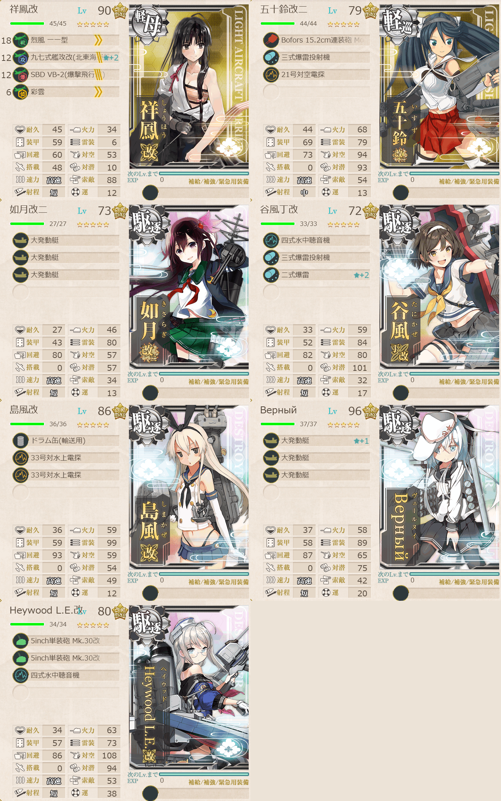

# 2026夏イベE1ゲージ2-輸送

## 目次
<details>
<summary>クリックで展開</summary>

- [2026夏イベE1ゲージ2-輸送](#2026夏イベe1ゲージ2-輸送)
  - [目次](#目次)
  - [E1の順番（短縮リンク）](#e1の順番短縮リンク)
  - [難易度](#難易度)
  - [基地航空隊編成](#基地航空隊編成)
  - [艦隊編成](#艦隊編成)
    - [T](#t)
      - [所感](#所感)
  - [参考文献(Reference)](#参考文献reference)
</details>

---

## E1の順番（短縮リンク）
1. [ギミック1](./[1]ギミック1.md)  
2. [ゲージ1-戦力](./[2]ゲージ1-戦力.md)  
3. [ギミック2](./[3]ギミック2.md)
4. [ゲージ2-輸送](./[4]ゲージ2-輸送.md) ←今ここ
5. [ゲージ3-戦力](./[5]ゲージ3-戦力.md)

---

## 難易度
乙

---

## 基地航空隊編成
```yaml
E1ゲージ2-輸送基地航空隊:
  - number: 1
    mode: 出撃
    squadrons:
      - 銀河(江草隊)
      - 銀河
      - 一式陸攻
      - 一式陸攻
```

> 戦闘行動半径　N:通常(3) O:潜水(4) O2:通常(5) T:ボス(5)
> - 1部隊目：ボスマスに集中

(引用元:四腕『【夏イベ】E1-2 輸送ゲージ 第三十一戦隊駆逐艦の出撃 【反撃！第三十一戦隊の戦い】』,2026)

---

## 艦隊編成
### T



```yaml
E1ゲージ2-輸送T:
  - name: 祥鳳改
    level: 90
    equipments:
      - 烈風 一一型
      - 九七式艦攻改(北東海軍航空隊)☆2
      - SBD VB-2(爆撃飛行隊)
      - 彩雲

  - name: 五十鈴改二
    level: 79
    equipments:
      - Bofors 15.2cm連装砲 Model 1930     
      - 三式爆雷投射機
      - 21号対空電探 

  - name: 如月改二
    level: 73
    equipments:
      - 大発動艇
      - 大発動艇
      - 大発動艇
      
  - name: 谷風丁改
    level: 72
    equipments:
      - 四式水中聴音機
      - 三式爆雷投射機
      - 二式爆雷☆2
      
  - name: 島風改
    level: 86
    equipments:
      - ドラム缶(輸送用)
      - 33号対水上電探
      - 33号対水上電探
      
  - name: Верный
    level: 96
    equipments:
      - 大発動艇☆1
      - 大発動艇
      - 大発動艇
      
  - name: Heywood L.E.改
    level: 80
    equipments:
      - 5inch単装砲 Mk.30改
      - 5inch単装砲 Mk.30改
      - 四式水中聴音機
```

> 軽空1軽巡1駆逐5【増強第三十一戦隊】【第三十一戦隊】
>
> 【MNOO2RT】(N:通常 O:潜水 O2:通常 T:ボス)
>
>  陣形例：警戒陣→警戒陣→警戒陣→単縦陣
>
> 要索敵。33式分岐点係数4で索敵値約75以上必要。

(引用元:四腕『【夏イベ】E1-2 輸送ゲージ 第三十一戦隊駆逐艦の出撃 【反撃！第三十一戦隊の戦い】』,2026)

#### 所感
陣形は警戒陣→**単横陣**→警戒陣→単縦陣で行った。Oマスはただの潜水マスだったので。
一応この編成で
- **S勝利:** 80
- **A勝利:** 56

は輸送ゲージが削れる。今回のゲージ量は550なので、A勝利でも10回で終了。

ボスの耐久は、乙でも案外脆いは脆い。基地航空隊も十全に活用すれば昼戦の時点で結構削れそう。毎回S勝利ってわけではないが、かと言って絶対にS勝利が取れないってわけではなさそう。ただし普通に基地に空襲が来るので若干資源は減りやすくなる。

とはいえ基地航空隊使って攻撃に回したほうが精神的なアレがマシになると思う。なぜなら基地空襲で減った資源はわかりにくいけどゲージを削る量は目に見えてわかりやすいから。

- **出撃カウンター(この編成になってからの記録):** 合計10回 

|リザルト|回数|
|---|---|
|S勝利|4|
|A勝利|5|
|それ以外|0|

---

## 参考文献(Reference)
- 四腕[『【夏イベ】E1-2 輸送ゲージ 第三十一戦隊駆逐艦の出撃 【反撃！第三十一戦隊の戦い】』](https://zekamashi.net/202607-event/dai31sentai-syutugeki-4/), 2026年

---

- [一番上に戻る](#2026夏イベe1ゲージ2-輸送)
- [イベントトップ](../../README.md)

|前の記事|次の記事|
|---|---|
|[ギミック2](./[3]ギミック2.md)|[ゲージ3-戦力](./[5]ゲージ3-戦力.md)|