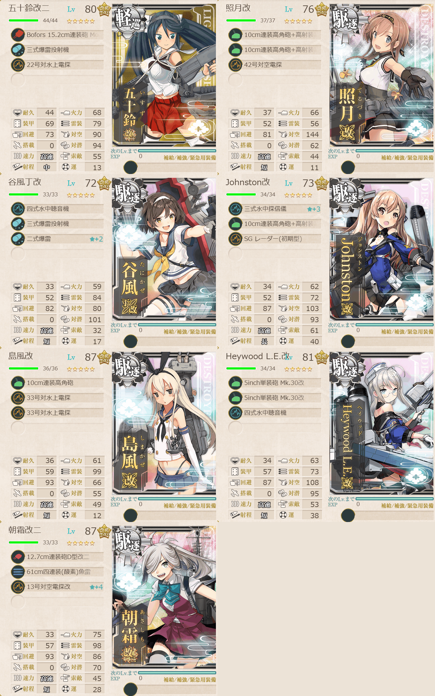
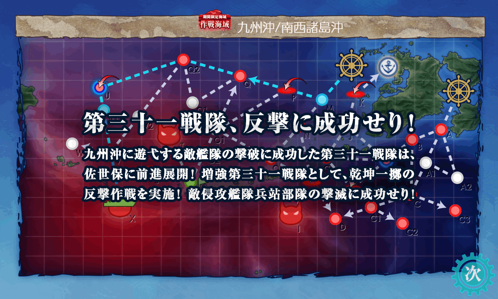

# 2026夏イベE1ゲージ3-戦力

## 目次
<details>
<summary>クリックで展開</summary>

- [2026夏イベE1ゲージ3-戦力](#2026夏イベe1ゲージ3-戦力)
  - [目次](#目次)
  - [E1の順番（短縮リンク）](#e1の順番短縮リンク)
  - [難易度](#難易度)
  - [基地航空隊編成](#基地航空隊編成)
  - [艦隊編成](#艦隊編成)
    - [X](#x)
      - [所感](#所感)
  - [参考文献(Reference)](#参考文献reference)

</details>

---

## E1の順番（短縮リンク）
1. [ギミック1](./[1]ギミック1.md)  
2. [ゲージ1-戦力](./[2]ゲージ1-戦力.md)  
3. [ギミック2](./[3]ギミック2.md)
4. [ゲージ2-輸送](./[4]ゲージ2-輸送.md) 
5. [ゲージ3-戦力](./[5]ゲージ3-戦力.md) ←今ここ
---

## 難易度
乙

---

## 基地航空隊編成
```yaml
E1ゲージ3-戦力基地航空隊:
  - number: 1
    mode: 出撃
    squadrons:
      - 銀河(江草隊)
      - 銀河
      - 一式陸攻
      - 一式陸攻
```
> 戦闘行動半径　P:空襲(3) Q:通常(4) Q2:潜水(5) V:通常(6) X:ボス(7)
> - 1部隊目：ボスマスに集中

(引用元:四腕『【夏イベ】E1-3 戦力ゲージ2 第三十一戦隊駆逐艦の出撃 【反撃！第三十一戦隊の戦い】』,2026)

---

## 艦隊編成
### X



```yaml
E1ゲージ3-戦力X:
  - name: 五十鈴改二
    level: 80
    equipments:
      - Bofors 15.2cm連装砲 Model 1930
      - 三式爆雷投射機
      - 22号対水上電探

  - name: 照月改
    level: 76
    equipments:
      - 10cm連装高角砲+高射装置
      - 10cm連装高角砲+高射装置
      - 42号対空電探

  - name: 谷風丁改
    level: 72
    equipments:
      - 四式水中聴音機
      - 三式爆雷投射機
      - 二式爆雷☆2

  - name: Johnston改
    level: 73
    equipments:
      - 三式水中探信儀☆3
      - 10cm連装高角砲+高射装置
      - SG レーダー(初期型)

  - name: 島風改
    level: 87
    equipments:
      - 10cm連装高角砲
      - 33号対水上電探
      - 33号対水上電探

  - name: Heywood L.E.改
    level: 81
    equipments:
      - 5inch単装砲 Mk.30改
      - 5inch単装砲 Mk.30改
      - 四式水中聴音機

  - name: 朝霜改二
    level: 87
    equipments:
      - 12.7cm連装砲D型改二
      - 61cm四連装(酸素)魚雷
      - 13号対空電探改☆4
```

> 【増強第三十一戦隊】【第三十一戦隊】
> - 軽巡1駆逐6
> - 雷巡1駆逐6
> - 軽巡1駆逐5水母1 等
>
> 【MPQQ2UV1VX】 (P:空襲 Q:通常 Q2:潜水 U:潜水空襲 V:通常 X:ボス)
> 
> ※要索敵。33式分岐点係数4で索敵値約80以上必要
> 
> ※戦艦空母0, 重巡級0?, 軽巡級1迄, 駆逐4?以上の編成

(引用元:四腕『【夏イベ】E1-3 戦力ゲージ2 第三十一戦隊駆逐艦の出撃 【反撃！第三十一戦隊の戦い】』,2026)

#### 所感
今回の陣形は輪形陣→警戒陣→単横陣→輪形陣→警戒陣→単縦陣。
特攻がついてるらしいので朝霜改二を in da fleet。フィニッシャーとして1番後ろに配置。

基地航空隊はボスマスXにブッパ。たまに全滅して熟練度剥がれちゃうのは仕方がない。削り切ること自体は可能であった。

存外道中も安定しているので、最短ルートではないしその分戦闘回数自体は増えてるのでお祈りすることは多くなってるが、割とすんなり戦えた。

- **出撃カウンター(この編成になってからの記録):** 7回
  
|リザルト|回数|
|---|---|
|S勝利|5|
|A勝利|0|
|それ以外|2|

2回ほど道中大破で帰投を余儀なくさせられたが装甲破砕することなく削りきり勝利。



---

## 参考文献(Reference)
- 四腕[『【夏イベ】E1-3 戦力ゲージ2 第三十一戦隊駆逐艦の出撃 【反撃！第三十一戦隊の戦い】』](https://zekamashi.net/202607-event/dai31sentai-syutugeki-5/), 2026年

---

- △[一番上に戻る](#2026夏イベe1ゲージ3-戦力)
- [イベントトップ](../../README.md)

|前の記事|次の記事|
|---|---|
|[ゲージ2-輸送](./[4]ゲージ2-輸送.md)||