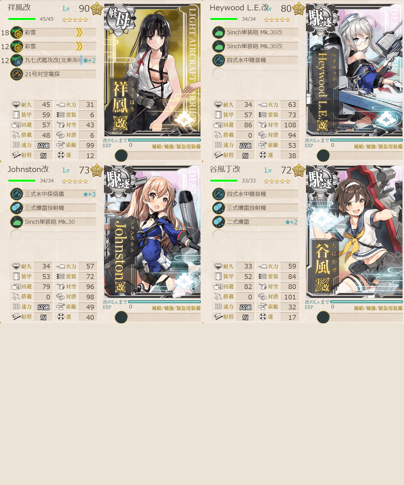
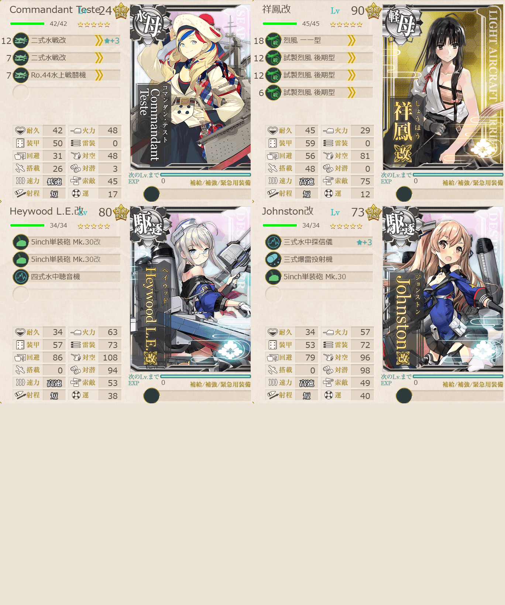

# 2026夏イベE1ギミック1

## 目次
<details>
<summary>クリックで展開</summary>

- [2026夏イベE1ギミック1](#2026夏イベe1ギミック1)
  - [目次](#目次)
  - [E1の順番（短縮リンク）](#e1の順番短縮リンク)
  - [難易度](#難易度)
  - [対象マス](#対象マス)
  - [基地航空隊編成](#基地航空隊編成)
  - [艦隊編成](#艦隊編成)
    - [C2 / C3](#c2--c3)
      - [所感](#所感)
    - [F](#f)
      - [所感](#所感-1)
  - [参考文献(Reference)](#参考文献reference)
</details>

## E1の順番（短縮リンク）
1. [ギミック1](./ギミック1.md)  ←今ここ
2. [ゲージ1-戦力](./ゲージ1-戦力.md)  
3. [ギミック2](./ギミック2.md)
4. [ゲージ2-輸送](./ゲージ2-輸送.md)
5. [ゲージ3-戦力](./ゲージ3-戦力.md)

## 難易度
乙

## 対象マス
| マス＼難易度 | 甲 | 乙 | 丙 | 丁 |
| --- | --- | --- | --- | --- |
| C2マス | S勝利×2回 | S勝利×1回 | A勝利×1回 | A勝利×1回 |
| C3マス | S勝利×2回 | S勝利×1回 | A勝利×1回 | A勝利×1回 |
| Fマス | 航空優勢×2回 | - | - | - |
| Hマス | 到達×1回 | 到達×1回 | 到達×1回 | 到達×1回 |

## 基地航空隊編成
```yaml
E1ギミック1基地航空隊:
  - number: 1
    mode: 防空
    squadrons:
      - 試製 秋水 
      - 試製 秋水 
      - 紫電二一型 紫電改
      - 紫電二一型 紫電改
```

## 艦隊編成
### C2 / C3



```yaml
E1ギミック1C2C3:
  - name: 祥鳳改
    level: 90
    equipments:
      - 彩雲
      - 彩雲
      - 九七式艦攻(北東海軍航空隊)☆2
      - 21号対空電探

  - name: Heywood L.E.改
    level: 80
    equipments:
      - 5inch単装砲 Mk.30改
      - 5inch単装砲 Mk.30改
      - 四式水中聴音機

  - name: Johnston改
    level: 72
    equipments:
      - 三式水中探信儀☆3
      - 三式爆雷投射機
      - 5inch単装砲 Mk.30

  - name: 谷風改二丁
    level: 71
    equipments:
      - 四式水中聴音機
      - 三式爆雷投射機
      - 二式爆雷☆2
```

> 軽空1駆逐3 【第三十一戦隊】
> 【ABCC1C2】(A:潜水 C2:潜水(2回)) 要索敵
> 陣形選択例：単横陣→単横陣
> 【ABCC3】(A:潜水 C3:潜水(2回))
> 陣形選択例：単横陣→単横陣
> ※要索敵。33式分岐点係数4で索敵値約65以上必要
> ルート固定：4隻, 正空0, 軽空1以下

(引用元:四腕【夏イベ】E1 ギミック1 第三十一戦隊駆逐艦の出撃 【反撃！第三十一戦隊の戦い】』,2026)

#### 所感
先制対潜できると楽そう。進む方向は選べるのでわりかし簡単。

### F



```yaml
E1ギミック1F:
  - name: Commandant Teste
    level: 24
    equipments:
      - 二式水戦改☆3
      - 二式水戦
      - Ro.44水上戦闘機

  - name: 祥鳳改
    level: 90
    equipments:
      - 烈風 一一型
      - 試製烈風 後期型
      - 試製烈風 後期型
      - 試製烈風 後期型

  - name: Heywood L.E.改
    level: 80
    equipments:
      - 5inch単装砲 Mk.30改
      - 5inch単装砲 Mk.30改
      - 四式水中聴音機

  - name: Johnston改
    level: 72
    equipments:
      - 三式水中探信儀☆3
      - 三式爆雷投射機
      - 5inch単装砲 Mk.30
```

> 軽空1駆逐2水母1【第三十一戦隊】
>【ABEFGH】(A:潜水 E:潜水空襲 F:空襲(2回) G:通常 H:空襲(1回到達))
> 陣形選択例：単横陣→単横陣→複縦陣→警戒陣→複縦陣 *4隻輪形陣不可
> ルート固定：4隻, 戦艦0, 正空0, 軽空1以下

(引用元:四腕『【夏イベ】E1 ギミック1 第三十一戦隊駆逐艦の出撃 【反撃！第三十一戦隊の戦い】』,2026)

#### 所感
とりあえずある艦上戦闘機を全部軽空に載せる||ある水上戦闘機を全部水母に載せれば多分大丈夫。空襲はそんなにきつくない。

## 参考文献(Reference)

- 四腕[『【夏イベ】E1 ギミック1 第三十一戦隊駆逐艦の出撃 【反撃！第三十一戦隊の戦い】』](https://zekamashi.net/202607-event/dai31sentai-syutugeki-1/), 2026年
