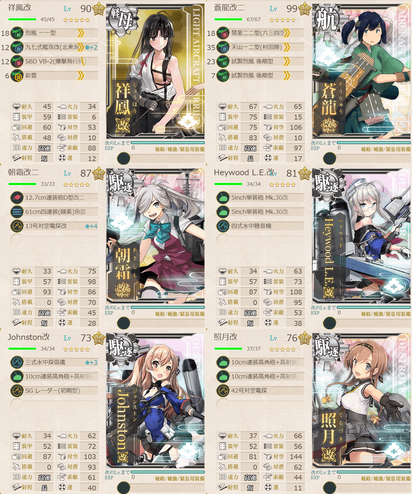
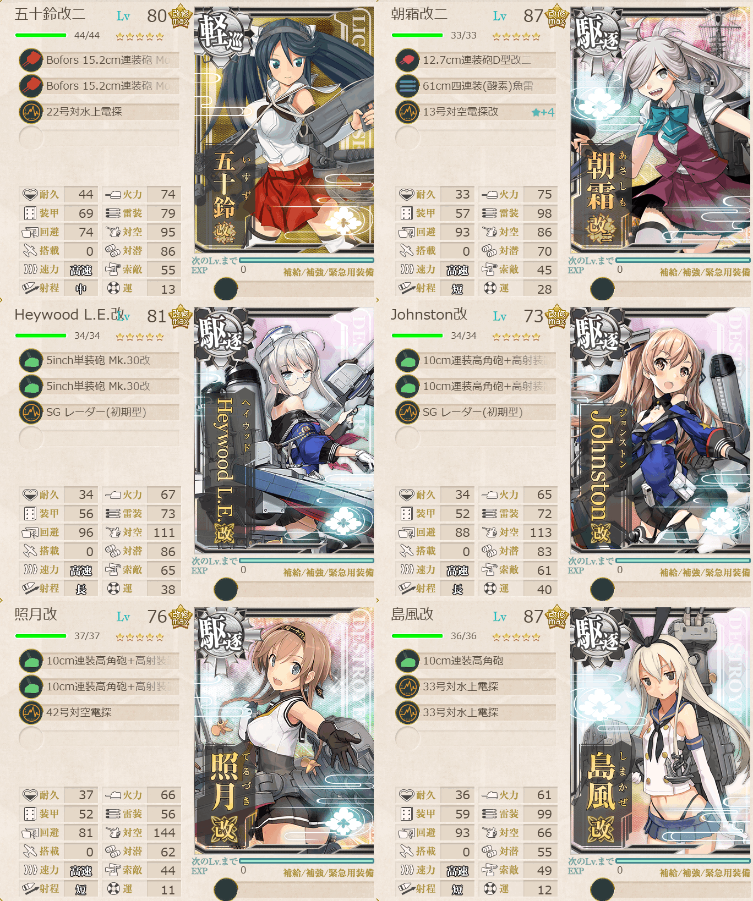

# 2026夏イベE2ギミック1

## 目次
<details>
<summary>クリックで展開</summary>

- [2026夏イベE2ギミック1](#2026夏イベe2ギミック1)
  - [目次](#目次)
  - [E2の順番（短縮リンク）](#e2の順番短縮リンク)
  - [難易度](#難易度)
  - [ギミック](#ギミック)
  - [編成](#編成)
    - [D](#d)
      - [艦隊編成](#艦隊編成)
      - [基地航空隊編成](#基地航空隊編成)
      - [所感](#所感)
    - [C2](#c2)
      - [艦隊編成](#艦隊編成-1)
      - [基地航空隊編成](#基地航空隊編成-1)
      - [所感](#所感-1)
  - [参考文献(Reference)](#参考文献reference)

</details>

---

## E2の順番（短縮リンク）

- [ギミック1](./[1]ギミック1.md)    ←今ここ
- [ギミック2](./[2]ギミック2.md)
- [ゲージ1-輸送](./[3]ゲージ1-輸送.md)
- [ゲージ2-戦力](./[4]ゲージ2-戦力.md)
- [ゲージ3-戦力](./[5]ゲージ3-戦力.md)

---

## 難易度
丙

---

## ギミック
| マス＼難易度 | 甲 | 乙 | 丙 | 丁 |
| --- | --- | --- | --- | --- |
|Dマス|航空優勢×2回|航空優勢×2回|航空優勢×1回|-|
|C2マス|S勝利×3回|S勝利×2回|A勝利×2回|A勝利×2回|

(引用元:四腕『【夏イベ】E2 ギミック1 サンベルナルジノ海峡 通峡【反撃！第三十一戦隊の戦い】』,2026)

---

## 編成
### D
#### 艦隊編成



```yaml
E2ギミック1D:
  - name: 祥鳳改
    level: 90
    equipments:
      - 烈風 一一型
      - 九七式艦攻改(北東海軍航空隊)☆2
      - SBD VB-2(爆撃飛行隊)
      - 彩雲

  - name: 蒼龍改二
    level: 99
    equipments:
      - 彗星二二型(六三四空)
      - 天山一二型(村田隊)
      - 試製烈風 後期型
      - 試製烈風 後期型

  - name: 朝霜改二
    level: 87
    equipments:
      - 12.7cm連装砲D型改二
      - 61cm四連装(酸素)魚雷
      - 13号対空電探改☆4

  - name: Heywood L.E.改
    level: 81
    equipments:
      - 5inch単装砲 Mk.30改
      - 5inch単装砲 Mk.30改
      - 四式水中聴音機

  - name: Johnston改
    level: 73
    equipments:
      - 三式水中探信儀☆3
      - 10cm連装高角砲+高射装置
      - SG レーダー(初期型)

  - name: 照月改
    level: 76
    equipments:
      - 10cm連装高角砲+高射装置
      - 10cm連装高角砲+高射装置
      - 42号対空電探
```

> 正空1軽空1駆逐4【第三十一戦隊】【増強第三十一戦隊】
> 
> 【AA1A2A3B2D】(A2:通常 A3:通常 B2:潜水 D:空襲(2回))
> 
> 陣形選択例：警戒陣→警戒陣→単横陣→輪形陣
> 
> ルート固定：駆逐4以上

(引用元:四腕『【夏イベ】E2 ギミック1 サンベルナルジノ海峡 通峡【反撃！第三十一戦隊の戦い】』,2026)

#### 基地航空隊編成

```yaml
E2ギミック1D基地航空隊:
  - number: 1
    mode: 出撃
    squadrons:
      - 銀河(江草隊)
      - 銀河
      - 一式陸攻
      - 一式陸攻

  - number: 2
    mode: 防空
    squadrons:
      - 試製 秋水 
      - 試製 秋水 
      - 紫電二一型 紫電改
      - 紫電二一型 紫電改
```

> 戦闘行動半径　A2:通常(5) A3:通常(4) B2:潜水(3) D:空襲(4)
>
> - 1部隊目：A2/A3マスに分散・待機等
> - 2部隊目：防空
> 
> A2とA3マスが警戒陣ランダムのため出す想定。待機でも特段問題なさそう。

(引用元:四腕『【夏イベ】E2 ギミック1 サンベルナルジノ海峡 通峡【反撃！第三十一戦隊の戦い】』,2026)

#### 所感
丙にしたのもあって簡単だった。丙以下は基地航空隊出撃しなくても良いかも。

---

### C2
#### 艦隊編成


```yaml
E2ギミック1C2:
  - name: 五十鈴改二
    level: 80
    equipments:
      - Bofors 15.2cm連装砲 Model 1930
      - Bofors 15.2cm連装砲 Model 1930
      - 22号対水上電探

  - name: 朝霜改二
    level: 87
    equipments:
      - 12.7cm連装砲D型改二
      - 61cm四連装(酸素)魚雷
      - 13号対空電探改☆4

  - name: Heywood L.E.改
    level: 81
    equipments:
      - 5inch単装砲 Mk.30改
      - 5inch単装砲 Mk.30改
      - SG レーダー(初期型)

  - name: Johnston改
    level: 73
    equipments:
      - 10cm連装高角砲+高射装置
      - 10cm連装高角砲+高射装置
      - SG レーダー(初期型)

  - name: 照月改
    level: 76
    equipments:
      - 10cm連装高角砲+高射装置
      - 10cm連装高角砲+高射装置
      - 42号対空電探

  - name: 島風改
    level: 87
    equipments:
      - 10cm連装高角砲
      - 33号対水上電探
      - 33号対水上電探
```

> 軽巡1駆逐5【第三十一戦隊】【増強第三十一戦隊】
> 
> 【AA1A2A3CC2】(A2:通常 A3:通常 C:空襲 C2:通常(3回))
> 
> 陣形例選択：警戒陣→警戒陣→輪形陣→単縦陣
> 
> ルート固定：(戦艦+空母)0
> 
> ※要索敵。33式分岐点係数4で索敵値約66以上必要(甲)

(引用元:四腕『【夏イベ】E2 ギミック1 サンベルナルジノ海峡 通峡【反撃！第三十一戦隊の戦い】』,2026)

#### 基地航空隊編成
```yaml
E2ギミック1C2基地航空隊:
  - number: 1
    mode: 出撃
    squadrons:
      - 銀河(江草隊)
      - 銀河
      - 一式陸攻
      - 一式陸攻

  - number: 2
    mode: 防空
    squadrons:
      - 試製 秋水 
      - 試製 秋水 
      - 紫電二一型 紫電改
      - 紫電二一型 紫電改
```

> 戦闘行動半径　A2:通常(5) A3:通常(4) C:空襲(5) C2:通常(6)
>
> - 1部隊目：ギミックマスに集中
> - 2部隊目：防空

(引用元:四腕『【夏イベ】E2 ギミック1 サンベルナルジノ海峡 通峡【反撃！第三十一戦隊の戦い】』,2026)

#### 所感
基地航空隊の力もあって、ギミックマスは2回ともS勝利。基地航空隊が最低限でもおそらく行けそう。

---

## 参考文献(Reference)
- 四腕[『【夏イベ】E2 ギミック1 サンベルナルジノ海峡 通峡【反撃！第三十一戦隊の戦い】』](https://zekamashi.net/202607-event/sanberunarujino-kaikyou-1/), 2026年

---

- [△ 一番上に戻る](#2026夏イベe2ギミック1)
- [イベントトップ](../../README.md)

|前の記事|次の記事|
|---|---|
|[E1ゲージ3-戦力](../../E1/docs/[5]ゲージ3-戦力.md)|[E2ギミック2](./[2]ギミック2.md)|