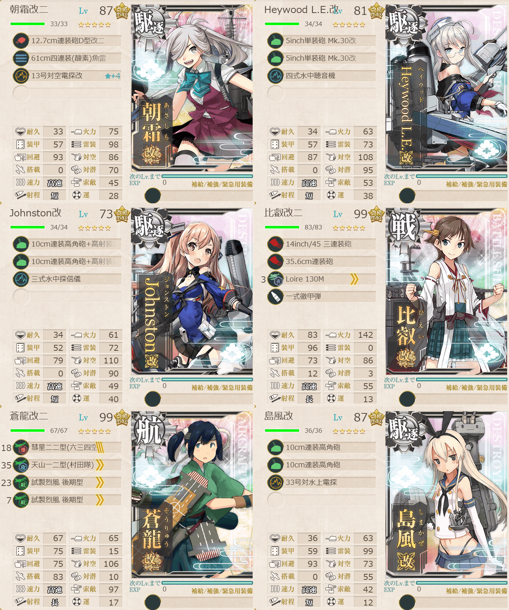
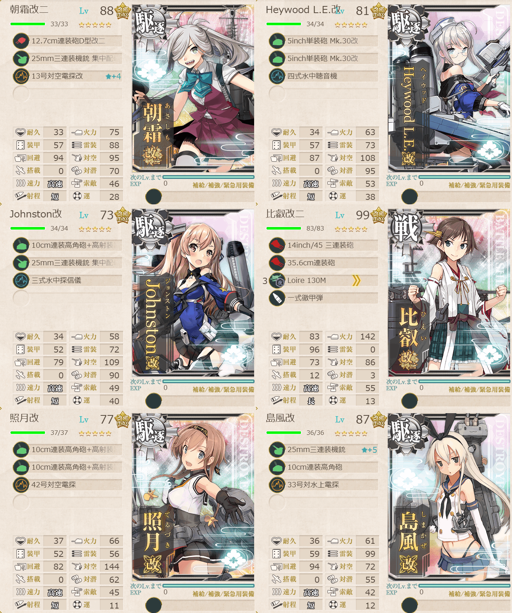

# 2026夏イベE2ギミック2

## 目次
<details>
<summary>クリックで展開</summary>

- [2026夏イベE2ギミック2](#2026夏イベe2ギミック2)
  - [目次](#目次)
  - [E2の順番（短縮リンク）](#e2の順番短縮リンク)
  - [難易度](#難易度)
  - [ギミック](#ギミック)
  - [編成](#編成)
    - [H](#h)
      - [艦隊編成](#艦隊編成)
      - [基地航空隊編成](#基地航空隊編成)
      - [所感](#所感)
  - [編成](#編成-1)
    - [G2](#g2)
      - [艦隊編成](#艦隊編成-1)
      - [基地航空隊編成](#基地航空隊編成-1)
      - [所感](#所感-1)
  - [参考文献(Reference)](#参考文献reference)

</details>

---

## E2の順番（短縮リンク）
- [ギミック1](./[1]ギミック1.md)    
- [ギミック2](./[2]ギミック2.md)    ←今ここ
- [ゲージ1-輸送](./[3]ゲージ1-輸送.md)
- [ゲージ2-戦力](./[4]ゲージ2-戦力.md)
- [ゲージ3-戦力](./[5]ゲージ3-戦力.md)

---

## 難易度
丙

---

## ギミック
| マス＼難易度 | 甲 | 乙 | 丙 | 丁 |
| :---: | --- | --- | --- | --- |
|Hマス|S勝利×3回|S勝利×2回|A勝利×2回|A勝利×2回|
|G2マス|S勝利×2回|A勝利×2回|A勝利×2回|A勝利×1回|
|Bマス|S勝利×1回|-|-|-|
|基地防空|航空優勢×2回|航空優勢×2回|航空優勢×1回|-|

(引用元:四腕『【夏イベ】E2 ギミック2 サンベルナルジノ海峡 通峡【反撃！第三十一戦隊の戦い】』,2026)

---

## 編成
### H
#### 艦隊編成



- **第1艦隊**
```yaml
E2ギミック2H:
  - name: 朝霜改二
    level: 87
    equipments:
      - 12.7cm連装砲D型改二
      - 61cm四連装(酸素)魚雷
      - 13号対空電探改☆4

  - name: Heywood L.E.改
    level: 81
    equipments:
      - 5inch単装砲 Mk.30改
      - 5inch単装砲 Mk.30改
      - 四式水中聴音機

  - name: Johnston改
    level: 73
    equipments:
      - 10cm連装高角砲+高射装置
      - 10cm連装高角砲+高射装置
      - 三式水中探信儀

  - name: 比叡改二
    level: 99
    equipments:
      - 14inch/45 三連装砲
      - 35.6cm連装砲
      - Loire 130M
      - 一式徹甲弾

  - name: 蒼龍改二
    level: 99
    equipments:
      - 彗星二二型(六三四空)
      - 天山一二型(村田隊)
      - 試製烈風 後期型
      - 試製烈風 後期型

  - name: 島風改
    level: 87
    equipments:
      - 10cm連装高角砲
      - 10cm連装高角砲
      - 33号対水上電探

```

- 制空値: 140
- 33式分岐点係数

|番号|係数|
|:---:|---|
|1|13.35|
|2|28.25|
|3|43.15|
|4|58.05|

※今回から制空値や33式分岐点係数も載せていきます。

> 戦艦1空母1駆逐4【第三十一戦隊】【増強第三十一戦隊】
> 
> 【AA1A3B1FGH】(A3:通常 B1:空襲 F:空襲 G:潜水 H:通常(3回))
> 
> ルート固定：正空1, 駆逐4以上
> 
> 陣形選択例：警戒陣→輪形陣→輪形陣→警戒陣→単縦陣

(引用元:四腕『【夏イベ】E2 ギミック2 サンベルナルジノ海峡 通峡【反撃！第三十一戦隊の戦い】』,2026)

#### 基地航空隊編成

```yaml
E2ギミック2H基地航空隊:
  - number: 1
    mode: 出撃
    squadrons:
      - 銀河(江草隊)
      - 銀河
      - 一式陸攻
      - 一式陸攻

  - number: 2
    mode: 防空
    squadrons:
      - 試製 秋水
      - 試製 秋水
      - 紫電二一型 紫電改
      - 紫電二一型 紫電改
```

> 戦闘行動半径　A3:通常(4) B1:空襲(2) F:空襲(2) G:潜水(3) H:通常(5)
>
> - 1部隊目：ギミックマスに集中
> - 2部隊目：防空

(引用元:四腕『【夏イベ】E2 ギミック2 サンベルナルジノ海峡 通峡【反撃！第三十一戦隊の戦い】』,2026)

#### 所感
道選びを間違えなければ(1敗)すんなり行けた。ボスはそれほど硬くは無いようで駆逐艦でも結構ダメージは与えられていた印象。戦艦も入っているので削り切るのは難しくないかも。

--- 

## 編成
### G2
#### 艦隊編成



- **第1艦隊**
```yaml
E2ギミック2G2:
  - name: 朝霜改二
    level: 87
    equipments:
      - 12.7cm連装砲D型改二
      - 25mm三連装機銃 集中配備
      - 13号対空電探改☆4

  - name: Heywood L.E.改
    level: 81
    equipments:
      - 5inch単装砲 Mk.30改
      - 5inch単装砲 Mk.30改
      - 四式水中聴音機

  - name: Johnston改
    level: 73
    equipments:
      - 10cm連装高角砲+高射装置
      - 25mm三連装機銃 集中配備
      - 三式水中探信儀

  - name: 比叡改二
    level: 99
    equipments:
      - 14inch/45 三連装砲
      - 35.6cm連装砲
      - Loire 130M
      - 一式徹甲弾

  - name: 照月改
    level: 76
    equipments:
      - 10cm連装高角砲+高射装置
      - 10cm連装高角砲+高射装置
      - 42号対空電探

  - name: 島風改
    level: 87
    equipments:
      - 25mm三連装機銃
      - 10cm連装高角砲
      - 33号対水上電探
```

- 制空値: 0
- 33式分岐点係数

|番号|係数|
|:---:|---|
|1|9.75|
|2|24.45|
|3|39.15|
|4|53.85|

> 戦艦1駆逐5【増強第三十一戦隊】【第三十一戦隊】
> 
> 【AA1A3B1FGG1G2】(A3:通常 B1:空襲 F:空襲 G:潜水 G1:PT G2:PT(2回))
> 
> 陣形選択例：警戒陣→輪形陣→輪形陣→単横陣(警戒陣)→単縦陣→単縦陣
> 
> ルート固定：(戦艦+軽空)1以下, 正空0, 駆逐4以上

(引用元:四腕『【夏イベ】E2 ギミック2 サンベルナルジノ海峡 通峡【反撃！第三十一戦隊の戦い】』,2026)

PT対策: [PT小鬼群及びSchnellboot小鬼群(Sボート)への装備や対策例](https://zekamashi.net/kancolle-kouryaku/ptboat-taisaku/#google_vignette)

#### 基地航空隊編成

```yaml
E2ギミック2G2基地航空隊:
  - number: 1
    mode: 出撃
    squadrons:
      - 銀河(江草隊)
      - 銀河
      - 一式陸攻
      - 一式陸攻
      
  - number: 2
    mode: 防空
    squadrons:
      - 試製 秋水
      - 試製 秋水
      - 紫電二一型 紫電改
      - 紫電二一型 紫電改
```

> 戦闘行動半径　A3:通常(4) B1:空襲(2) F:空襲(2) G:潜水(3) G1:PT(3) G2:PT(4)
> 
> - 1部隊目：A3マスに集中
> - 2部隊目：防空
> 
> ランダム警戒陣対策にA3に基地を出す想定。
> 待機で良いかも。

(引用元:四腕『【夏イベ】E2 ギミック2 サンベルナルジノ海峡 通峡【反撃！第三十一戦隊の戦い】』,2026)

#### 所感
駆逐艦に機銃を持たせれば適当装備でもそれなりにPTは削りきれる。今回はめんどくさくて戦艦の装備をそのままにしていたが、PTにはまるで効かないので本当はちゃんと考えたほうが良い。

---

## 参考文献(Reference)
- 四腕[『【夏イベ】E2 ギミック2 サンベルナルジノ海峡 通峡【反撃！第三十一戦隊の戦い】』](https://zekamashi.net/202607-event/sanberunarujino-kaikyou-2/), 2026年
- 四腕[『PT小鬼群及びSchnellboot小鬼群(Sボート)への装備や対策例』](https://zekamashi.net/kancolle-kouryaku/ptboat-taisaku/), 2026年

---

- △[一番上に戻る](#2026夏イベe2ギミック2)
- [イベントトップ](../../README.md)

|前の記事|次の記事|
|---|---|
|[E2ギミック1](./[1]ギミック1.md)|[E2ゲージ1-輸送](./[3]ゲージ1-輸送.md)|