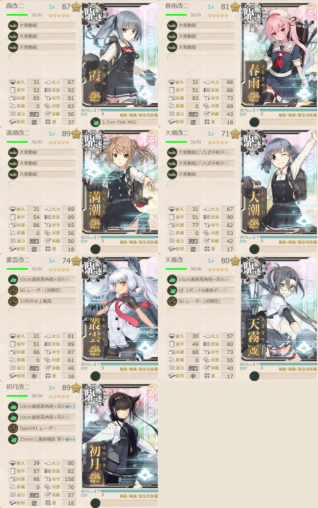

# 2026夏イベE2ゲージ1-輸送

## 目次
<details>
<summary>クリックで展開</summary>

- [2026夏イベE2ゲージ1-輸送](#2026夏イベe2ゲージ1-輸送)
  - [目次](#目次)
  - [E2の順番（短縮リンク）](#e2の順番短縮リンク)
  - [難易度](#難易度)
  - [編成](#編成)
    - [P](#p)
      - [艦隊編成](#艦隊編成)
      - [基地航空隊編成](#基地航空隊編成)
      - [所感](#所感)
  - [参考文献(Reference)](#参考文献reference)

</details>

---

## E2の順番（短縮リンク）
- [ギミック1](./[1]ギミック1.md)    
- [ギミック2](./[2]ギミック2.md)    
- [ゲージ1-輸送](./[3]ゲージ1-輸送.md)  ←今ここ
- [ゲージ2-戦力](./[4]ゲージ2-戦力.md)
- [ゲージ3-戦力](./[5]ゲージ3-戦力.md)

---

## 難易度
丙

---

## 編成
### P
#### 艦隊編成



- **第3艦隊**
```yaml
E2ゲージ1-輸送P:
  - name: 霞改二
    level: 87
    equipments:
      - 大発動艇
      - 大発動艇
      - 大発動艇
      - 3.7cm FlaK M42

  - name: 春雨改二
    level: 81
    equipments:
      - 大発動艇
      - 大発動艇
      - 大発動艇

  - name: 満潮改二
    level: 89
    equipments:
      - 大発動艇
      - 大発動艇
      - 大発動艇

  - name: 大潮改二
    level: 71
    equipments:
      - 大発動艇(八九式中戦車&陸戦隊)
      - 大発動艇(八九式中戦車&陸戦隊)
      - 大発動艇

  - name: 叢雲改二
    level: 74
    equipments:
      - 10cm連装高角砲+高射装置
      - SG レーダー(初期型)
      - 33号対水上電探

  - name: 天霧改
    level: 80
    equipments:
      - 10cm連装高角砲+高射装置
      - QF 2ポンド8連装ポンポン砲
      - SG レーダー(初期型)

  - name: 初月改二
    level: 89
    equipments:
      - 10cm連装高角砲+高射装置☆3
      - 10cm連装高角砲+高射装置
      - Type281 レーダー
      - 25mm三連装機銃 集中配備☆4
```

- **制空値:** 0
- **33式分岐点係数:**

|番号|係数|
|:---:|---|
|1|17.18|
|2|25.78|
|3|54.38|
|4|72.98|

- **TP(輸送):**

|リザルト|数値|
|:---:|---|
|S勝利|131|
|A勝利|91|

> 駆逐7【多号作戦部隊】
> 
> 【IJKLMOP】(J:空襲 K:空襲 L:通常 M:空襲 P:ボス)
>
> 陣形選択例：輪形陣→輪形陣→警戒陣→輪形陣→単縦陣
> 
> ※要索敵。33式分岐点係数4で索敵値約75以上必要(甲)

(引用元:四腕『【夏イベ】E2-1 輸送ゲージ サンベルナルジノ海峡 通峡【反撃！第三十一戦隊の戦い】』,2026)

#### 基地航空隊編成

```yaml
E2ゲージ1-輸送P基地航空隊:
  - number: 1
    mode: 出撃
    squadrons:
      - 銀河(江草隊)
      - 銀河
      - 一式陸攻
      - 一式陸攻

  - number: 2
    mode: 防空
    squadrons:
      - 試製 秋水
      - 試製 秋水
      - 紫電二一型 紫電改
      - 紫電二一型 紫電改
```

> 戦闘行動半径　J:空襲(2) K:空襲(3) L:通常(4) M:空襲(5) P:ボス(6)
>
> - 1部隊目：ボスマスに集中
> - 2部隊目：防空

(引用元:四腕『【夏イベ】E2-1 輸送ゲージ サンベルナルジノ海峡 通峡【反撃！第三十一戦隊の戦い】』,2026)

#### 所感
道中ラ級が出てくるのでそこが若干お祈りポイント。私は中破1小破1程度で、それ以外はあまりダメージも受けずに進めることが出来た。今回はTP目的で火力を削っているので、逆によくS勝利が1回できたなという印象。

- **出撃カウンター(この編成になってからの記録):**

合計: 6

|リザルト|回数|
|:---:|---|
|S勝利|1|
|A勝利|5|
|それ以外|0|

---

## 参考文献(Reference)
- 四腕[『【夏イベ】E2-1 輸送ゲージ サンベルナルジノ海峡 通峡【反撃！第三十一戦隊の戦い】』](https://zekamashi.net/202607-event/sanberunarujino-kaikyou-3/), 2026年

---

- △[一番上に戻る](#2026夏イベe2ゲージ1-輸送)
- [イベントトップ](../../README.md)

|前の記事|次の記事|
|---|---|
|[E2ギミック2](./[2]ギミック2.md)|[E2ゲージ2-戦力](./[4]ゲージ2-戦力.md)|