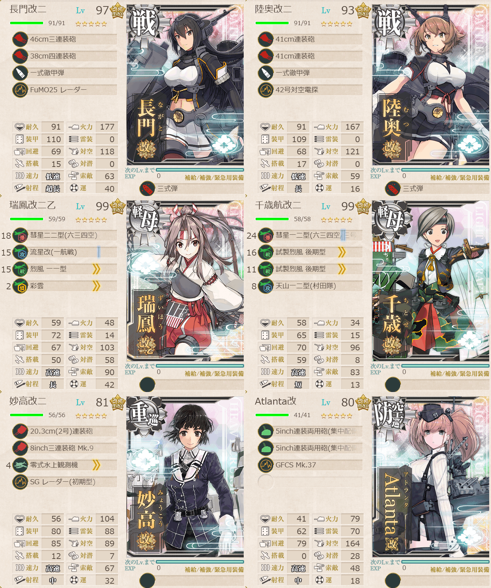
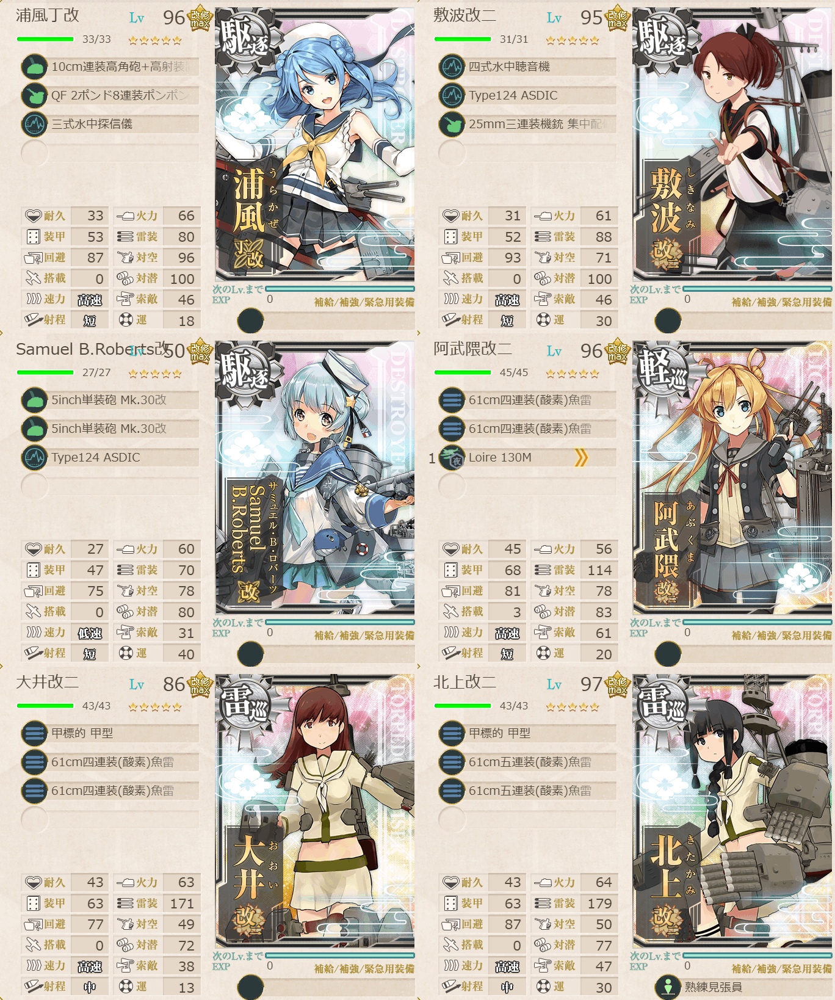

# 2026夏イベE2ゲージ2-戦力

## 目次
<details>
<summary>クリックで展開</summary>

- [2026夏イベE2ゲージ2-戦力](#2026夏イベe2ゲージ2-戦力)
  - [目次](#目次)
  - [E2の順番（短縮リンク）](#e2の順番短縮リンク)
  - [難易度](#難易度)
  - [編成](#編成)
    - [{マス}](#マス)
      - [艦隊編成](#艦隊編成)
      - [基地航空隊編成](#基地航空隊編成)
      - [所感](#所感)
      - [出撃カウンター(この編成になってからの記録)](#出撃カウンターこの編成になってからの記録)
  - [参考文献(Reference)](#参考文献reference)

</details>

---

## E2の順番（短縮リンク）
- [ギミック1](./[1]ギミック1.md)    
- [ギミック2](./[2]ギミック2.md)    
- [ゲージ1-輸送](./[3]ゲージ1-輸送.md)  
- [ゲージ2-戦力](./[4]ゲージ2-戦力.md)  ←今ここ
- [ゲージ3-戦力](./[5]ゲージ3-戦力.md)

---

## 難易度
丙

---

## 編成
### {マス}
#### 艦隊編成

連合艦隊

- **第1艦隊:**



```yaml
E2ゲージ2-戦力V:
  - name: 長門改二
    level: 97
    equipments:
      - 46cm三連装砲
      - 38cm四連装砲
      - 一式徹甲弾
      - FuMO25 レーダー
      - 三式弾

  - name: 陸奥改二
    level: 93
    equipments:
      - 41cm連装砲
      - 41cm連装砲
      - 一式徹甲弾
      - 42号対空電探
      - 三式弾

  - name: 瑞鳳改二乙
    level: 99
    equipments:
      - 彗星二二型(六三四空)
      - 流星改(一航戦)
      - 烈風 一一型
      - 彩雲

  - name: 千歳航改二
    level: 99
    equipments:
      - 彗星一二型(六三四空/三号爆弾搭載機)
      - 試製烈風 後期型
      - 試製烈風 後期型
      - 天山一二型(村田隊)

  - name: 妙高改二
    level: 81
    equipments:
      - 20.3cm(2号)連装砲
      - 8inch三連装砲 Mk.9
      - 零式水上観測機
      - SG レーダー(初期型)

  - name: Atlanta改
    level: 80
    equipments:
      - 5inch連装両用砲(集中配備)
      - 5inch連装両用砲(集中配備)
      - GFCS Mk.37
```

> 戦艦2空母2重巡1軽巡1【連合艦隊】水上打撃部隊
> 
> 【QDGG1KLSTV】(D:空襲 G:潜水 G1:PT K:空襲 L:通常(煙幕) T:通常 V:ボス)
> 
> 陣形選択例：第三→第一→第四→第三→第四→第四→第二

(引用元:四腕『【夏イベ】E2-2 戦力ゲージ1 サンベルナルジノ海峡 通峡【反撃！第三十一戦隊の戦い】』,2026)

- **第2艦隊:**



```yaml
E2ゲージ2-戦力V:
  - name: 浦風丁改
    level: 96
    equipments:
      - 10cm連装高角砲+高射装置
      - QF 2ポンド8連装ポンポン砲
      - 三式水中探信儀

  - name: 敷波改二
    level: 95
    equipments:
      - 四式水中聴音機
      - Type124 ASDIC
      - 25mm三連装機銃 集中配備

  - name: Samuel B.Roberts改
    level: 50
    equipments:
      - 5inch単装砲 Mk.30改
      - 5inch単装砲 Mk.30改
      - Type124 ASDIC

  - name: 阿武隈改二
    level: 96
    equipments:
      - 61cm四連装(酸素)魚雷
      - 61cm四連装(酸素)魚雷
      - Loire 130M

  - name: 大井改二
    level: 86
    equipments:
      - 甲標的 甲型
      - 61cm四連装(酸素)魚雷
      - 61cm四連装(酸素)魚雷

  - name: 北上改二
    level: 97
    equipments:
      - 甲標的 甲型
      - 61cm五連装(酸素)魚雷
      - 61cm五連装(酸素)魚雷
      - 熟練見張員
```

> 雷巡2軽巡1駆逐3

(引用元:四腕『【夏イベ】E2-2 戦力ゲージ1 サンベルナルジノ海峡 通峡【反撃！第三十一戦隊の戦い】』,2026)

- **制空値:** 224
- **33式分岐点係数:** 

|番号|係数|
|:---:|---|
|1|39.94|
|2|84.14|
|3|128.34|
|4|172.54|

#### 基地航空隊編成

```yaml
E2ゲージ2-戦力基地航空隊:
  - number: 1
    mode: 出撃
    squadrons:
      - 銀河(江草隊)
      - 銀河
      - 一式陸攻
      - 一式陸攻

  - number: 2
    mode: 出撃
    squadrons:
      - 九六式陸攻
      - 九六式陸攻
      - Ho229
      - PBY-5A Catalina
```

> 戦闘行動半径　D:空襲(4) G:潜水(3) G1:PT(3) K:空襲(3) L:通常(4) T:通常(4) V:ボス(5)
>
> - 1部隊目：ボスマスに集中
> - 2部隊目：ボスマスに集中
> 
> 喪失の2部隊で敵の随伴艦を減らし、
> タッチ攻撃が空母夏姫に当たる確率を少しでも上げます。

(引用元:四腕『【夏イベ】E2-2 戦力ゲージ1 サンベルナルジノ海峡 通峡【反撃！第三十一戦隊の戦い】』,2026)

#### 所感

> [!TIP]
> ### 基地航空隊について
> 参考元ではボスマス集中となってるが、個人的には空襲のダメージも馬鹿にならないのでこの難易度だったらもしかしたら第二航空隊に関しては防空のままでも良いかもとも思った。そこはお好み。
> 
> 私はHo229と、距離が足りないのでPBY-5A Catalinaを使っているが、普通に九六式陸攻でも大丈夫。

参考元では煙幕システムでLマスのラ級をやり過ごす想定だったが、[前回の記事](./[3]ゲージ1-輸送.md)で書いた通りこの難易度のラ級はあまり強くないのでそこまで気にしなくてもいいかも。とは言え普通にではある。

煙幕システム: [煙幕システムを活用しよう　発煙装置(煙幕)・同改の入手について](https://zekamashi.net/kancolle-kouryaku/smoke-system/)

> [重巡]青葉(特効) 煙幕持つ仕事
> 
> 火力要員として妙高に変更可

(引用元:四腕『【夏イベ】E2-2 戦力ゲージ1 サンベルナルジノ海峡 通峡【反撃！第三十一戦隊の戦い】』,2026)

となっていたので重巡枠は妙高を採用している感じ。毎回Sというわけではないが、長門陸奥のタッチが決まれば昼でも決めきれそう。

うちは夜戦で北上様に決めていただきました(小声)

#### 出撃カウンター(この編成になってからの記録)

****合計:**** 計測中

|リザルト|回数|
|:---:|---|
|S勝利|4|
|A勝利|2|
|道中撤退|2|

**道中撤退内訳**

|回数|マス|原因|
|:---:|:---:|---|
|1|L|駆逐ラ級の先制雷撃で北上が大破|
|2|T|昼戦中、敵軽空母の爆撃で瑞鳳が大破|

---

## 参考文献(Reference)
- 四腕[『【夏イベ】E2-2 戦力ゲージ1 サンベルナルジノ海峡 通峡【反撃！第三十一戦隊の戦い】』](https://zekamashi.net/202607-event/sanberunarujino-kaikyou-4/), 2026年
- 四腕[『煙幕システムを活用しよう　発煙装置(煙幕)・同改の入手について』](https://zekamashi.net/kancolle-kouryaku/smoke-system/), 2024年

---

- [△ 一番上に戻る](#2026夏イベe2ゲージ2-戦力)
- [イベントトップ](../../README.md)

|前の記事|次の記事|
|---|---|
|[E2ゲージ1-輸送]([3]ゲージ1-輸送.md)|[E2ゲージ3-戦力]([5]ゲージ3-戦力.md)|