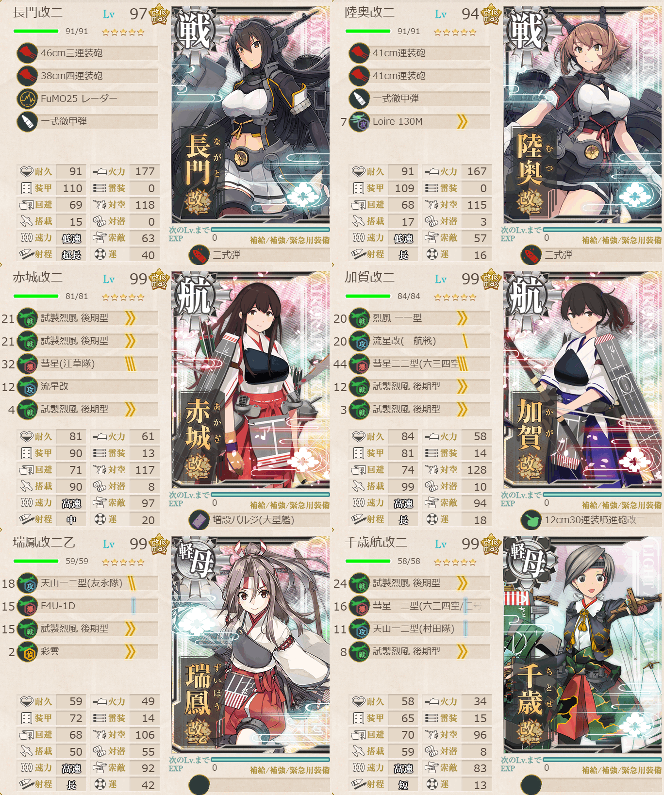
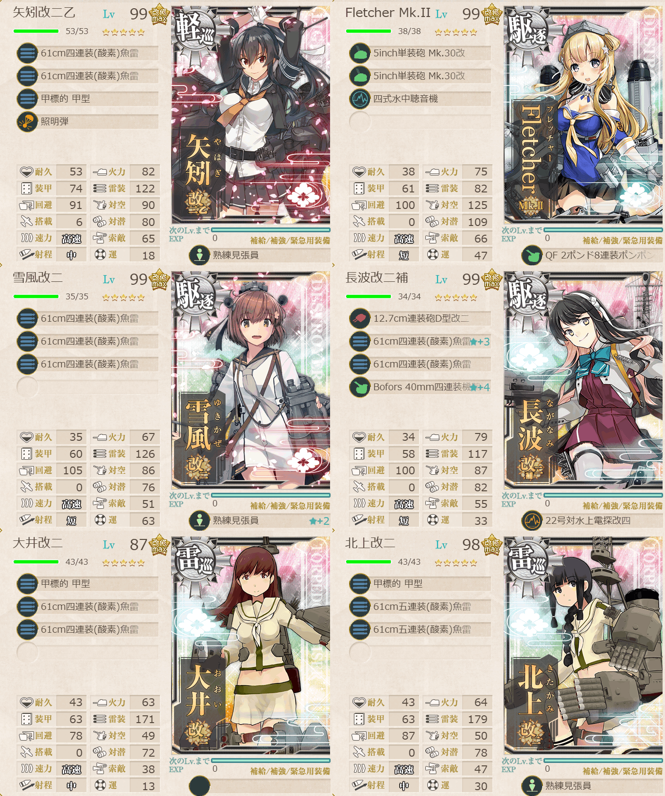
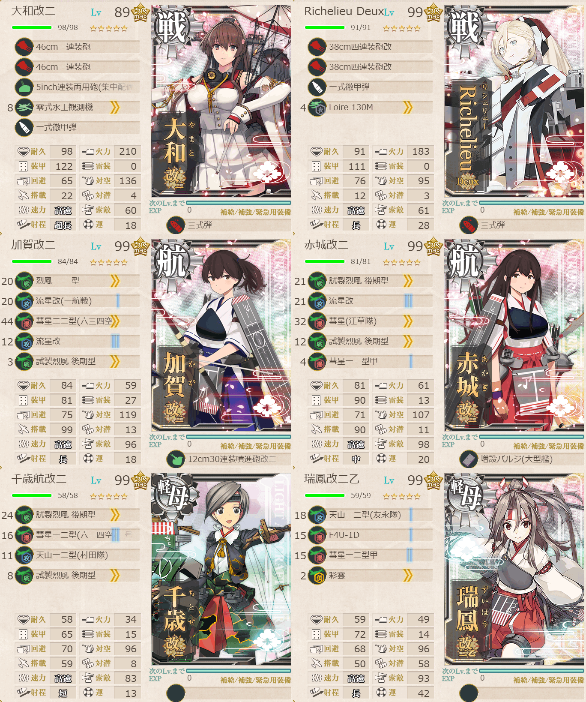
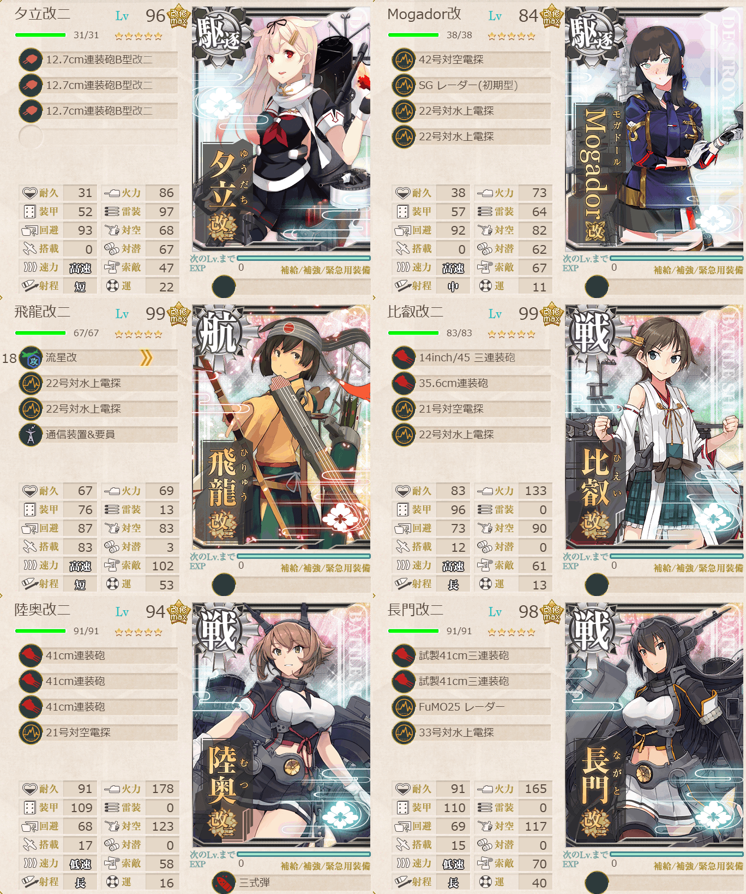
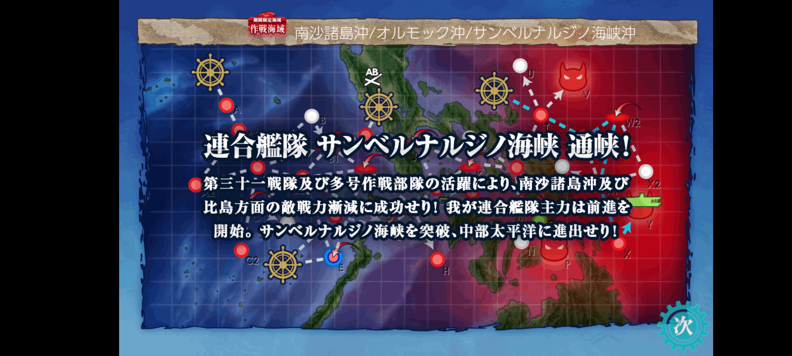

# 2026夏イベE2ゲージ3-戦力

## 目次
<details>
<summary>クリックで展開</summary>

- [2026夏イベE2ゲージ3-戦力](#2026夏イベe2ゲージ3-戦力)
  - [目次](#目次)
  - [E2の順番（短縮リンク）](#e2の順番短縮リンク)
  - [難易度](#難易度)
  - [編成](#編成)
    - [Y削り](#y削り)
      - [艦隊編成](#艦隊編成)
      - [基地航空隊編成](#基地航空隊編成)
      - [所感](#所感)
      - [出撃カウンター(この編成になってからの記録)](#出撃カウンターこの編成になってからの記録)
    - [Yトドメ](#yトドメ)
      - [艦隊編成](#艦隊編成-1)
      - [基地航空隊編成](#基地航空隊編成-1)
      - [所感](#所感-1)
      - [出撃カウンター(この編成になってからの記録)](#出撃カウンターこの編成になってからの記録-1)
  - [参考文献(Reference)](#参考文献reference)

</details>

---

## E2の順番（短縮リンク）
- [ギミック1](./[1]ギミック1.md)    
- [ギミック2](./[2]ギミック2.md)    
- [ゲージ1-輸送](./[3]ゲージ1-輸送.md)  
- [ゲージ2-戦力](./[4]ゲージ2-戦力.md)  
- [ゲージ3-戦力](./[5]ゲージ3-戦力.md)  ←今ここ

---

## 難易度
丙

---

## 編成
### Y削り
#### 艦隊編成

連合艦隊



- **第1艦隊:**
```yaml
E2ゲージ3-戦力Y削り:
  - name: 長門改二
    level: 97
    equipments: 
      - 46cm三連装砲
      - 38cm四連装砲
      - FuMO25 レーダー
      - 一式徹甲弾
      - 三式弾

  - name: 陸奥改二
    level: 94
    equipments:
      - 41cm連装砲
      - 41cm連装砲
      - 一式徹甲弾
      - Loire 130M
      - 三式弾

  - name: 赤城改二
    level: 99
    equipments:
      - 試製烈風 後期型
      - 試製烈風 後期型
      - 彗星(江草隊)
      - 流星改
      - 試製烈風 後期型
      - 増設バルジ(大型艦)

  - name: 加賀改二
    level: 99
    equipments:
      - 烈風 一一型
      - 流星改
      - 彗星二二型(六三四空)
      - 試製烈風 後期型
      - 試製烈風 後期型
      - 12cm30連装噴進砲改二

  - name: 瑞鳳改二乙
    level: 99
    equipments:
      - 天山一二型(友永隊)
      - F4U-1D
      - 試製烈風 後期型
      - 彩雲

  - name: 千歳航改二
    level: 99
    equipments:
      - 試製烈風 後期型
      - 彗星一二型(六三四空/三号爆弾搭載機)
      - 天山一二型(村田隊)
      - 試製烈風 後期型
```

> 戦艦2空母2軽空1軽巡1【連合艦隊】
> 
> 【TWW2X1XY】(T:通常 W:潜水 W2:空襲 X1:空襲 X:通常 Y:ボス)
> 
> 陣形選択例：第四→第一→第三→第三→第四→第二(長門陸奥特殊攻撃)

(引用元:四腕『【夏イベ】E2-3 戦力ゲージ2 サンベルナルジノ海峡 通峡【反撃！第三十一戦隊の戦い】』,2026)



- **第2艦隊:**
```yaml
E2ゲージ3-戦力Y削り:
  - name: 矢矧改二乙
    level: 99
    equipments:
      - 61cm四連装(酸素)魚雷
      - 61cm四連装(酸素)魚雷
      - 甲標的 甲型
      - 照明弾
      - 熟練見張員

  - name: Fletcher MK.II
    level: 99
    equipments:
      - 5inch単装砲 Mk.30改
      - 5inch単装砲 Mk.30改
      - 四式水中聴音機
      - QF 2ポンド8連装ポンポン砲

  - name: 雪風改二
    level: 99
    equipments:
      - 61cm四連装(酸素)魚雷
      - 61cm四連装(酸素)魚雷
      - 61cm四連装(酸素)魚雷
      - 熟練見張員☆2

  - name: 長波改二補
    level: 99
    equipments:
      - 12.7cm連装砲D型改二
      - 61cm四連装(酸素)魚雷☆3
      - 61cm四連装(酸素)魚雷
      - Bofors 40mm四連装機関砲☆4
      - 22号対水上電探改四

  - name: 大井改二
    level: 88
    equipments:
      - 甲標的 甲型
      - 61cm四連装(酸素)魚雷
      - 61cm四連装(酸素)魚雷

  - name:
    level:
    equipments:
      - 甲標的 甲型
      - 61cm五連装(酸素)魚雷
      - 61cm五連装(酸素)魚雷
```

- **制空値:** 636
- **33式分岐点係数:** 

|番号|係数|
|:---:|---|
|1|43.99|
|2|83.59|
|3|123.19|
|4|162.79|

> 雷巡2軽巡1駆逐3

(引用元:四腕『【夏イベ】E2-3 戦力ゲージ2 サンベルナルジノ海峡 通峡【反撃！第三十一戦隊の戦い】』,2026)

#### 基地航空隊編成

```yaml
E2ゲージ3-戦力Y基地航空隊:
  - number: 1
    mode: 出撃
    squadrons:
      - 銀河(江草隊)
      - 銀河
      - 一式陸攻
      - PBY-5A Catalina # 搭乗員拾ってほしい

  - number: 2
    mode: 出撃
    squadrons:
      - 九六式陸攻
      - 九六式陸攻
      - 九六式陸攻
      - 一式陸攻
```

> 戦闘行動半径　T:通常(4) W:潜水(5) W2:空襲(6) X1:空襲(6) X:通常(8) Y:ボス(7)
>
> - 1部隊目：ボスマスに集中
> - 2部隊目：ボスマスに集中

(引用元:四腕『【夏イベ】E2-3 戦力ゲージ2 サンベルナルジノ海峡 通峡【反撃！第三十一戦隊の戦い】』,2026)

#### 所感

ながもんタッチして（迫真）
正直ながむつタッチが発動しないとキツかったというか話にならない。

削りでは航空優勢取れるように艦戦多めに。第1艦隊は引用元とは編成変えた。変に防空巡入れるよりは空母多くして制空値取ったほうが良いだろうという判断。結果的には功を奏した。

#### 出撃カウンター(この編成になってからの記録)

**合計:** 8

|リザルト|回数|
|:---:|---|
|S勝利|2|
|A勝利|6|
|C敗北|1|
|D敗北|0|

> [!NOTE]
> ここに来るまで結構紆余曲折あった。割と迷走してこの編成になった。乙以降の札システム練習用として編成を考えながらやっていましたがちょっと流石に無理。主力of主力出してます。

---

### Yトドメ
#### 艦隊編成

連合艦隊



- **第1艦隊:**
```yaml
E2ゲージ3-戦力Yトドメ:
  - name: 大和改二 
    level: 89
    equipments:
      - 46cm三連装砲
      - 46cm三連装砲
      - 5inch連装両用砲(集中配備)
      - 零式水上観測機
      - 一式徹甲弾
      - 三式弾

  - name: Richelieu Deux
    level: 99
    equipments:
      - 38cm四連装砲改
      - 38cm四連装砲改
      - 一式徹甲弾
      - Loire 130M
      - 三式弾

  - name: 加賀改二
    level: 99
    equipments:
      - 烈風 一一型
      - 流星改(一航戦)
      - 彗星二二型(六三四空)
      - 流星改
      - 試製烈風 後期型
      - 12cm30連装噴進砲改二

  - name: 赤城改二
    level: 99
    equipments:
      - 試製烈風 後期型
      - 流星改
      - 彗星(江草隊)
      - 試製烈風 後期型
      - 彗星一二型甲
      - 増設バルジ(大型艦)

  - name: 千歳航改二
    level: 99
    equipments:
      - 試製烈風 後期型
      - 彗星一二型(六三四空/三号爆弾搭載機)
      - 天山一二型(村田隊)
      - 試製烈風 後期型

  - name: 瑞鳳改二乙
    level: 99
    equipments:
      - 天山一二型(友永隊)
      - F4U-1D
      - 彗星一二型甲
      - 彩雲
```

- **第2艦隊:**

[削り](#艦隊編成)と変わらず

- **制空値:** 465
- **33式分岐点係数:**

|番号|係数|
|:---:|---|
|1|48.93|
|2|93.13|
|3|137.33|
|4|181.53|

支援艦隊



- **第3艦隊:**
```yaml
E2ゲージ3-戦力Yトドメ決戦支援:
  - name: 夕立改二
    level: 96
    equipments:
      - 12.7cm連装砲B型改二
      - 12.7cm連装砲B型改二
      - 12.7cm連装砲B型改二

  - name: Mogador改
    level: 84
    equipments:
      - 42号対空電探
      - SG レーダー(初期型)
      - 22号対水上電探
      - 22号対水上電探

  - name: 飛龍改二
    level: 99
    equipments:
      - 流星改
      - 22号対水上電探
      - 22号対水上電探
      - 通信装置&要員

  - name: 比叡改二
    level: 99
    equipments:
      - 14inch/45 三連装砲
      - 35.6cm連装砲
      - 21号対空電探
      - 22号対水上電探

  - name: 陸奥改二
    level: 94
    equipments:
      - 41cm連装砲
      - 41cm連装砲
      - 41cm連装砲
      - 21号対空電探
      - 三式弾

  - name: 長門改二
    level: 98
    equipments:
      - 試製41cm三連装砲
      - 試製41cm三連装砲
      - FuMO25 レーダー
      - 33号対水上電探
```

#### 基地航空隊編成

[削り](#基地航空隊編成)と変わらず

#### 所感

もともと削り段階の編成の、空母の装備をちょっとだけ変えた編成だったが何回行っても勝てなかったので、そもそも長門陸奥にこだわってるのが敗因では？ということで大和と、武蔵がいないのでRiciliueにしたら行けた。

2人の火力が、というより長門タッチの場合は陣形が第二警戒航行序列、つまりは複縦陣でその他の火力が出なかったのが原因だと推測。大和タッチは第四警戒航行序列、つまりは単縦陣みたいな形になるので、他の子も火力が出しやすかったと推測。

◯ 連合艦隊の陣形: [連合艦隊の仕様や特徴・運用注意点等　基本事項まとめ](https://zekamashi.net/kancolle-kouryaku/rengoukantai-unyou/)

結果的には大井っちと矢矧がスナイプしてくれたので勝てた。悪態ついてごめんね大井っち。

支援艦隊は適当。随伴艦を削りきってくれたので出しておいて良かったとは思う。

ていうかE2の丙でこれは難易度高すぎでは...？

◯ 支援艦隊: [新支援艦隊の概要　基本や砲撃支援の組み方、初心者向けの準備物等【第二期】](https://zekamashi.net/kancolle-kouryaku/siennkantai/)

#### 出撃カウンター(この編成になってからの記録)

**合計:** 1

|リザルト|回数|
|:---:|---|
|S勝利|0|
|A勝利|1|

> [!NOTE]
> 全然この編成に行き着くまでにめっちゃやられてる。本当に精神的にキツかった。
>



---

## 参考文献(Reference)
- 四腕[『【夏イベ】E2-3 戦力ゲージ2 サンベルナルジノ海峡 通峡【反撃！第三十一戦隊の戦い】』](https://zekamashi.net/202607-event/sanberunarujino-kaikyou-5/), 2026年
- 四腕[『連合艦隊の仕様や特徴・運用注意点等　基本事項まとめ』](https://zekamashi.net/kancolle-kouryaku/rengoukantai-unyou/), 2018年
- 四腕[『新支援艦隊の概要　基本や砲撃支援の組み方、初心者向けの準備物等【第二期】』](https://zekamashi.net/kancolle-kouryaku/siennkantai/), 2020年

---

- [△ 一番上に戻る](#2026夏イベE2ゲージ3-戦力)
- [イベントトップ](../../README.md)

|前の記事|次の記事|
|---|---|
|[E2ゲージ2-戦力](./[4]ゲージ2-戦力.md)|   |