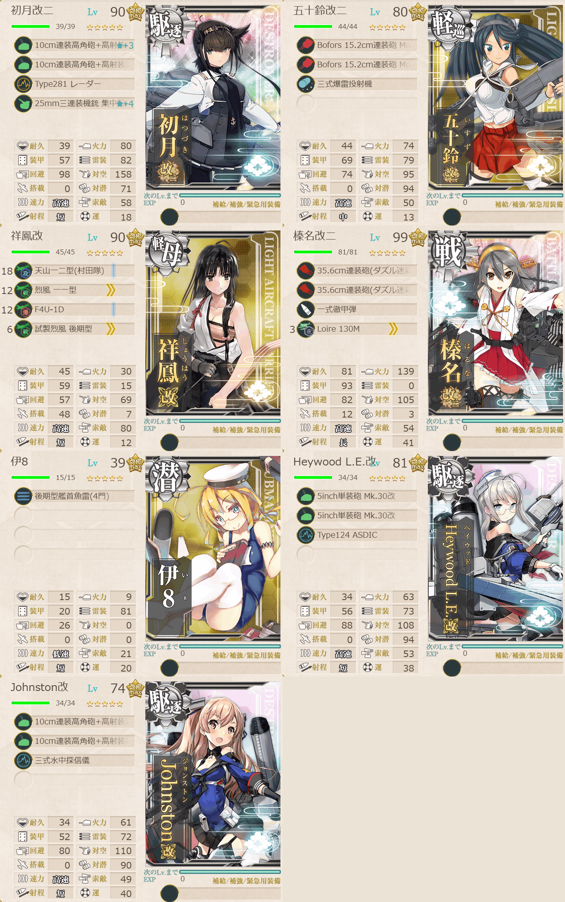
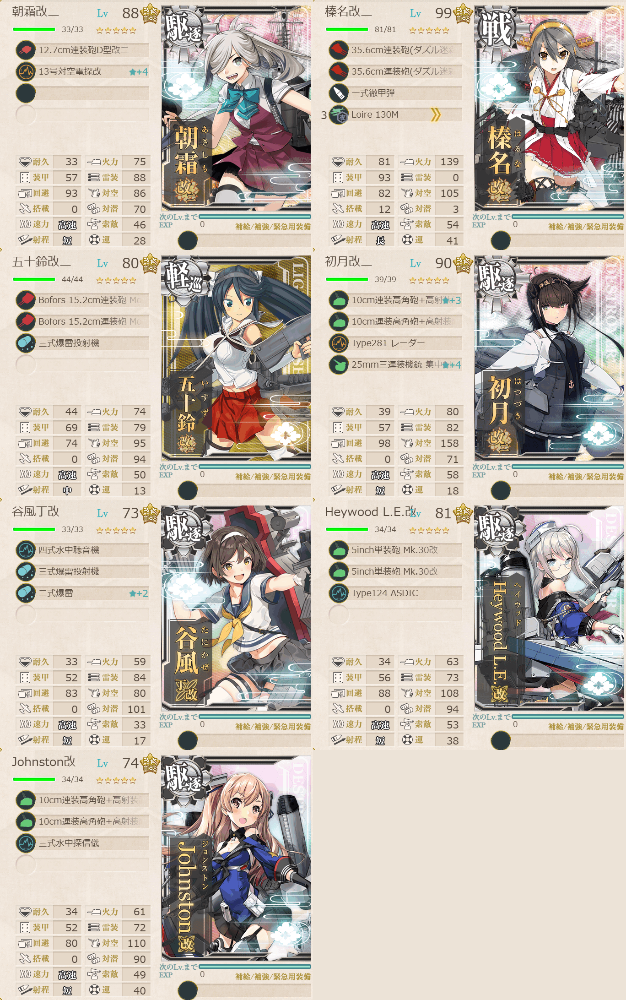
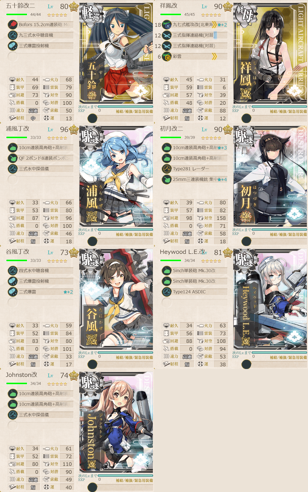
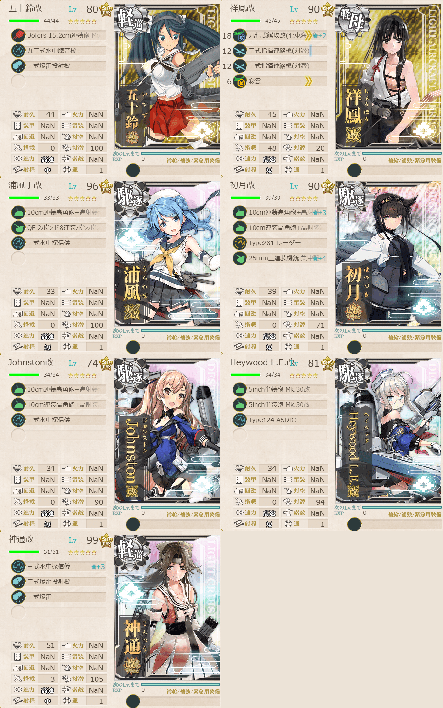

# 2026夏イベE3ギミック1

## 目次
<details>
<summary>クリックで展開</summary>

- [2026夏イベE3ギミック1](#2026夏イベe3ギミック1)
  - [目次](#目次)
  - [E3の順番（短縮リンク）](#e3の順番短縮リンク)
  - [難易度](#難易度)
  - [ギミック](#ギミック)
  - [編成](#編成)
    - [E2](#e2)
      - [艦隊編成](#艦隊編成)
      - [基地航空隊編成](#基地航空隊編成)
      - [所感](#所感)
      - [出撃カウンター(この編成になってからの記録)](#出撃カウンターこの編成になってからの記録)
    - [C2](#c2)
      - [艦隊編成](#艦隊編成-1)
      - [基地航空隊編成](#基地航空隊編成-1)
      - [所感](#所感-1)
      - [出撃カウンター(この編成になってからの記録)](#出撃カウンターこの編成になってからの記録-1)
    - [B2](#b2)
      - [艦隊編成](#艦隊編成-2)
      - [基地航空隊編成](#基地航空隊編成-2)
      - [所感](#所感-2)
      - [出撃カウンター(この編成になってからの記録)](#出撃カウンターこの編成になってからの記録-2)
    - [D2](#d2)
      - [艦隊編成](#艦隊編成-3)
      - [基地航空隊編成](#基地航空隊編成-3)
      - [所感](#所感-3)
      - [出撃カウンター(この編成になってからの記録)](#出撃カウンターこの編成になってからの記録-3)
  - [参考文献(Reference)](#参考文献reference)

</details>

---

## E3の順番（短縮リンク）
- [ギミック1](./[1]ギミック1.md)    ←今ここ
- [ゲージ1-戦力](./[2]ゲージ1-戦力.md)
- [ゲージ2-輸送](./[3]ゲージ2-輸送.md)
- [ゲージ3-戦力](./[4]ゲージ3-戦力.md)
- [ゲージ4-戦力](./[5]ゲージ4-戦力.md)

---

## 難易度
丙

---

## ギミック
| マス＼難易度 | 甲 | 乙 | 丙 | 丁 |
| --- | --- | --- | --- | --- |
|E2マス|S勝利×2回|A勝利×1回|A勝利×1回|A勝利×1回|
|C2マス|A勝利×2回|A勝利×1回|A勝利×1回|A勝利×1回|
|B2マス|S勝利×2回|A勝利×1回|A勝利×1回|A勝利×1回|
|D2マス|A勝利×2回|A勝利×1回|A勝利×1回|A勝利×1回|

(引用元:四腕『【夏イベ】E3 ギミック ウルシー泊地への本格反攻【反撃！第三十一戦隊の戦い】』,2026)

---

## 編成
### E2
#### 艦隊編成



- **第3艦隊:**
```yaml
E3ギミック1E2艦隊:
  - name: 初月改二
    level: 90
    equipments:
      - 10cm連装高角砲+高射装置☆3
      - 10cm連装高角砲+高射装置
      - Type281 レーダー
      - 25mm三連装機銃 集中配備☆4

  - name: 五十鈴改二
    level: 80
    equipments:
      - Bofors 15.2cm連装砲 Model 1930
      - Bofors 15.2cm連装砲 Model 1930
      - 三式爆雷投射機

  - name: 祥鳳改
    level: 90
    equipments:
      - 天山一二型(村田隊)
      - 烈風 一一型
      - F4U-1D
      - 試製烈風 後期型

  - name: 榛名改二
    level: 99
    equipments:
      - 35.6cm連装砲(ダズル迷彩)
      - 35.6cm連装砲(ダズル迷彩)
      - 一式徹甲弾
      - Loire 130M

  - name: 伊8
    level: 39
    equipments:
      - 後期型艦首魚雷(4門)

  - name: Heywood L.E.改
    level: 81
    equipments:
      - 5inch単装砲 Mk.30改
      - 5inch単装砲 Mk.30改
      - Type124 ASDIC

  - name: Johnston改
    level: 74
    equipments:
      - 10cm連装高角砲+高射装置
      - 10cm連装高角砲+高射装置
      - 三式水中探信儀
```

- **制空値:** 145
- **33式分岐点係数:**

|番号|係数|
|:---:|---|
|1|14|
|2|26.2|
|3|38.4|
|4|50.6|

> 戦艦1軽空1軽巡1駆逐3潜水1【第三十一戦隊】【増強第三十一戦隊】
> 
> 【AA2DEE1E2】(A2:空襲 E:潜水 E1:空襲 E2:通常(2回))
> 
> 陣形選択例：輪形陣→警戒陣→輪形陣→単縦陣
> 
> ルート固定：正空0, 軽巡1以上, 駆逐3以上, 潜水1または軽巡2 (仮置き)

(引用元:四腕『【夏イベ】E3 ギミック ウルシー泊地への本格反攻【反撃！第三十一戦隊の戦い】』,2026)

#### 基地航空隊編成

```yaml
E3ギミック1E2基地航空隊:
  - number: 1
    mode: 出撃
    squadrons:
      - 銀河(江草隊)
      - 銀河
      - 一式陸攻
      - PBY-5A Catalina #配置転換で陸攻にできなかったのでそのまま出撃

  - number: 2
    mode: 防空
    squadrons:
      - 試製 秋水
      - 試製 秋水
      - 紫電二一型 紫電改
      - 紫電二一型 紫電改
```

> 戦闘行動半径　A2:空襲(5) E:潜水(5) E1:空襲(6) E2:通常(7)
>
> - 1部隊目：ギミックマスに集中
> - 2部隊目：防空

(引用元:四腕『【夏イベ】E3 ギミック ウルシー泊地への本格反攻【反撃！第三十一戦隊の戦い】』,2026)

#### 所感
五十鈴が中破。とは言え大したことはなさそう。ボスのHPは無駄に高いので夜戦はやらず、A勝利でそのまま終了。

#### 出撃カウンター(この編成になってからの記録)

**合計:** 1

|リザルト|回数|
|:---:|---|
|S勝利||
|A勝利|1|

---

### C2
#### 艦隊編成



- **第3艦隊:**
```yaml
E3ギミック1C2艦隊:
  - name: 朝霜改二
    level: 88
    equipments:
      - 12.7cm連装砲D型改二
      - 13号対空電探改☆4

  - name: 榛名改二
    level: 99
    equipments:
      - 35.6cm連装砲(ダズル迷彩)
      - 35.6cm連装砲(ダズル迷彩)
      - 一式徹甲弾
      - Loire 130M

  - name: 五十鈴改二
    level: 80
    equipments:
      - Bofors 15.2cm連装砲 Model 1930
      - Bofors 15.2cm連装砲 Model 1930
      - 三式爆雷投射機

  - name: 初月改二
    level: 90
    equipments:
      - 10cm連装高角砲+高射装置☆3
      - 10cm連装高角砲+高射装置
      - Type281 レーダー
      - 25mm三連装機銃 集中配備☆4

  - name: 谷風丁改
    level: 73
    equipments:
      - 四式水中聴音機
      - 三式爆雷投射機
      - 二式爆雷☆2

  - name: Heywood L.E.改
    level: 81
    equipments:
      - 5inch単装砲 Mk.30改
      - 5inch単装砲 Mk.30改
      - Type124 ASDIC

  - name: Johnston改
    level: 74
    equipments:
      - 10cm連装高角砲+高射装置
      - 10cm連装高角砲+高射装置
      - 三式水中探信儀
```

- **制空値:** 0
- **33式分岐点係数:**

|番号|係数|
|:---:|---|
|1|13.08|
|2|25.38|
|3|37.68|
|4|49.98|

> 戦艦1軽巡1駆逐5【第三十一戦隊】【増強第三十一戦隊】
> 
> 【AA2BCC1C2】(A2:空襲 C:潜水 C1:潜水 C2:通常(2回))
> 
> 陣形選択例：輪形陣→単横陣→単横陣→単縦陣
> 
> ルート固定：正空0, 軽巡級1以上, 駆逐5以上

(引用元:四腕『【夏イベ】E3 ギミック ウルシー泊地への本格反攻【反撃！第三十一戦隊の戦い】』,2026)

#### 基地航空隊編成

```yaml
E3ギミック1C2基地航空隊:
  - number: 1
    mode: 待機
    squadrons:
      - 銀河(江草隊)
      - 銀河
      - 一式陸攻
      - 一式陸攻

  - number: 2
    mode: 防空
    squadrons:
      - 試製 秋水
      - 試製 秋水
      - 紫電二一型 紫電改
      - 紫電二一型 紫電改
```

> 戦闘行動半径　A2:空襲(5) C:潜水(7) C1:潜水(8) C2:通常(8)
> - 1部隊目：ギミックマスに集中
> - 2部隊目：防空

(引用元:四腕『【夏イベ】E3 ギミック ウルシー泊地への本格反攻【反撃！第三十一戦隊の戦い】』,2026)

#### 所感
一度別編成で行って潜水艦マスで狂わされたので編成をちょっと変更。そしたら一発で行けた。ボスマスは昼戦で大破までさせられたのでそのまま夜戦でフィニッシュ。

朝霜の装備見てなくて舐めプしてたことに今気づいたorz

#### 出撃カウンター(この編成になってからの記録)

**合計:** 1

|リザルト|回数|
|:---:|---|
|S勝利|1|
|A勝利||

---

### B2
#### 艦隊編成



- **第3艦隊:**
```yaml
E3ギミック1B2艦隊:
  - name: 五十鈴改二
    level: 80
    equipments:
      - Bofors 15.2cm連装砲 Model 1930
      - 九三式水中聴音機
      - 三式爆雷投射機

  - name: 祥鳳改
    level: 90
    equipments:
      - 九七式艦攻改(北東海軍航空隊)☆2
      - 三式指揮連絡機(対潜)
      - 三式指揮連絡機(対潜)
      - 彩雲

  - name: 浦風丁改
    level: 96
    equipments:
      - 10cm連装高角砲+高射装置
      - QF 2ポンド8連装ポンポン砲
      - 三式水中探信儀

  - name: 初月改二
    level: 90
    equipments:
      - 10cm連装高角砲+高射装置☆3
      - 10cm連装高角砲+高射装置
      - Type281 レーダー
      - 25mm三連装機銃 集中配備☆4

  - name: 谷風丁改
    level: 73
    equipments:
      - 四式水中聴音機
      - 三式爆雷投射機
      - 二式爆雷☆2

  - name: Heywood L.E.改
    level: 81
    equipments:
      - 5inch単装砲 Mk.30改
      - 5inch単装砲 Mk.30改
      - Type124 ASDIC

  - name: Johnston改
    level: 74
    equipments:
      - 10cm連装高角砲+高射装置
      - 10cm連装高角砲+高射装置
      - 三式水中探信儀
```

- **制空値:** 3
- **33式分岐点係数:**

|番号|係数|
|:---:|---|
|1|19.2|
|2|35.8|
|3|52.4|
|4|69|

> 軽空1軽巡1駆逐5【増強第三十一戦隊】【第三十一戦隊】
> 
> 【AA2BB1B2】(A2:空襲 B1:潜水空襲 B2:潜水(2回))
> 
> ルート固定：正空0, 軽巡級1以上, 駆逐5以上
> 
> 陣形選択例：輪形陣→警戒陣→単横陣

(引用元:四腕『【夏イベ】E3 ギミック ウルシー泊地への本格反攻【反撃！第三十一戦隊の戦い】』,2026)

#### 基地航空隊編成

```yaml
基地航空隊:
  - number: 1
    mode: 待機
    squadrons:
      - 銀河(江草隊)
      - 銀河
      - 一式陸攻
      - 一式陸攻

  - number: 2
    mode: 防空
    squadrons:
      - 試製 秋水
      - 試製 秋水
      - 紫電二一型 紫電改
      - 紫電二一型 紫電改
```

> 戦闘行動半径　A2:空襲(5) B1:潜水空襲(7) B2:潜水(6)
>
> - 1部隊目：待機orギミックマスに集中
> - 2部隊目：防空

(引用元:四腕『【夏イベ】E3 ギミック ウルシー泊地への本格反攻【反撃！第三十一戦隊の戦い】』,2026)

#### 所感
意外と削りきれた。

#### 出撃カウンター(この編成になってからの記録)

**合計:** 1

|リザルト|回数|
|:---:|---|
|S勝利|1|
|A勝利||

---

### D2
#### 艦隊編成



- **第3艦隊:**
```yaml
E3ギミック1D2艦隊:
  - name: 五十鈴改二
    level: 80
    equipments:
      - Bofors 15.2cm連装砲 Model 1930
      - 九三式水中聴音機
      - 三式爆雷投射機

  - name: 祥鳳改
    level: 90
    equipments:
      - 九七式艦攻改(北東海軍航空隊)☆2
      - 三式指揮連絡機(対潜)
      - 三式指揮連絡機(対潜)
      - 彩雲

  - name: 浦風丁改
    level: 96
    equipments:
      - 10cm連装高角砲+高射装置
      - QF 2ポンド8連装ポンポン砲
      - 三式水中探信儀

  - name: 初月改二
    level: 90
    equipments:
      - 10cm連装高角砲+高射装置☆3
      - 10cm連装高角砲+高射装置
      - Type281 レーダー
      - 25mm三連装機銃 集中配備☆4

  - name: Johnston改
    level: 74
    equipments:
      - 10cm連装高角砲+高射装置
      - 10cm連装高角砲+高射装置
      - 三式水中探信儀

  - name: Heywood L.E.改
    level: 81
    equipments:
      - 5inch単装砲 Mk.30改
      - 5inch単装砲 Mk.30改
      - Type124 ASDIC

  - name: 神通改二
    level: 99
    equipments:
      - 三式水中探信儀☆3
      - 三式爆雷投射機
      - 二式爆雷
```

- **制空値:** 3
- **33式分岐点係数:**

|番号|係数|
|:---:|---|
|1|20.81|
|2|37.41|
|3|54.01|
|4|70.61|

> 軽空1軽巡2駆逐4【第三十一戦隊】【増強第三十一戦隊】
> 
> 【AA2DD1D2】(A2:空襲 D1:潜水空襲 D2:潜水(2回))
> 
> ルート固定：正空0, 軽巡2以上, 駆逐3以上
> 
> 陣形選択例：輪形陣→警戒陣→単横陣

(引用元:四腕『【夏イベ】E3 ギミック ウルシー泊地への本格反攻【反撃！第三十一戦隊の戦い】』,2026)

#### 基地航空隊編成

```yaml
E3ギミック1D2基地航空隊:
  - number: 1
    mode: 休息
    squadrons:
      - 銀河(江草隊)
      - 銀河
      - 一式陸攻
      - 一式陸攻

  - number: 2
    mode: 防空
    squadrons:
      - 試製 秋水
      - 試製 秋水
      - 紫電二一型 紫電改
      - 紫電二一型 紫電改
```

> 戦闘行動半径　A2:空襲(5) D1:潜水空襲(6) D2:潜水(6)
> 
> - 1部隊目：待機orギミックマスに集中
> - 2部隊目：防空

(引用元:四腕『【夏イベ】E3 ギミック ウルシー泊地への本格反攻【反撃！第三十一戦隊の戦い】』,2026)

#### 所感
ここもすんなり行けた😊

#### 出撃カウンター(この編成になってからの記録)

**合計:** 1

|リザルト|回数|
|:---:|---|
|S勝利|1|
|A勝利||

---

## 参考文献(Reference)
- 四腕『【夏イベ】E3 ギミック ウルシー泊地への本格反攻【反撃！第三十一戦隊の戦い】』, 2026年

---

- [△ 一番上に戻る](#2026夏イベe3ギミック1)
- [イベントトップ](../../README.md)

|前の記事|次の記事|
|---|---|
|[E2ゲージ3-戦力](../../E2/docs/[5]ゲージ3-戦力.md)|[E3ゲージ1-戦力](./[2]ゲージ1-戦力.md)|