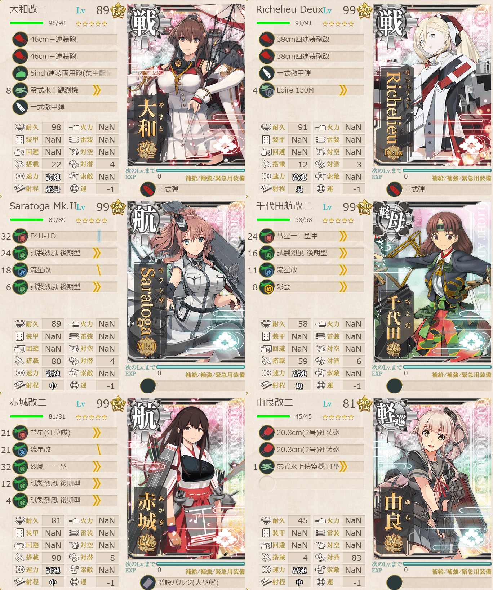

# 2026夏イベE3ゲージ1-戦力

## 目次
<details>
<summary>クリックで展開</summary>

- [2026夏イベE3ゲージ1-戦力](#2026夏イベe3ゲージ1-戦力)
  - [目次](#目次)
  - [E3の順番（短縮リンク）](#e3の順番短縮リンク)
  - [難易度](#難易度)
  - [編成](#編成)
    - [O](#o)
      - [艦隊編成](#艦隊編成)
      - [基地航空隊編成](#基地航空隊編成)
      - [所感](#所感)
      - [出撃カウンター(この編成になってからの記録)](#出撃カウンターこの編成になってからの記録)
  - [参考文献(Reference)](#参考文献reference)

</details>

---

## E3の順番（短縮リンク）
- [ギミック1](./[1]ギミック1.md)    
- [ゲージ1-戦力](./[2]ゲージ1-戦力.md)  ←今ここ
- [ゲージ2-輸送](./[3]ゲージ2-輸送.md)
- [ゲージ3-戦力](./[4]ゲージ3-戦力.md)
- [ゲージ4-戦力](./[5]ゲージ4-戦力.md)

---

## 難易度
丙→丁

---

## 編成
### O
#### 艦隊編成

連合艦隊



- **第1艦隊:**
```yaml
E3ゲージ1-戦力O第1艦隊:
  - name: 大和改二
    level: 89
    equipments:
      - 46cm三連装砲
      - 46cm三連装砲
      - 5inch連装両用砲(集中配備)
      - 零式水上観測機
      - 一式徹甲弾
      - 三式弾

  - name: Richelieu Deux
    level: 99
    equipments:
      - 38cm四連装砲改
      - 38cm四連装砲改
      - 一式徹甲弾
      - Loire 130M
      - 三式弾

  - name: Saratoga Mk.II
    level: 99
    equipments:
      - F4U-1D
      - 試製烈風 後期型
      - 流星改
      - 試製烈風 後期型

  - name: 千代田航改二
    level: 99
    equipments:
      - 彗星一二型甲
      - 試製烈風 後期型
      - 流星改
      - 彩雲

  - name: 赤城改二
    level: 99
    equipments:
      - 彗星(江草隊)
      - 流星改
      - 烈風 一一型
      - 試製烈風 後期型
      - 試製烈風 後期型
      - 増設バルジ(大型艦)

  - name: 由良改二
    level: 81
    equipments:
      - 20.3cm(2号)連装砲
      - 20.3cm(2号)連装砲
      - 零式水上偵察機11型乙
```


- **第2艦隊:**
```yaml
E3ゲージ1-戦力O第2艦隊:
  - name: 初月改二
    level: 90
    equipments:
      - 10cm連装高角砲+高射装置☆3
      - 10cm連装高角砲+高射装置
      - Type281 レーダー
      - 25mm三連装機銃 集中配備☆4

  - name: Fletcher Mk.II
    level: 99
    equipments:
      - 5inch単装砲 Mk.30改
      - 5inch単装砲 Mk.30改
      - 四式水中聴音機
      - QF 2ポンド8連装ポンポン砲

  - name: 時雨改二
    level: 98
    equipments:
      - 61cm四連装(酸素)魚雷
      - 61cm四連装(酸素)魚雷
      - 61cm四連装(酸素)魚雷
      - 3.7cm FlaK M42

  - name: 矢矧改二乙
    level: 99
    equipments:
      - 61cm四連装(酸素)魚雷
      - 61cm四連装(酸素)魚雷
      - 甲標的 甲型
      - 照明弾
      - 熟練見張員

  - name: 長波改二補
    level: 99
    equipments:
      - 12.7cm連装砲D型改二
      - 61cm四連装(酸素)魚雷☆3
      - 61cm四連装(酸素)魚雷
      - Bofors 40mm四連装機関砲☆4
      - 22号対水上電探改四

  - name: 瑞鳳改二乙
    level: 99
    equipments:
      - 天山一二型(友永隊)
      - 天山一二型(村田隊)
      - 流星改
      - 流星改
```

- **制空値:** 454
- **33式分岐点係数:**

| 番号  | 係数   |
| :---: | ------ |
|   1   | 60.89  |
|   2   | 115.69 |
|   3   | 170.49 |
|   4   | 225.29 |

> 【ウルシー攻撃部隊】空母機動部隊
>
> - 戦艦2空母2軽空1軽巡1
> - 軽巡1駆逐4自由1
> 【FA2GHILO】(A2:空襲 G:潜水 I:通常 L:通常 O:ボス)
> 
> ※要高速統一, 戦艦2以下, 正空2以下, 軽巡2以上, 駆逐4以上
> 
> (軽巡+練巡)2不詳

(引用元:四腕『【夏イベ】E3-1 戦力ゲージ ウルシー泊地への本格反攻【反撃！第三十一戦隊の戦い】』, 2026)

#### 基地航空隊編成

```yaml
E3ゲージ1-戦力O削り基地航空隊:
  - number: 1
    mode: 出撃
    squadrons:
      - 銀河(江草隊)
      - 銀河
      - 一式陸攻
      - PBY-5A Catalina

  - number: 2
    mode: 防空
    squadrons:
      - 試製 秋水
      - 試製 秋水
      - 紫電二一型 紫電改
      - 紫電二一型 紫電改
```

> 戦闘行動半径　A2:空襲(5) G:潜水(7) I:通常(8) J:空襲(9) L:通常(9) O:ボス(9)
> 
> - 1部隊目：ボスマスに集中
> - 2部隊目：防空
> 
> 1部隊のみ出撃可能。

(引用元:四腕『【夏イベ】E3-1 戦力ゲージ ウルシー泊地への本格反攻【反撃！第三十一戦隊の戦い】』, 2026)

#### 所感
優勢に必要な制空値が高すぎるので互角で妥協、割と途中で飛行機刈り取られる。
道中が第二警戒航行序列に制限されるおかげなのか道中の安定性自体は高い。先制対潜がもう少しできれば更に安定はしそう。

ありがたいことに毎度大和がタッチをしてくれるおかげもありSは取りやすかった。

◯ 大和タッチ:[大和武蔵(大和型改二)特殊攻撃の概要　スキル発動条件や実際の装備例等](https://zekamashi.net/kancolle-kouryaku/yamato-skill/)

#### 出撃カウンター(この編成になってからの記録)

> [!IMPORTANT]
> 丙で削りきれなくて途中で丁に落とした。ああああああああああ！！バケツが、バケツが勿体ない！！下の記録は丙のもので、丁になってからはS勝利2回。

- **合計:** 9(丁含む)

| リザルト | 回数 |
| :------: | ---- |
|  S勝利   | 4    |
|  A勝利   | 2    |
| 道中撤退 | 1    |

- **道中撤退内訳:**

| 回数  | マス  | 原因                                                                     |
| :---: | :---: | ------------------------------------------------------------------------ |
|   1   |   L   | 事前のGマスでの潜水艦で矢矧が中破したところをLマスの戦艦に的確に抜かれた |

~~1回ミスってE2に出撃しちゃったのは内緒~~

---

## 参考文献(Reference)
- 四腕[『【夏イベ】E3-1 戦力ゲージ ウルシー泊地への本格反攻【反撃！第三十一戦隊の戦い】』](https://zekamashi.net/202607-event/urushiihakuchi-hankou-2/), 2026年
- 四腕[『大和武蔵(大和型改二)特殊攻撃の概要　スキル発動条件や実際の装備例等』](https://zekamashi.net/kancolle-kouryaku/yamato-skill/), 2022年

---

- [△ 一番上に戻る](#2026夏イベe3ゲージ1-戦力)
- [イベントトップ](../../README.md)

| 前の記事                         | 次の記事                             |
| -------------------------------- | ------------------------------------ |
| [E3ギミック1](./[1]ギミック1.md) | [E3ゲージ2-輸送]([3]ゲージ2-輸送.md) |