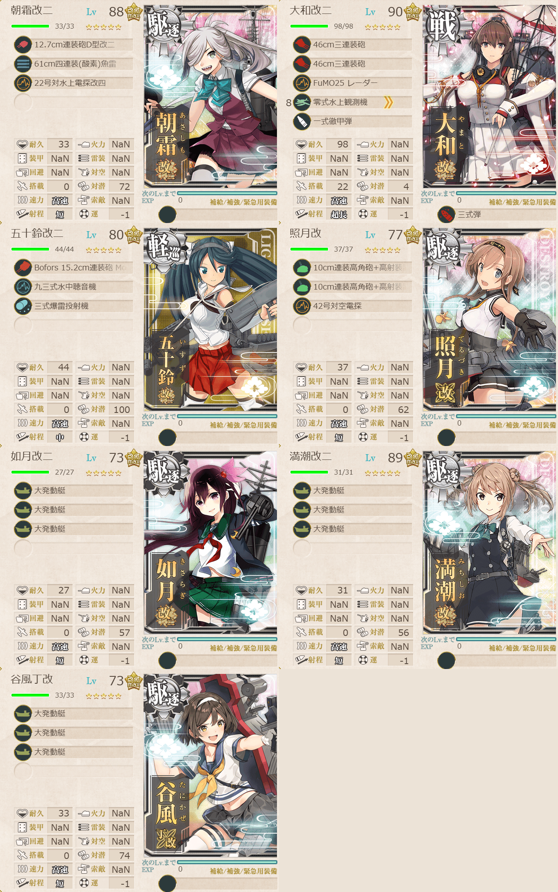

# 2026夏イベE3ゲージ2-輸送

## 目次
<details>
<summary>クリックで展開</summary>

- [2026夏イベE3ゲージ2-輸送](#2026夏イベe3ゲージ2-輸送)
  - [目次](#目次)
  - [E3の順番（短縮リンク）](#e3の順番短縮リンク)
  - [難易度](#難易度)
  - [編成](#編成)
    - [Q](#q)
      - [艦隊編成](#艦隊編成)
      - [基地航空隊編成](#基地航空隊編成)
      - [所感](#所感)
      - [出撃カウンター(この編成になってからの記録)](#出撃カウンターこの編成になってからの記録)
  - [参考文献(Reference)](#参考文献reference)

</details>

---

## E3の順番（短縮リンク）
- [ギミック1](./[1]ギミック1.md)    
- [ゲージ1-戦力](./[2]ゲージ1-戦力.md) 
- [ゲージ2-輸送](./[3]ゲージ2-輸送.md)  ←今ここ
- [ゲージ3-戦力](./[4]ゲージ3-戦力.md)
- [ゲージ4-戦力]

---

## 難易度
丁

---

## 編成
### Q
#### 艦隊編成



- **第3艦隊:**
```yaml
E3ゲージ2-輸送Q艦隊隊:
  - name: 朝霜改二
    level: 88
    equipments:
      - 12.7cm連装砲D型改二
      - 61cm四連装(酸素)魚雷
      - 22号対水上電探改四

  - name: 大和改二
    level: 90
    equipments:
      - 46cm三連装砲
      - 46cm三連装砲
      - FuMO25 レーダー
      - 零式水上観測機
      - 一式徹甲弾
      - 三式弾

  - name: 五十鈴改二
    level: 80
    equipments:
      - Bofors 15.2cm連装砲 Model 1930
      - 九三式水中聴音機
      - 三式爆雷投射機

  - name: 照月改
    level: 77
    equipments:
      - 10cm連装高角砲+高射装置
      - 10cm連装高角砲+高射装置
      - 42号対空電探

  - name: 如月改二
    level: 73
    equipments:
      - 大発動艇
      - 大発動艇
      - 大発動艇

  - name: 満潮改二
    level: 89
    equipments:
      - 大発動艇
      - 大発動艇
      - 大発動艇

  - name: 谷風丁改
    level: 73
    equipments:
      - 大発動艇
      - 大発動艇
      - 大発動艇
```

- **制空値:** 0
- **33式分岐点係数:**

|番号|係数|
|:---:|---|
|1|19.53|
|2|38.13|
|3|56.73|
|4|75.33|

- **TP(輸送):**

|リザルト|数値|
|:---:|---|
|S勝利99|
|A勝利|69|

> 戦艦1軽巡1駆逐5【増強第三十一戦隊】【第三十一戦隊】
> 
> 【AA2BCC2PQ】(A2:空襲 C:潜水 C2:通常 Q:ボス)
> 
> 陣形選択例：輪形陣→警戒陣→警戒陣→単縦陣

(引用元:四腕『【夏イベ】E3-2 輸送ゲージ ウルシー泊地への本格反攻【反撃！第三十一戦隊の戦い】』,2026)

#### 基地航空隊編成

```yaml
E3ゲージ2-輸送Q基地航空隊:
  - number: 1
    mode: 出撃
    squadrons:
      - 銀河(江草隊)
      - 銀河
      - 一式陸攻
      - 一式陸攻
```

> 戦闘行動半径　A2:空襲(5) C:潜水(7) Q:ボス(8)
>
> - 1部隊目：ボスマスに集中
> - 2部隊目：防空
> 
> 戦闘行動半径8

(引用元:四腕『【夏イベ】E3-2 輸送ゲージ ウルシー泊地への本格反攻【反撃！第三十一戦隊の戦い】』,2026)

#### 所感
すっげーきつかったゾ。

真面目な話多分照月の枠をFletcherにするとかで安定性は変わったと思う。後の祭りですが...

空襲で案外やられちゃうし潜水艦マスで中破→ボス前で大破、みたいなのも結構あったので丁とは言えど対空見張りは厳として、潜水艦対策もちゃんとしよう。

#### 出撃カウンター(この編成になってからの記録)

**合計:** 12

|リザルト|回数|
|:---:|---|
|S勝利|6|
|A勝利|1|
|道中撤退|5|

**道中撤退内訳**

|回数|マス|原因|
|:---:|:---:|---|
|1|A2|空襲でシンプルに満潮が大破|
|2|A2|空襲でシンプルに朝霜が大破|
|3|C2|軽巡ム級に照月&谷風がぶち抜かれて大破|
|4|A2|空襲でシンプルに五十鈴が大破|
|5|C2|軽巡ム級に満潮がぶち抜かれて大破|

---

## 参考文献(Reference)
- 四腕[『【夏イベ】E3-2 輸送ゲージ ウルシー泊地への本格反攻【反撃！第三十一戦隊の戦い】』](https://zekamashi.net/202607-event/urushiihakuchi-hankou-3/), 2026年

---

- [△ 一番上に戻る](#2026夏イベe3ゲージ2-輸送)
- [イベントトップ](../../README.md)

|前の記事|次の記事|
|---|---|
|[E3ゲージ1-戦力](./[2]ゲージ1-戦力.md)|[E3ゲージ3-戦力](./[4]ゲージ3-戦力.md)|