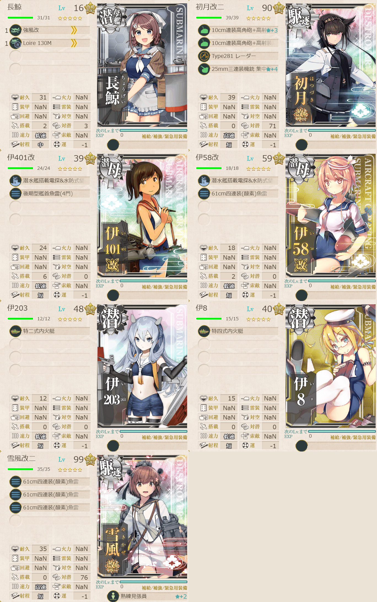

# 2026夏イベE3ゲージ3-戦力

## 目次
<details>
<summary>クリックで展開</summary>

- [2026夏イベE3ゲージ3-戦力](#2026夏イベe3ゲージ3-戦力)
  - [目次](#目次)
  - [E3の順番（短縮リンク）](#e3の順番短縮リンク)
  - [難易度](#難易度)
  - [編成](#編成)
    - [X](#x)
      - [艦隊編成](#艦隊編成)
      - [基地航空隊編成](#基地航空隊編成)
      - [所感](#所感)
      - [出撃カウンター(この編成になってからの記録)](#出撃カウンターこの編成になってからの記録)
  - [参考文献(Reference)](#参考文献reference)

</details>

---

## E3の順番（短縮リンク）
- [ギミック1](./[1]ギミック1.md)    
- [ゲージ1-戦力](./[2]ゲージ1-戦力.md) 
- [ゲージ2-輸送](./[3]ゲージ2-輸送.md)  
- [ゲージ3-戦力](./[4]ゲージ3-戦力.md)  ←今ここ
- [ゲージ4-戦力](./[5]ゲージ4-戦力.md)

---

## 難易度
丁

---

## 編成
### X
#### 艦隊編成



- **第3艦隊:**
```yaml
E3ゲージ3-戦力X艦隊:
  - name: 長鯨
    level: 16
    equipments:
      - 強風改
      - Loire 130M

  - name: 初月改二
    level: 90
    equipments:
      - 10cm連装高角砲+高射装置☆3
      - 10cm連装高角砲+高射装置
      - Type281 レーダー
      - 25mm三連装機銃 集中配備☆4

  - name: 伊401改
    level: 39
    equipments:
      - 潜水艦搭載電探&水防式望遠鏡
      - 後期型艦首魚雷(4門)

  - name: 伊58改
    level: 59
    equipments:
      - 潜水艦搭載電探&水防式望遠鏡
      - 61cm四連装(酸素)魚雷

  - name: 伊203
    level: 48
    equipments:
      - 特二式内火艇

  - name: 伊8
    level: 40
    equipments:
      - 特四式内火艇

  - name: 雪風改二
    level: 99
    equipments:
      - 61cm四連装(酸素)魚雷
      - 61cm四連装(酸素)魚雷
      - 61cm四連装(酸素)魚雷
      - 熟練見張員☆2
```

- **制空値:** 30
- **33式分岐点係数:**

|番号|係数|
|:---:|---|
|1|8.44|
|2|23.44|
|3|38.44|
|4|53.44|

> 駆逐2潜水4潜母1【第六艦隊】
> 
> 【RTVX】(T:空襲 V:通常 X:ボス)
> 
> 陣形選択例：輪形陣→警戒陣(単縦陣)→単縦陣

(引用元:四腕『【夏イベ】E3-3 戦力ゲージ2 ウルシー泊地への本格反攻【反撃！第三十一戦隊の戦い】』,2026)

#### 基地航空隊編成

```yaml
E3ゲージ3-戦力X基地航空隊:
  - number: 1
    mode: 出撃
    squadrons:
      - 銀河(江草隊)
      - 銀河
      - 一式陸攻
      - 一式陸攻

  - number: 2
    mode: 出撃
    squadrons:
      - 九六式陸攻
      - 九六式陸攻
      - 九六式陸攻
      - 九六式陸攻

  - number: 3
    mode: 防空
    squadrons:
      - 試製 秋水
      - 試製 秋水
      - 紫電二一型 紫電改
      - 紫電二一型 紫電改
```

> 戦闘行動半径　T:空襲(6) V:通常(6) X:ボス(7)
>
> - 1部隊目：道中orボスマスに集中
> - 2部隊目：ボスマスに集中
> - 3部隊目：防空

(引用元:四腕『【夏イベ】E3-3 戦力ゲージ2 ウルシー泊地への本格反攻【反撃！第三十一戦隊の戦い】』,2026)

#### 所感

#### 出撃カウンター(この編成になってからの記録)

**合計:** 7

|リザルト|回数|
|:---:|---|
|S勝利|4|
|A勝利|3|

---

## 参考文献(Reference)
- 四腕[『【夏イベ】E3-3 戦力ゲージ2 ウルシー泊地への本格反攻【反撃！第三十一戦隊の戦い】』](https://zekamashi.net/202607-event/urushiihakuchi-hankou-4/), 2026年

---

- [△ 一番上に戻る](#2026夏イベe3ゲージ3-戦力)
- [イベントトップ](../../README.md)

|前の記事|次の記事|
|---|---|
|[E3ゲージ2-輸送](./[3]ゲージ2-輸送.md)|[E3ゲージ4-戦力](./[5]ゲージ4-戦力.md)|