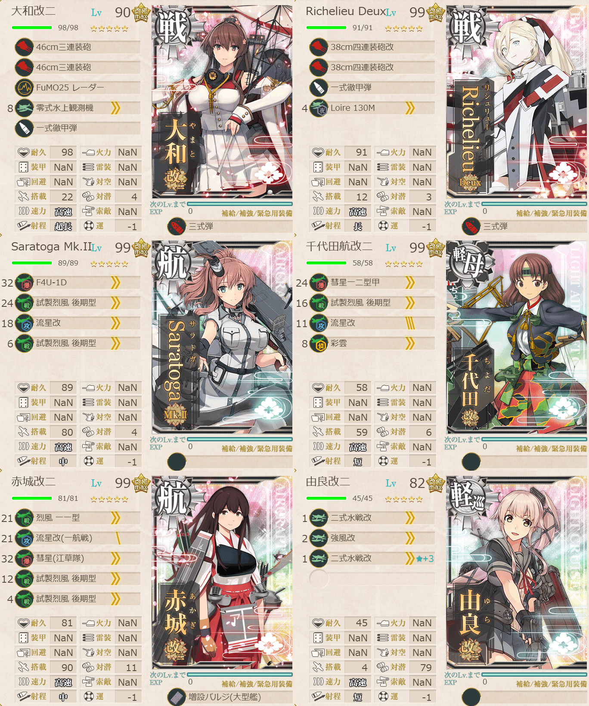
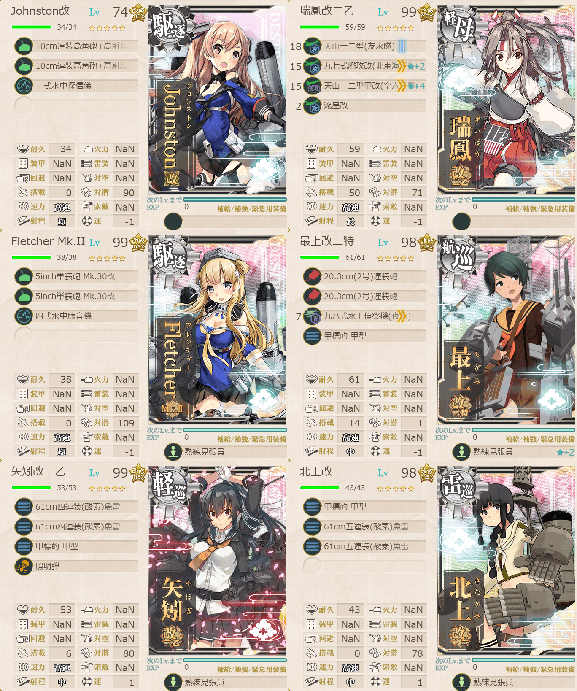
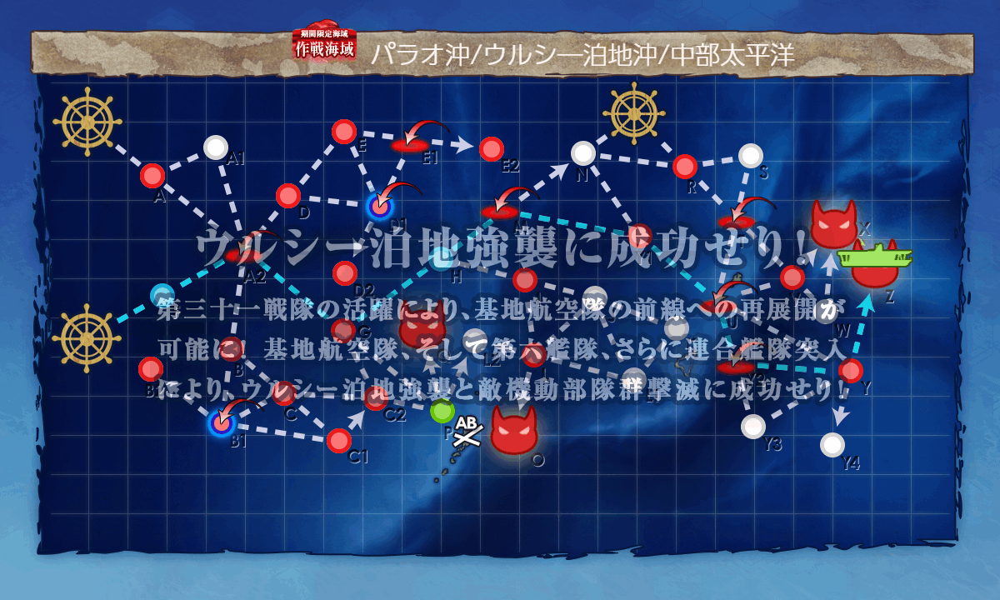

# 2026夏イベE3ゲージ4-戦力

## 目次
<details>
<summary>クリックで展開</summary>

- [2026夏イベE3ゲージ4-戦力](#2026夏イベe3ゲージ4-戦力)
  - [目次](#目次)
  - [E3の順番（短縮リンク）](#e3の順番短縮リンク)
  - [難易度](#難易度)
  - [編成](#編成)
    - [Z](#z)
      - [艦隊編成](#艦隊編成)
      - [基地航空隊編成](#基地航空隊編成)
      - [所感](#所感)
      - [出撃カウンター(この編成になってからの記録)](#出撃カウンターこの編成になってからの記録)
  - [参考文献(Reference)](#参考文献reference)

</details>

---

## E3の順番（短縮リンク）
- [ギミック1](./[1]ギミック1.md)    
- [ゲージ1-戦力](./[2]ゲージ1-戦力.md) 
- [ゲージ2-輸送](./[3]ゲージ2-輸送.md)  
- [ゲージ3-戦力](./[4]ゲージ3-戦力.md)  
- [ゲージ4-戦力](./[5]ゲージ4-戦力.md)  ←今ここ

---

## 難易度
丁

---

## 編成
### Z
#### 艦隊編成

連合艦隊



- **第1艦隊:**
```yaml
E3ゲージ4-戦力Z第1艦隊:
  - name: 大和改二
    level: 90
    equipments:
      - 46cm三連装砲
      - 46cm三連装砲
      - FuMO25 レーダー
      - 零式水上観測機
      - 一式徹甲弾
      - 三式弾

  - name: Richelieu Deux
    level: 99
    equipments:
      - 38cm四連装砲改
      - 38cm四連装砲改
      - 一式徹甲弾
      - Loire 130M
      - 三式弾

  - name: Saratoga Mk.II
    level: 99
    equipments:
      - F4U-1D
      - 試製烈風 後期型
      - 流星改
      - 試製烈風 後期型

  - name: 千代田航改二
    level: 99
    equipments:
      - 彗星一二型甲
      - 試製烈風 後期型
      - 流星改
      - 彩雲

  - name: 赤城改二
    level: 99
    equipments:
      - 烈風 一一型
      - 流星改(一航戦)
      - 彗星(江草隊)
      - 試製烈風 後期型
      - 試製烈風 後期型
      - 増設バルジ(大型艦)

  - name: 由良改二
    level: 82
    equipments:
      - 二式水戦改
      - 強風改
      - 二式水戦改☆3
```



- **第2艦隊:**
```yaml
E3ゲージ4-戦力Z第2艦隊:
  - name: Johnston改
    level: 74
    equipments:
      - 10cm連装高角砲+高射装置
      - 10cm連装高角砲+高射装置
      - 三式水中探信儀

  - name: 瑞鳳改二乙
    level: 99
    equipments:
      - 天山一二型(友永隊)
      - 九七式艦攻改(北東海軍航空隊)☆2
      - 天山一二型甲改(空六号電探改装備機)☆4
      - 流星改

  - name: Fletcher Mk.II
    level: 99
    equipments:
      - 5inch単装砲 Mk.30改
      - 5inch単装砲 Mk.30改
      - 四式水中聴音機
      - 熟練見張員

  - name: 最上改二特
    level: 98
    equipments:
      - 20.3cm(2号)連装砲
      - 20.3cm(2号)連装砲
      - 九八式水上偵察機(夜偵)
      - 甲標的 甲型
      - 熟練見張員☆2

  - name: 矢矧改二乙
    level: 99
    equipments:
      - 61cm四連装(酸素)魚雷
      - 61cm四連装(酸素)魚雷
      - 甲標的 甲型
      - 照明弾
      - 熟練見張員

  - name: 北上改二
    level: 98
    equipments:
      - 甲標的 甲型
      - 61cm五連装(酸素)魚雷
      - 61cm五連装(酸素)魚雷
      - 熟練見張員
```

- **制空値:** 540
- **33式分岐点係数:**

| 番号  | 係数   |
| :---: | ------ |
|   1   | 64.12  |
|   2   | 120.72 |
|   3   | 177.32 |
|   4   | 233.92 |

> 戦艦2空母2軽空1軽巡1
> 
> 軽空1軽巡1駆逐2自由2
> ※自由枠に重巡級/軽巡級/水母想定
> 
> 【FA2GHMY1UY2YZ】
> (A2:空襲 G:潜水 M:空襲 Y1:潜水 U:空襲 Y2:空襲 Y:通常 Z:ボス)
> 
> ※要索敵。
> 
> 戦艦3以下, 正空2以下, 空母4以下, (軽巡+練巡)2以上の編成

(引用元:四腕『【夏イベ】E3-4 戦力ゲージ3 ウルシー泊地への本格反攻【反撃！第三十一戦隊の戦い】』,2026)

#### 基地航空隊編成

```yaml
E3ゲージ4-戦力Z基地航空隊:
  - number: 1
    mode: 出撃
    squadrons:
      - 銀河(江草隊)
      - 銀河
      - 一式陸攻
      - 一式陸攻

  - number: 2
    mode: 出撃
    squadrons:
      - 九六式陸攻
      - 九六式陸攻
      - 九六式陸攻
      - 九六式陸攻

  - number: 3
    mode: 防空
    squadrons:
      - 試製 秋水
      - 試製 秋水
      - 紫電二一型 紫電改
      - 紫電二一型 紫電改
```

> 戦闘行動半径　A2:空襲(5) G:潜水(3) M:空襲(4) Y1:潜水(5) U:空襲(5) Y2:空襲(5) Y:通常(6) Z:ボス(8)
>
> - 1部隊目：ボスマスに集中
> - 2部隊目：ボスマスに集中
> - 3部隊目：防空

(引用元:四腕『【夏イベ】E3-4 戦力ゲージ3 ウルシー泊地への本格反攻【反撃！第三十一戦隊の戦い】』,2026)

#### 所感

思ったより簡単でびっくりした。ストレート勝ち。E2とE3の輸送で沼ったのでキツいかと思ってたけどE3ゲージ3,4は簡単で良かった。
この編成で削り段階では制空権確保、トドメでは航空優勢だった。

参考元では三隈を編成に入れていたが私は北上を編成、けどあんまり変わんないかも。

#### 出撃カウンター(この編成になってからの記録)

- **合計:** 6

| リザルト | 回数 |
| :------: | ---- |
|  S勝利   | 6    |
|  A勝利   |      |


~~ミスって薄くなっちゃった~~

---

## 参考文献(Reference)
- 四腕[『【夏イベ】E3-4 戦力ゲージ3 ウルシー泊地への本格反攻【反撃！第三十一戦隊の戦い】』](https://zekamashi.net/202607-event/urushiihakuchi-hankou-5/), 2026年

---

- [△ 一番上に戻る](#2026夏イベe3ゲージ4-戦力)
- [イベントトップ](../../README.md)

| 前の記事                               | 次の記事                                           |
| -------------------------------------- | -------------------------------------------------- |
| [E3ゲージ3-戦力](./[4]ゲージ3-戦力.md) | [E4ゲージ1-戦力](../../E4/docs/[1]ゲージ1-戦力.md) |