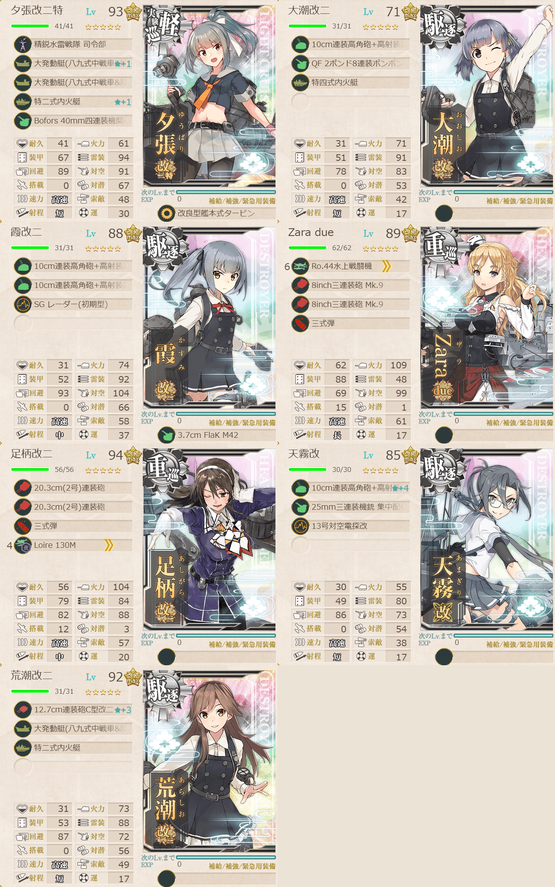

# 2026夏イベE4ゲージ1-戦力

## 目次
<details>
<summary>クリックで展開</summary>

- [2026夏イベE4ゲージ1-戦力](#2026夏イベe4ゲージ1-戦力)
  - [目次](#目次)
  - [E4の順番（短縮リンク）](#e4の順番短縮リンク)
  - [難易度](#難易度)
  - [編成](#編成)
    - [D](#d)
      - [艦隊編成](#艦隊編成)
      - [所感](#所感)
      - [出撃カウンター(この編成になってからの記録)](#出撃カウンターこの編成になってからの記録)
  - [参考文献(Reference)](#参考文献reference)

</details>

---

## E4の順番（短縮リンク）
- [ゲージ1-戦力](./[1]ゲージ1-戦力.md)  ←今ここ
- ギミック1
- [ゲージ2-輸送](./[2]ゲージ2-輸送.md)
- [ゲージ3-戦力](./[3]ゲージ3-戦力.md)
- [ゲージ4-戦力](./[4]ゲージ4-戦力.md)
- [ゲージ5-戦力](./[5]ゲージ5-戦力.md)

> [!IMPORTANT]
> ギミック1は甲難易度のみ。故に私はスルーしてます。

---

## 難易度
丁

---

## 編成
### D
#### 艦隊編成



- **第3艦隊:**
```yaml
E4ゲージ1-戦力D艦隊:
  - name: 夕張改二特
    level: 93
    equipments:
      - 精鋭水雷戦隊 司令部
      - 大発動艇(八九式中戦車&陸戦隊)☆1
      - 大発動艇(八九式中戦車&陸戦隊)
      - 特二式内火艇☆1
      - Bofors 40mm四連装機関砲
      - 改良型艦本式タービン

  - name: 大潮改二
    level: 71
    equipments:
      - 10cm連装高角砲+高射装置
      - QF 2ポンド8連装ポンポン砲
      - 特四式内火艇

  - name: 霞改二
    level: 88
    equipments:
      - 10cm連装高角砲+高射装置
      - 10cm連装高角砲+高射装置
      - SG レーダー(初期型)
      - 3.7cm FlaK M42

  - name: Zara due
    level: 89
    equipments:
      - Ro.44水上戦闘機
      - 8inch三連装砲 Mk.9
      - 8inch三連装砲 Mk.9
      - 三式弾

  - name: 足柄改二
    level: 94
    equipments:
      - 20.3cm(2号)連装砲
      - 20.3cm(2号)連装砲
      - 三式弾
      - Loire 130M

  - name: 天霧改
    level: 85
    equipments:
      - 10cm連装高角砲+高射装置☆4
      - 25mm三連装機銃 集中配備
      - 13号対空電探改

  - name: 荒潮改二
    level: 92
    equipments:
      - 12.7cm連装砲C型改二☆3
      - 大発動艇(八九式中戦車&陸戦隊)
      - 特二式内火艇
```

- **制空値:** 30
- **33式分岐点係数:**

|番号|係数|
|:---:|---|
|1|15.86|
|2|28.46|
|3|41.06|
|4|53.66|

> 航巡1重巡1軽巡1駆逐4(高速統一)【仏第3艦隊】
> 
> 【ACD】(A:混成(Sボート) C:対地Sボート(煙幕) D:ボス)
> 
> 陣形選択例：警戒陣→警戒陣→警戒陣(単縦陣)

(引用元:四腕『【夏イベ】E4-1 戦力ゲージ1 Opération Vado -ヴァード作戦-【L’Élan de la Flotte Française -フランス艦隊の躍動-】』,2026)

#### 所感
内火艇が強い。仮にE2が丙以上でクリアしていて、そこで特四式内火艇を取得していたらそれだけで結構な火力を出してくれるかも。

事前に戦車をどれだけ用意できたかで評価は変わりそう。私は結構簡単だった。丁なのもあって1500ダメージ近く出したのは笑った。
意外と重巡もダメージ出してくれてた。Sボート自体はほとんどいないのでこの難易度ならあんまり気にしなくていいかも。

#### 出撃カウンター(この編成になってからの記録)

**合計:** 5

|リザルト|回数|
|:---:|---|
|S勝利|5|
|A勝利||

---

## 参考文献(Reference)
- 四腕[『【夏イベ】E4-1 戦力ゲージ1 Opération Vado -ヴァード作戦-【L’Élan de la Flotte Française -フランス艦隊の躍動-】』](https://zekamashi.net/202607-event/vado-sakusen-1/), 2026年

---

- [△ 一番上に戻る](#2026夏イベe4ゲージ1-戦力)
- [イベントトップ](../../README.md)

|前の記事|次の記事|
|---|---|
|[E3ゲージ4-戦力](../../E3/docs/[5]ゲージ4-戦力.md)|[E4ゲージ2-輸送](./[2]ゲージ2-輸送.md)|