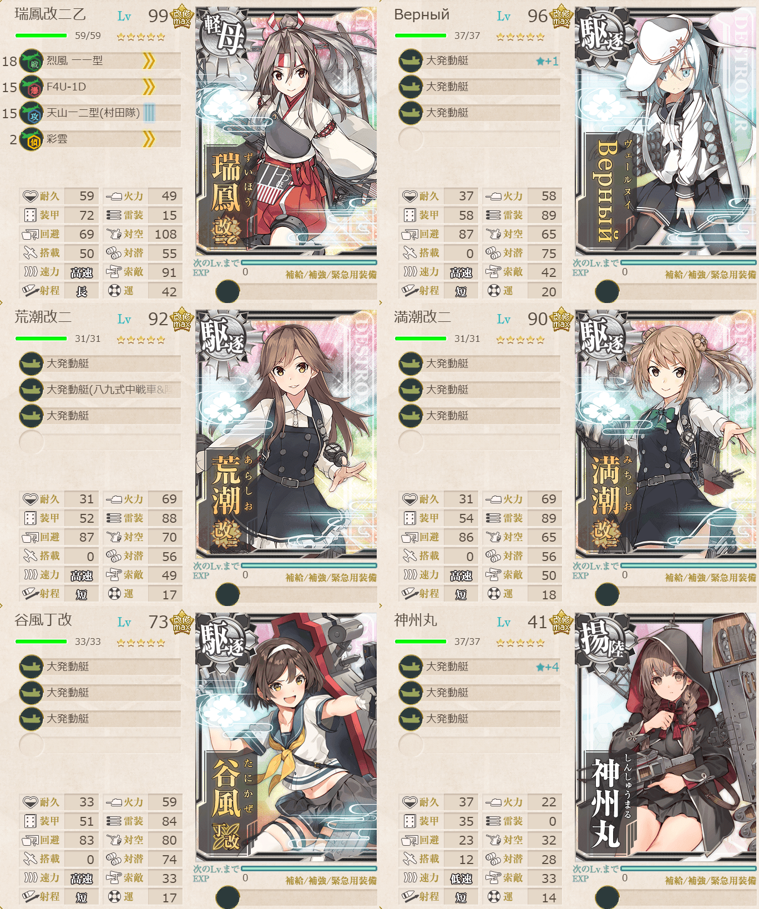
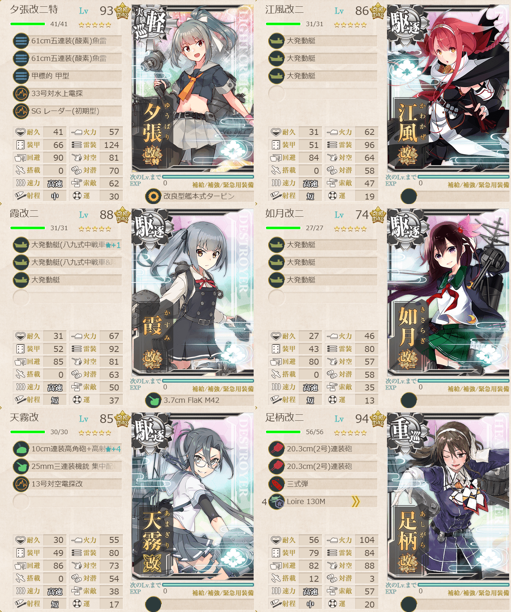

# 2026夏イベE4ゲージ2-輸送

## 目次
<details>
<summary>クリックで展開</summary>

- [2026夏イベE4ゲージ2-輸送](#2026夏イベe4ゲージ2-輸送)
  - [目次](#目次)
  - [E4の順番（短縮リンク）](#e4の順番短縮リンク)
  - [難易度](#難易度)
  - [編成](#編成)
    - [N](#n)
      - [艦隊編成](#艦隊編成)
      - [所感](#所感)
      - [出撃カウンター(この編成になってからの記録)](#出撃カウンターこの編成になってからの記録)
  - [参考文献(Reference)](#参考文献reference)

</details>

---

## E4の順番（短縮リンク）
- [ゲージ1-戦力](./[1]ゲージ1-戦力.md)  
- ギミック1
- [ゲージ2-輸送](./[2]ゲージ2-輸送.md)  ←今ここ
- [ゲージ3-戦力](./[3]ゲージ3-戦力.md)
- [ゲージ4-戦力](./[4]ゲージ4-戦力.md)
- [ゲージ5-戦力](./[5]ゲージ5-戦力.md)

> [!IMPORTANT]
> ギミック1は甲難易度のみ。故に私はスルーしてます。

---

## 難易度
丁

---

## 編成
### N
#### 艦隊編成

連合艦隊



- **第1艦隊:**
```yaml
E4ゲージ2-輸送N第1艦隊:
  - name: 瑞鳳改二乙
    level: 99
    equipments:
      - 烈風 一一型
      - F4U-1D
      - 天山一二型(村田隊)
      - 彩雲

  - name: Верный
    level: 96
    equipments:
      - 大発動艇☆1
      - 大発動艇
      - 大発動艇

  - name: 荒潮改二
    level: 92
    equipments:
      - 大発動艇
      - 大発動艇(八九式中戦車&陸戦隊)
      - 大発動艇

  - name: 満潮改二
    level: 90
    equipments:
      - 大発動艇
      - 大発動艇
      - 大発動艇

  - name: 谷風丁改
    level: 73
    equipments:
      - 大発動艇
      - 大発動艇
      - 大発動艇

  - name: 神州丸
    level: 41
    equipments:
      - 大発動艇☆4
      - 大発動艇
      - 大発動艇
```



- **第2艦隊:**
```yaml
E4ゲージ2-輸送N第2艦隊:
  - name: 夕張改二特
    level: 93
    equipments:
      - 61cm五連装(酸素)魚雷
      - 61cm五連装(酸素)魚雷
      - 甲標的 甲型
      - 33号対水上電探
      - SG レーダー(初期型)
      - 改良型艦本式タービン

  - name: 江風改二
    level: 86
    equipments:
      - 大発動艇
      - 大発動艇
      - 大発動艇

  - name: 霞改二
    level: 88
    equipments:
      - 大発動艇(八九式中戦車&陸戦隊)☆1
      - 大発動艇(八九式中戦車&陸戦隊)
      - 大発動艇
      - 3.7cm FlaK M42

  - name: 如月改二
    level: 74
    equipments:
      - 大発動艇
      - 大発動艇
      - 大発動艇

  - name: 天霧改
    level: 85
    equipments:
      - 10cm連装高角砲+高射装置☆4
      - 25mm三連装機銃 集中配備
      - 13号対空電探改

  - name: 足柄改二
    level: 94
    equipments:
      - 20.3cm(2号)連装砲
      - 20.3cm(2号)連装砲
      - 三式弾
      - Loire 130M
```

- **制空値:** 113
- **33式分岐点係数:**

|番号|係数|
|:---:|---|
|1|18.48|
|2|46.28|
|3|74.08|
|4|101.88|

- **TP(輸送):**

|リザルト|数値|
|:---:|---|
|S勝利|246|
|A勝利|172|

> 【仏第3艦隊】輸送護衛部隊
>
> - 駆逐4自由2
> - 軽巡1駆逐3自由2
> 
>【FE1KLN】(E1:混成(Sボート) K:通常 N:ボス)

> ※要索敵。33式分岐点係数2で索敵値約50以上必要(甲)
> 
> 以下何れかの条件を満たすこと
> ・重巡級1以下
> ・高速統一, 航戦0
> ・(航戦+軽空)0

(引用元:四腕『【夏イベ】E4-2 輸送ゲージ Opération Vado -ヴァード作戦-【L’Élan de la Flotte Française -フランス艦隊の躍動-】』,2026)

#### 所感
流石にこれだけ大発持ったら一回の減少量もデカくて良き。結局3回で終わった。道中2戦しかないし敵も強くはない。ボスマスは、S勝利が取れる範囲の装備で出来るだけ大発やバケツをもつことを意識。
一応索敵は必要なのでそこら辺のバランスは要注意。

#### 出撃カウンター(この編成になってからの記録)

**合計:** 3

|リザルト|回数|
|:---:|---|
|S勝利|3|
|A勝利||

---

## 参考文献(Reference)
- 四腕[『【夏イベ】E4-2 輸送ゲージ Opération Vado -ヴァード作戦-【L’Élan de la Flotte Française -フランス艦隊の躍動-】』](https://zekamashi.net/202607-event/vado-sakusen-3/), 2026年

---

- [△ 一番上に戻る](#2026夏イベe4ゲージ2-輸送)
- [イベントトップ](../../README.md)

|前の記事|次の記事|
|---|---|
|[E4ゲージ1-戦力](./[1]ゲージ1-戦力.md)|[E4ゲージ3-戦力](./[3]ゲージ3-戦力.md)|