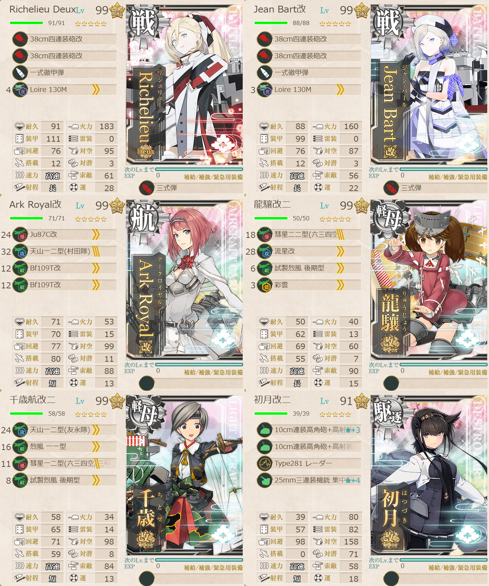
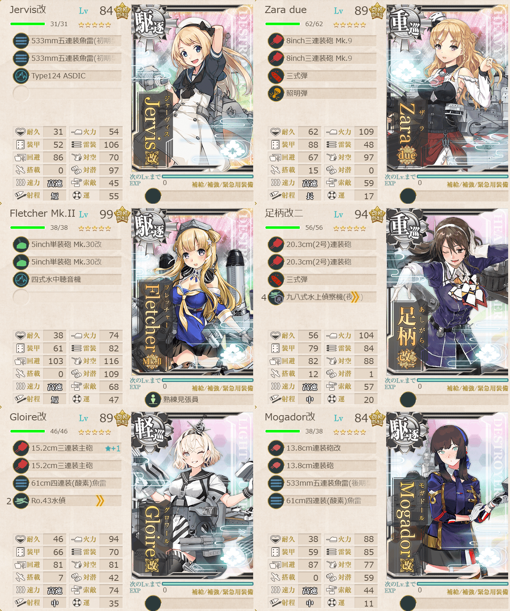

# 2026夏イベE4ゲージ3-戦力

## 目次
<details>
<summary>クリックで展開</summary>

- [2026夏イベE4ゲージ3-戦力](#2026夏イベe4ゲージ3-戦力)
  - [目次](#目次)
  - [E4の順番（短縮リンク）](#e4の順番短縮リンク)
  - [難易度](#難易度)
  - [編成](#編成)
    - [S](#s)
      - [艦隊編成](#艦隊編成)
      - [基地航空隊編成](#基地航空隊編成)
      - [所感](#所感)
      - [出撃カウンター(この編成になってからの記録)](#出撃カウンターこの編成になってからの記録)
  - [参考文献(Reference)](#参考文献reference)

</details>

---

## E4の順番（短縮リンク）
- [ゲージ1-戦力](./[1]ゲージ1-戦力.md)  
- ギミック1
- [ゲージ2-輸送](./[2]ゲージ2-輸送.md)  
- [ゲージ3-戦力](./[3]ゲージ3-戦力.md)  ←今ここ
- [ゲージ4-戦力](./[4]ゲージ4-戦力.md)
- [ゲージ5-戦力](./[5]ゲージ5-戦力.md)

> [!IMPORTANT]
> ギミック1は甲難易度のみ。故に私はスルーしてます。

---

## 難易度
丁

---

## 編成
### S
#### 艦隊編成

連合艦隊



- **第1艦隊:**
```yaml
E4ゲージ3-戦力S第1艦隊:
  - name: Richelieu Deux
    level: 99
    equipments:
      - 38cm四連装砲改
      - 38cm四連装砲改
      - 一式徹甲弾
      - Loire 130M
      - 三式弾

  - name: Jean Bart改
    level: 99
    equipments:
      - 38cm四連装砲改
      - 38cm四連装砲改
      - 一式徹甲弾
      - Loire 130M
      - 三式弾

  - name: Ark Royal改
    level: 99
    equipments:
      - Ju87C改
      - 天山一二型(村田隊)
      - Bf109T改
      - Bf109T改

  - name: 龍驤改二
    level: 99
    equipments:
      - 彗星二二型(六三四空)
      - 流星改
      - 試製烈風 後期型
      - 彩雲

  - name: 千歳航改二
    level: 99
    equipments:
      - 天山一二型(友永隊)
      - 烈風 一一型
      - 彗星一二型(六三四空/三号爆弾搭載機)
      - 試製烈風 後期型

  - name: 初月改二
    level: 91
    equipments:
      - 10cm連装高角砲+高射装置☆3
      - 10cm連装高角砲+高射装置
      - Type281 レーダー
      - 25mm三連装機銃 集中配備☆4
```



- **第2艦隊:**
```yaml
E4ゲージ3-戦力S第2艦隊:
  - name: Jervis改
    level: 84
    equipments:
      - 533mm五連装魚雷(初期型)
      - 533mm五連装魚雷(初期型)
      - Type124 ASDIC

  - name: Zara due
    level: 89
    equipments:
      - 8inch三連装砲 Mk.9
      - 8inch三連装砲 Mk.9
      - 三式弾
      - 照明弾

  - name: Fletcher Mk.II
    level: 99
    equipments:
      - 5inch単装砲 Mk.30改
      - 5inch単装砲 Mk.30改
      - 四式水中聴音機
      - 熟練見張員

  - name: 足柄改二
    level: 94
    equipments:
      - 20.3cm(2号)連装砲
      - 20.3cm(2号)連装砲
      - 三式弾
      - 九八式水上偵察機(夜偵)

  - name: Gloire改
    level: 89
    equipments:
      - 15.2cm三連装主砲☆1
      - 15.2cm三連装主砲
      - 61cm四連装(酸素)魚雷
      - Ro.43水偵

  - name: Mogador改
    level: 84
    equipments:
      - 13.8cm連装砲改
      - 13.8cm連装砲
      - 533mm五連装魚雷(後期型)
      - 61cm四連装(酸素)魚雷
```

- **制空値:** 328
- **33式分岐点係数:**

|番号|係数|
|:---:|---|
|1|43.16|
|2|82.56|
|3|121.96|
|4|161.36|

> 【仏地中海艦隊】空母機動部隊
>
> - 戦艦2正空1軽空2自由1
> - 軽巡1駆逐4自由1
> 
> 【OPQRS】(Q:混成(潜水) R:通常 S:ボス)
> 
> ※低速可。要索敵。
> 
> 戦艦2以下, 正空1以下, 軽空2以下, 軽巡2以上または駆逐4以上, 
> 
> (補給+揚陸+水母)1以下, (補給+揚陸+水母+潜母)2以下 
> 
> 自由枠に重巡級, 軽巡級, 水母(1迄), 駆逐を想定

(引用元:四腕『【夏イベ】E4-3 戦力ゲージ2 Opération Vado -ヴァード作戦-【L’Élan de la Flotte Française -フランス艦隊の躍動-】』,2026)

#### 基地航空隊編成

```yaml
E4ゲージ3-戦力S基地航空隊:
  - number: 1
    mode: 出撃
    squadrons:
      - 銀河(江草隊)
      - 銀河
      - 一式陸攻
      - 一式陸攻

  - number: 2
    mode: 出撃
    squadrons:
      - 九六式陸攻
      - 九六式陸攻
      - Ho229 # ただのイキり運用
      - PBY-5A Catalina

  - number: 3
    mode: 防空
    squadrons:
      - 試製 秋水
      - 試製 秋水
      - 紫電二一型 紫電改
      - 紫電二一型 紫電改
```

> 戦闘行動半径　Q:混成(5) R:通常(6) S:ボス(6)
>
> - 1部隊目：ボスマスに集中
> - 2部隊目：ボスマスに集中
> - 3部隊目：防空

(引用元:四腕『【夏イベ】E4-3 戦力ゲージ2 Opération Vado -ヴァード作戦-【L’Élan de la Flotte Française -フランス艦隊の躍動-】』,2026)

#### 所感

#### 出撃カウンター(この編成になってからの記録)

**合計:** 6

|リザルト|回数|
|:---:|---|
|S勝利|6|
|A勝利||

---

## 参考文献(Reference)
- 四腕[『【夏イベ】E4-3 戦力ゲージ2 Opération Vado -ヴァード作戦-【L’Élan de la Flotte Française -フランス艦隊の躍動-】』](https://zekamashi.net/202607-event/vado-sakusen-4/), 2026年

---

- [△ 一番上に戻る](#2026夏イベe4ゲージ3-戦力)
- [イベントトップ](../../README.md)

|前の記事|次の記事|
|---|---|
|[E4ゲージ2-輸送](./[2]ゲージ2-輸送.md)|[E4ゲージ4-戦力](./[4]ゲージ4-戦力.md)|