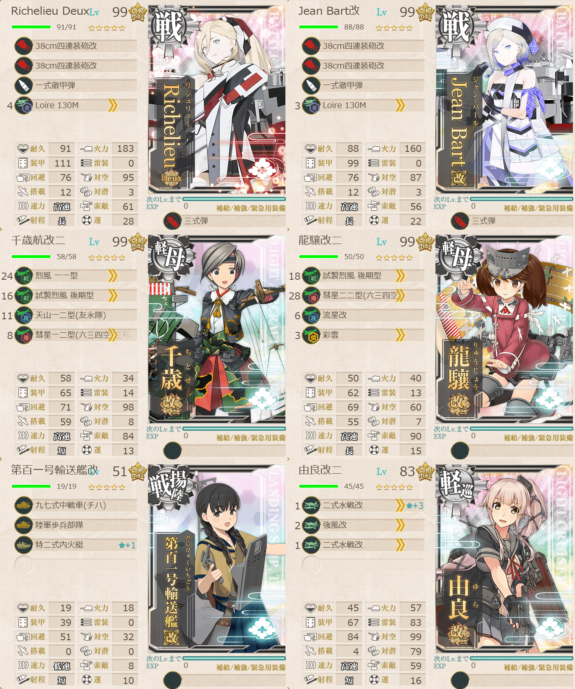
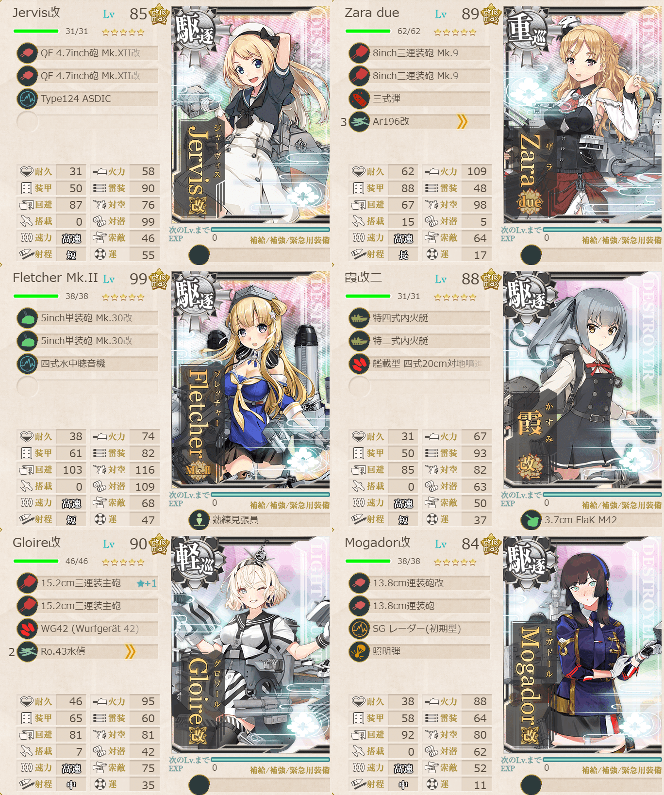

# 2026夏イベE4ゲージ4-戦力

## 目次
<details>
<summary>クリックで展開</summary>

- [2026夏イベE4ゲージ4-戦力](#2026夏イベe4ゲージ4-戦力)
  - [目次](#目次)
  - [E4の順番（短縮リンク）](#e4の順番短縮リンク)
  - [難易度](#難易度)
  - [編成](#編成)
    - [X](#x)
      - [艦隊編成](#艦隊編成)
      - [基地航空隊編成](#基地航空隊編成)
      - [所感](#所感)
      - [出撃カウンター(この編成になってからの記録)](#出撃カウンターこの編成になってからの記録)
  - [参考文献(Reference)](#参考文献reference)

</details>

---

## E4の順番（短縮リンク）
- [ゲージ1-戦力](./[1]ゲージ1-戦力.md)  
- ギミック1
- [ゲージ2-輸送](./[2]ゲージ2-輸送.md)
- [ゲージ3-戦力](./[3]ゲージ3-戦力.md)
- [ゲージ4-戦力](./[4]ゲージ4-戦力.md)  ←今ここ
- [ゲージ5-戦力](./[5]ゲージ5-戦力.md)

> [!IMPORTANT]
> ギミック1は甲難易度のみ。故に私はスルーしてます。

---

## 難易度
丁

---

## 編成
### X
#### 艦隊編成

連合艦隊



- **第1艦隊:**
```yaml
E4ゲージ4-戦力X第1艦隊:
  - name: Richelieu Deux
    level: 99
    equipments:
      - 38cm四連装砲改
      - 38cm四連装砲改
      - 一式徹甲弾
      - Loire 130M
      - 三式弾

  - name: Jean Bart改
    level: 99
    equipments:
      - 38cm四連装砲改
      - 38cm四連装砲改
      - 一式徹甲弾
      - Loire 130M
      - 三式弾

  - name: 千歳航改二
    level: 99
    equipments:
      - 烈風 一一型
      - 試製烈風 後期型
      - 天山一二型(友永隊)
      - 彗星一二型(六三四空/三号爆弾搭載機)

  - name: 龍驤改二
    level: 99
    equipments:
      - 試製烈風 後期型
      - 彗星二二型(六三四空)
      - 流星改
      - 彩雲

  - name: 第百一号輸送艦改
    level: 51
    equipments:
      - 九七式中戦車(チハ)
      - 陸軍歩兵部隊
      - 特二式内火艇☆1

  - name: 由良改二
    level: 83
    equipments:
      - 二式水戦改☆3
      - 強風改
      - 二式水戦改
```



- **第2艦隊:**
```yaml
E4ゲージ4-戦力X第2艦隊:
  - name: Jervis改
    level: 85
    equipments:
      - QF 4.7inch砲 Mk.XII改
      - QF 4.7inch砲 Mk.XII改
      - Type124 ASDIC

  - name: Zara due
    level: 89
    equipments:
      - 8inch三連装砲 Mk.9
      - 8inch三連装砲 Mk.9
      - 三式弾
      - Ar196改

  - name: Fletcher Mk.II
    level: 99
    equipments:
      - 5inch単装砲 Mk.30改
      - 5inch単装砲 Mk.30改
      - 四式水中聴音機
      - 熟練見張員

  - name: 霞改二
    level: 88
    equipments:
      - 特四式内火艇
      - 特二式内火艇
      - 艦載型 四式20cm対地噴進砲
      - 3.7cm FlaK M42

  - name: Gloire改
    level: 90
    equipments:
      - 15.2cm三連装主砲☆1
      - 15.2cm三連装主砲
      - WG42 (Wurfgerat 42)
      - Ro.43水偵

  - name: Mogador改
    level: 84
    equipments:
      - 13.8cm連装砲改
      - 13.8cm連装砲
      - SG レーダー(初期型)
      - 照明弾
```

- **制空値:** 335
- **33式分岐点係数:**

| 番号  | 係数   |
| :---: | ------ |
|   1   | 38.09  |
|   2   | 78.49  |
|   3   | 118.89 |
|   4   | 159.29 |

> 【仏地中海艦隊】水上打撃部隊
>
> - 戦艦2軽巡1自由3
> - 軽巡1駆逐4自由1
> 
> 【OPP1TT1VX】(P1:混成(潜水) T1:潜水 V:通常 X:ボス)
> 
> ※要索敵。33式分岐点係数2で索敵値約80以上必要(甲)
> 
> 低速可。大和型0, 戦艦2以下, 正空1以下, 軽空2以下, 軽巡2以上, 駆逐4以上, 
> 
> (補給+揚陸+水母)1以下, (補給+揚陸+水母+潜母)2以下 

(引用元:四腕『【夏イベ】E4-4 戦力ゲージ3 Opération Vado -ヴァード作戦-【L’Élan de la Flotte Française -フランス艦隊の躍動-】』,2026)

#### 基地航空隊編成

```yaml
E4ゲージ4-戦力X基地航空隊:
  - number: 1
    mode: 出撃
    squadrons:
      - 銀河(江草隊)
      - 銀河
      - 一式陸攻
      - 一式陸攻

  - number: 2
    mode: 出撃
    squadrons:
      - 九六式陸攻
      - 九六式陸攻
      - 九六式陸攻
      - 九六式陸攻

  - number: 3
    mode: 防空
    squadrons:
      - 試製 秋水
      - 試製 秋水
      - 紫電二一型 紫電改
      - 紫電二一型 紫電改
```

> 戦闘行動半径　P1:混成(5) T1:潜水(7) V:通常(7) X:ボス(8))
>
> - 1部隊目：ボスマスに集中
> - 2部隊目：ボスマスに集中
> - 3部隊目：防空

(引用元:四腕『【夏イベ】E4-4 戦力ゲージ3 Opération Vado -ヴァード作戦-【L’Élan de la Flotte Française -フランス艦隊の躍動-】』,2026)

#### 所感
フランス戦艦が強い。とりあえずこの2人いればなんとかなる。タッチが発動しようがしまいが。

#### 出撃カウンター(この編成になってからの記録)

- **合計:** 6

| リザルト | 回数 |
| :------: | ---- |
|  S勝利   | 6    |
|  A勝利   |      |

---

## 参考文献(Reference)
- 四腕[『【夏イベ】E4-4 戦力ゲージ3 Opération Vado -ヴァード作戦-【L’Élan de la Flotte Française -フランス艦隊の躍動-】』](https://zekamashi.net/202607-event/vado-sakusen-5/), 2026年

---

- [△ 一番上に戻る](#2026夏イベe4ゲージ4-戦力)
- [イベントトップ](../../README.md)

| 前の記事                               | 次の記事                               |
| -------------------------------------- | -------------------------------------- |
| [E4ゲージ3-戦力](./[3]ゲージ3-戦力.md) | [E4ゲージ5-戦力](./[5]ゲージ5-戦力.md) |