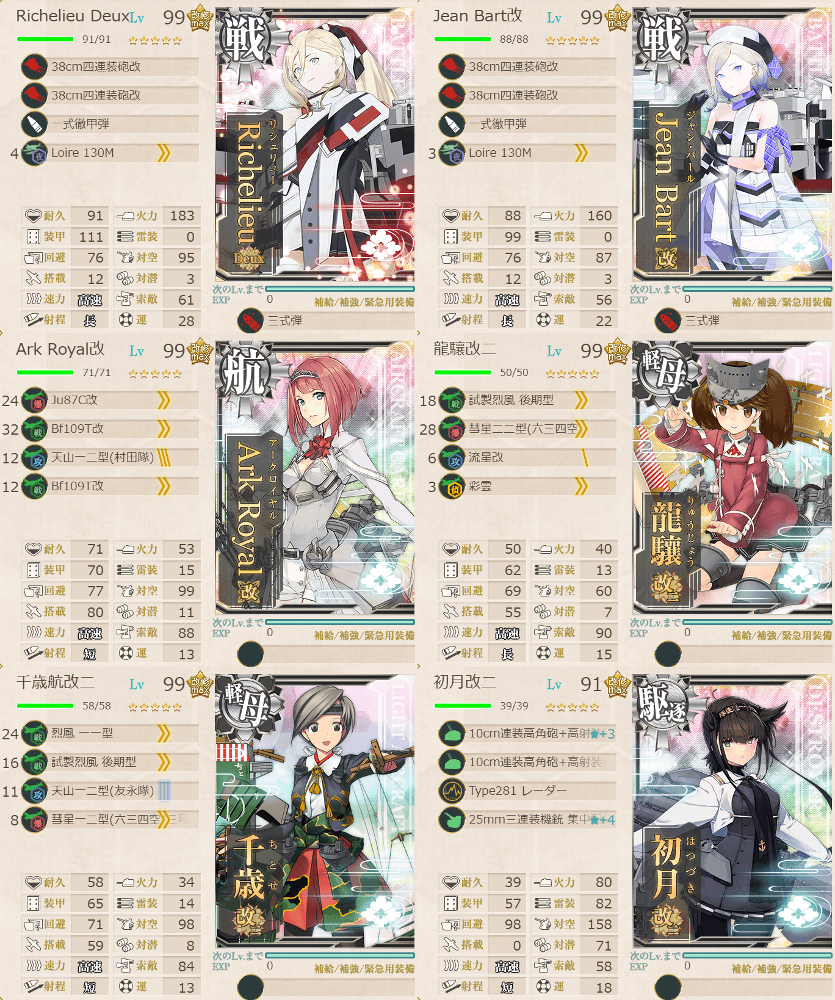
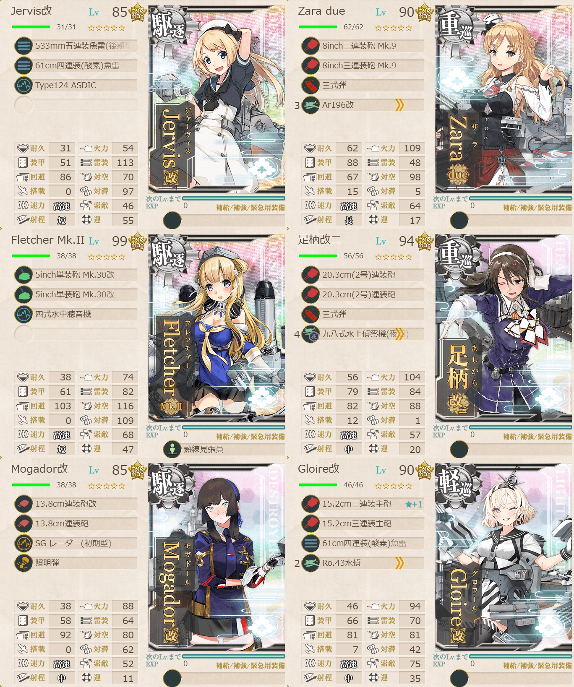
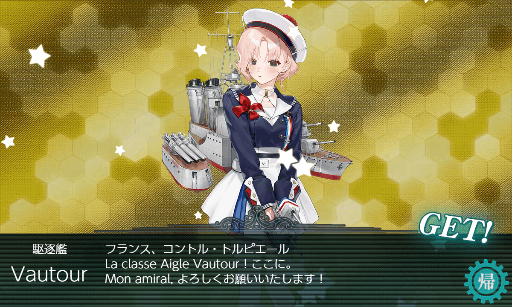
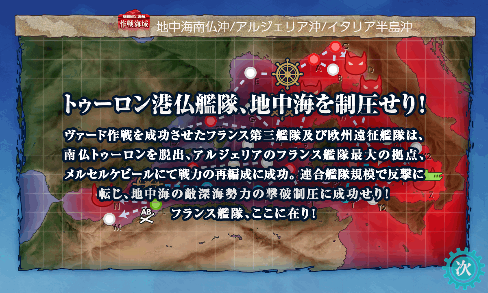

# 2026夏イベE4ゲージ5-戦力

## 目次
<details>
<summary>クリックで展開</summary>

- [2026夏イベE4ゲージ5-戦力](#2026夏イベe4ゲージ5-戦力)
  - [目次](#目次)
  - [E4の順番（短縮リンク）](#e4の順番短縮リンク)
  - [難易度](#難易度)
  - [編成](#編成)
    - [Z](#z)
      - [艦隊編成](#艦隊編成)
      - [基地航空隊編成](#基地航空隊編成)
      - [所感](#所感)
      - [出撃カウンター(この編成になってからの記録)](#出撃カウンターこの編成になってからの記録)
  - [参考文献(Reference)](#参考文献reference)

</details>

---

## E4の順番（短縮リンク）
- [ゲージ1-戦力](./[1]ゲージ1-戦力.md)  
- ギミック1
- [ゲージ2-輸送](./[2]ゲージ2-輸送.md)
- [ゲージ3-戦力](./[3]ゲージ3-戦力.md)
- [ゲージ4-戦力](./[4]ゲージ4-戦力.md)  
- [ゲージ5-戦力](./[5]ゲージ5-戦力.md)  ←今ここ

> [!IMPORTANT]
> ギミック1は甲難易度のみ。故に私はスルーしてます。

---

## 難易度
丁

---

## 編成
### Z
#### 艦隊編成

連合艦隊



- **第1艦隊:**
```yaml
E4ゲージ5-戦力Z第1艦隊:
  - name: Richelieu Deux
    level: 99
    equipments:
      - 38cm四連装砲改
      - 38cm四連装砲改
      - 一式徹甲弾
      - Loire 130M
      - 三式弾

  - name: Jean Bart改
    level: 99
    equipments:
      - 38cm四連装砲改
      - 38cm四連装砲改
      - 一式徹甲弾
      - Loire 130M
      - 三式弾

  - name: Ark Royal改
    level: 99
    equipments:
      - Ju87C改
      - Bf109T改
      - 天山一二型(村田隊)
      - Bf109T改

  - name: 龍驤改二
    level: 99
    equipments:
      - 試製烈風 後期型
      - 彗星二二型(六三四空)
      - 流星改
      - 彩雲

  - name: 千歳航改二
    level: 99
    equipments:
      - 烈風 一一型
      - 試製烈風 後期型
      - 天山一二型(友永隊)
      - 彗星一二型(六三四空/三号爆弾搭載機)

  - name: 初月改二
    level: 91
    equipments:
      - 10cm連装高角砲+高射装置☆3
      - 10cm連装高角砲+高射装置
      - Type281 レーダー
      - 25mm三連装機銃 集中配備☆4
```



- **第2艦隊:**
```yaml
E4ゲージ5-戦力Z第2艦隊:
  - name: Jervis改
    level: 85
    equipments:
      - 533mm五連装魚雷(後期型)
      - 61cm四連装(酸素)魚雷
      - Type124 ASDIC

  - name: Zara due
    level: 90
    equipments:
      - 8inch三連装砲 Mk.9
      - 8inch三連装砲 Mk.9
      - 三式弾
      - Ar196改

  - name: Fletcher Mk.II
    level: 99
    equipments:
      - 5inch単装砲 Mk.30改
      - 5inch単装砲 Mk.30改
      - 四式水中聴音機
      - 熟練見張員

  - name: 足柄改二
    level: 94
    equipments:
      - 20.3cm(2号)連装砲
      - 20.3cm(2号)連装砲
      - 三式弾
      - 九八式水上偵察機(夜偵)

  - name: Mogador改
    level: 85
    equipments:
      - 13.8cm連装砲改
      - 13.8cm連装砲
      - SG レーダー(初期型)
      - 照明弾

  - name: Gloire改
    level: 90
    equipments:
      - 15.2cm三連装主砲☆1
      - 15.2cm三連装主砲
      - 61cm四連装(酸素)魚雷
      - Ro.43水偵
```

- **制空値:** 378
- **33式分岐点係数:**

|番号|係数|
|:---:|---|
|1|54.09|
|2|104.29|
|3|154.49|
|4|204.69|

> 仏地中海艦隊】空母機動部隊
>
> - 戦艦2正空1軽空2自由1
> - 軽巡1駆逐3自由2
> 
> 【OPP1TT1UYZ】(P1:混成(潜水) T1:潜水 U:空襲 Y:通常 Z:ボス)
> 
> ※要高速統一。大和型0, 戦艦2以下, 正空1以下, 軽空2以下, 軽巡2以上駆逐3以上または駆逐4以上, 
> 
> (補給+揚陸+水母)1以下, (補給+揚陸+水母+潜母)2以下
> 
> 自由枠の1隻に軽巡か駆逐が必要。

(引用元:四腕『【夏イベ】E4-5 戦力ゲージ4 Opération Vado -ヴァード作戦-【L’Élan de la Flotte Française -フランス艦隊の躍動-】』,2026)

#### 基地航空隊編成

```yaml
E4ゲージ5-戦力Z基地航空隊:
  - number: 1
    mode: 出撃
    squadrons:
      - 銀河(江草隊)
      - 銀河
      - 一式陸攻
      - PBY-5A Catalina

  - number: 2
    mode: 出撃
    squadrons:
      - 九六式陸攻
      - 九六式陸攻
      - 九六式陸攻
      - 九六式陸攻

  - number: 3
    mode: 防空
    squadrons:
      - 試製 秋水
      - 試製 秋水
      - 紫電二一型 紫電改
      - 紫電二一型 紫電改
```

> 戦闘行動半径　P1:混成(5) T1:潜水(7) U:空襲(7) Y:通常(8) Z:ボス(9)
>
> - 1部隊目：ボスマスに集中
> - 2部隊目：ボスマスに集中
> - 3部隊目：防空

(引用元:四腕『【夏イベ】E4-5 戦力ゲージ4 Opération Vado -ヴァード作戦-【L’Élan de la Flotte Française -フランス艦隊の躍動-】』,2026)

#### 所感
すんなり行けた。割とRichelieuとJean Bartがいるならなんとかなりそう。タッチは発動したりしなかったり、でも元の特攻倍率が高いので普通に通常の砲撃で削りきってくれてた。

というかE4は全体通してすんなり行けてる。だいぶフランス戦艦の2人有りきではある。大体フランス戦艦とZaraで普通に回っちゃっていたし、25夏で苦しんだ甲斐があった。

新艦もドロップしてくれた。もともとこの子狙いでイベント始めたので嬉しい😊


可愛いね。

> [!NOTE]
> **基地航空隊について**
>
> 普通に距離足りてなかったので第1は辛うじてボス。第2はボス前に飛ばした。飛行艇不足を実感。秋津洲はいるので重い腰上げて育成を視野に入れないと...

~~というかE4は丙でも良かった説が微レ存~~

#### 出撃カウンター(この編成になってからの記録)

**合計:** 6

|リザルト|回数|
|:---:|---|
|S勝利|6|
|A勝利||



---

## 参考文献(Reference)
- 四腕[『【夏イベ】E4-5 戦力ゲージ4 Opération Vado -ヴァード作戦-【L’Élan de la Flotte Française -フランス艦隊の躍動-】』](https://zekamashi.net/202607-event/vado-sakusen-6/), 2026年

---

- [△ 一番上に戻る](#2026夏イベe4ゲージ5-戦力)
- [イベントトップ](../../README.md)

|前の記事|次の記事|
|---|---|
|[E4ゲージ4-戦力](./[4]ゲージ4-戦力.md)|   |