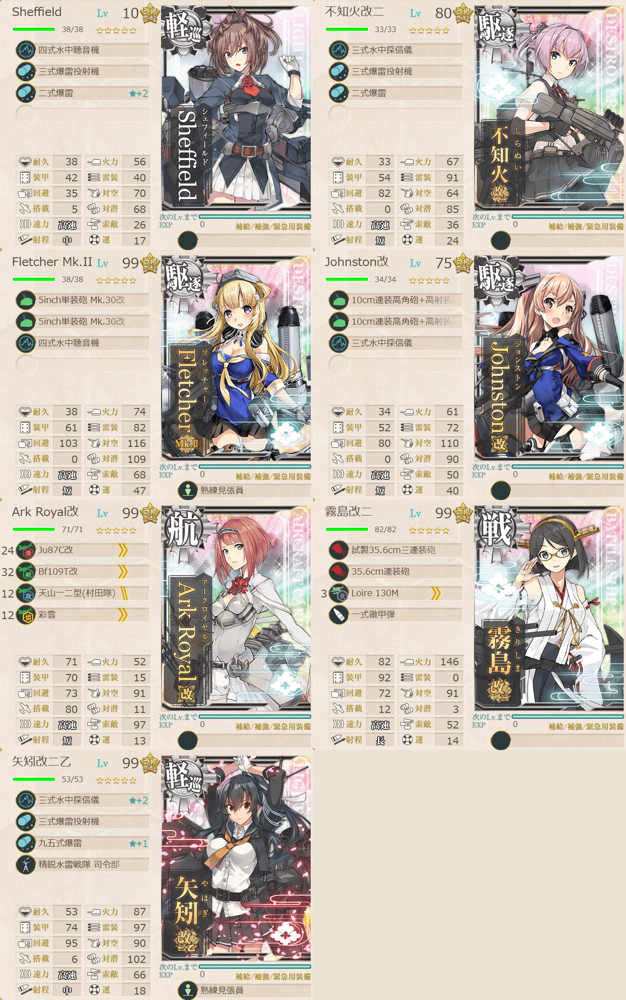

# 2026夏イベE5ギミック2

## 目次
<details>
<summary>クリックで展開</summary>

- [2026夏イベE5ギミック2](#2026夏イベe5ギミック2)
  - [目次](#目次)
  - [E5の順番（短縮リンク）](#e5の順番短縮リンク)
  - [難易度](#難易度)
  - [ギミック](#ギミック)
  - [編成](#編成)
    - [E2](#e2)
      - [艦隊編成](#艦隊編成)
      - [基地航空隊編成](#基地航空隊編成)
      - [所感](#所感)
      - [出撃カウンター(この編成になってからの記録)](#出撃カウンターこの編成になってからの記録)
  - [参考文献(Reference)](#参考文献reference)

</details>

---

## E5の順番（短縮リンク）
- [ギミック1](./[1]ギミック1.md)    
- [ギミック2](./[2]ギミック2.md)    ←今ここ
- [ゲージ1-戦力](./[3]ゲージ1-戦力.md)
- [ゲージ2-輸送](./[4]ゲージ2-輸送.md)
- [ギミック3](./[5]ギミック3.md) 
- [ギミック4]
- [ゲージ3-戦力]
- [ゲージ4-戦力]

---

## 難易度
丙

---

## ギミック
| マス＼難易度 | 甲           | 乙           | 丙           | 丁        |
| ------------ | ------------ | ------------ | ------------ | --------- |
| E2マス       | S勝利×2回    | A勝利×2回    | A勝利×2回    | A勝利×2回 |
| 基地防空     | 航空優勢×2回 | 航空優勢×1回 | 航空優勢×1回 | -         |

(引用元:四腕『【夏イベ】E5 ギミック2 Au-delà du Destin Cruel -フランス艦隊/欧州連合艦隊の躍動-【L’Élan de la Flotte Française -フランス艦隊の躍動-】』,2026)

---

## 編成
### E2
#### 艦隊編成



- **第3艦隊:**
```yaml
E5ギミック2E2艦隊:
  - name: Sheffield
    level: 10
    equipments:
      - 四式水中聴音機
      - 三式爆雷投射機
      - 二式爆雷☆2

  - name: 不知火改二
    level: 80
    equipments:
      - 三式水中探信儀
      - 三式爆雷投射機
      - 二式爆雷

  - name: Fletcher Mk.II
    level: 99
    equipments:
      - 5inch単装砲 Mk.30改
      - 5inch単装砲 Mk.30改
      - 四式水中聴音機
      - 熟練見張員

  - name: Johnston改
    level: 75
    equipments:
      - 10cm連装高角砲+高射装置
      - 10cm連装高角砲+高射装置
      - 三式水中探信儀

  - name: Ark Royal改
    level: 99
    equipments:
      - Ju87C改
      - Bf109T改
      - 天山一二型(村田隊)
      - 彩雲

  - name: 霧島改二
    level: 99
    equipments:
      - 試製35.6cm三連装砲
      - 35.6cm連装砲
      - Loire 130M
      - 一式徹甲弾

  - name: 矢矧改二乙
    level: 99
    equipments:
      - 三式水中探信儀☆2
      - 三式爆雷投射機
      - 九五式爆雷☆1
      - 精鋭水雷戦隊 司令部
      - 熟練見張員
```

- **制空値:** 79
- **33式分岐点係数:**

|番号|係数|
|:---:|---|
|1|24.00|
|2|42.80|
|3|61.60|
|4|80.40|

> 戦艦1空母1軽巡2駆逐3【2éme Escadre Légère】遊撃部隊  
> 
> 【AA2BCDE1E2】(A:潜水 A2:空襲 B:通常 D:潜水 E1:通常 E2:潜水(2回))  
> 陣形選択例：警戒陣(単横陣)→輪形陣→警戒陣→警戒陣(単横陣)→警戒陣→単横陣  
> 
> ルート固定：高速統一, 戦艦1以下, 空母1以下, 駆逐2以上, 潜水0

(引用元:四腕『【夏イベ】E5 ギミック2 Au-delà du Destin Cruel -フランス艦隊/欧州連合艦隊の躍動-【L’Élan de la Flotte Française -フランス艦隊の躍動-】』,2026)

#### 基地航空隊編成

```yaml
E5ギミック2E2基地航空隊:
  - number: 1
    mode: 出撃
    squadrons:
      - 銀河(江草隊)
      - 銀河
      - 一式陸攻
      - PBY-5A Catalina

  - number: 2
    mode: 出撃
    squadrons:
      - 九六式陸攻
      - 九六式陸攻
      - 九六式陸攻
      - 九六式陸攻

  - number: 3
    mode: 防空
    squadrons:
      - 試製 秋水
      - 試製 秋水
      - 紫電二一型 紫電改
      - 紫電二一型 紫電改
```

> 戦闘行動半径　A:潜水(2) A2:空襲(3) B:通常(4) D:潜水(5) E1:通常(6) E2:潜水(7)
>
> - 1部隊目：ギミックマスに集中
> - 2部隊目：E1マスに集中
> - 3部隊目：防空

(引用元:四腕『【夏イベ】E5 ギミック2 Au-delà du Destin Cruel -フランス艦隊/欧州連合艦隊の躍動-【L’Élan de la Flotte Française -フランス艦隊の躍動-】』,2026)

#### 所感

#### 出撃カウンター(この編成になってからの記録)

**合計:** n

|リザルト|回数|
|:---:|---|
|S勝利|1|
|A勝利||

---

## 参考文献(Reference)
- 四腕[『【夏イベ】E5 ギミック2 Au-delà du Destin Cruel -フランス艦隊/欧州連合艦隊の躍動-【L’Élan de la Flotte Française -フランス艦隊の躍動-】』](https://zekamashi.net/202607-event/furansu-oshu-rengo-2/), 2026年

---

- [△ 一番上に戻る](#2026夏イベe5ギミック2)
- [イベントトップ](../../README.md)

|前の記事|次の記事|
|---|---|
|[E5ギミック1](./[1]ギミック1.md)|[E5ゲージ1-戦力]((./[3]ゲージ1-戦力.md))|