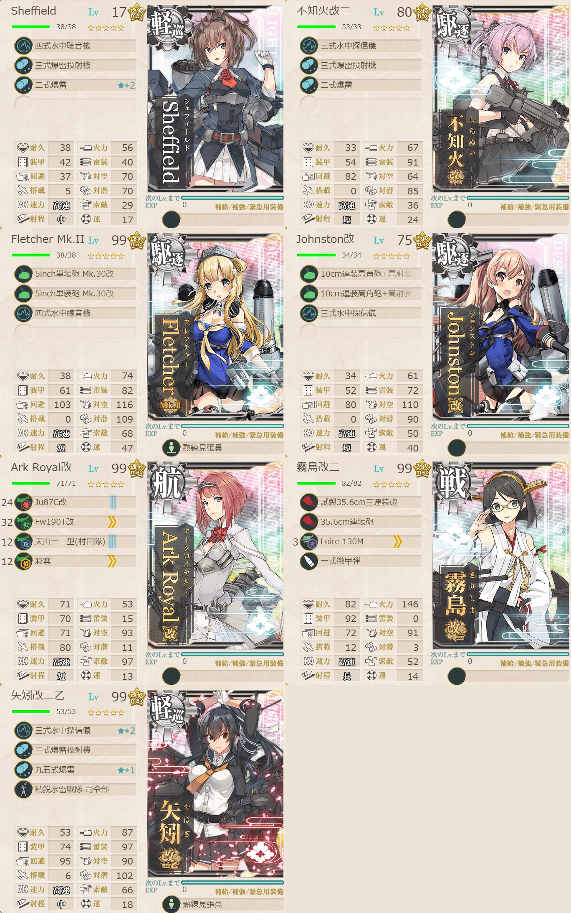
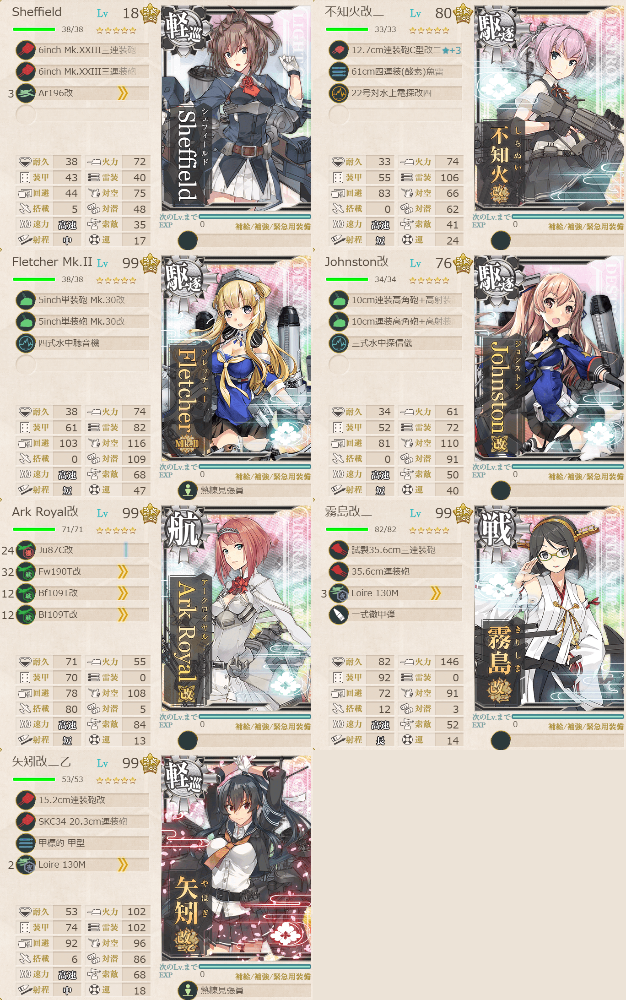

# 2026夏イベE5ゲージ1-戦力

## 目次
<details>
<summary>クリックで展開</summary>

- [2026夏イベE5ゲージ1-戦力](#2026夏イベe5ゲージ1-戦力)
  - [目次](#目次)
  - [E5の順番（短縮リンク）](#e5の順番短縮リンク)
  - [難易度](#難易度)
  - [編成](#編成)
    - [G削り](#g削り)
      - [艦隊編成](#艦隊編成)
      - [基地航空隊編成](#基地航空隊編成)
      - [所感](#所感)
      - [出撃カウンター(この編成になってからの記録)](#出撃カウンターこの編成になってからの記録)
    - [Gトドメ](#gトドメ)
      - [艦隊編成](#艦隊編成-1)
      - [基地航空隊編成](#基地航空隊編成-1)
      - [所感](#所感-1)
      - [出撃カウンター(この編成になってからの記録)](#出撃カウンターこの編成になってからの記録-1)
  - [参考文献(Reference)](#参考文献reference)

</details>

---

## E5の順番（短縮リンク）
- [ギミック1](./[1]ギミック1.md)    
- [ギミック2](./[2]ギミック2.md)
- [ゲージ1-戦力](./[3]ゲージ1-戦力.md)  ←今ここ
- [ゲージ2-輸送](./[4]ゲージ2-輸送.md)
- [ギミック3](./[5]ギミック3.md) 
- [ギミック4](./[6]ギミック4.md) 
- [ゲージ3-戦力]
- [ゲージ4-戦力]

---

## 難易度
丙

---

## 編成
### G削り
#### 艦隊編成



- **第3艦隊:**
```yaml
E5ゲージ1-戦力G削り艦隊:
  - name: Sheffield
    level: 17
    equipments:
      - 四式水中聴音機
      - 三式爆雷投射機
      - 二式爆雷☆2

  - name: 不知火改二
    level: 80
    equipments:
      - 三式水中探信儀
      - 三式爆雷投射機
      - 二式爆雷

  - name: Fletcher Mk.II
    level: 99
    equipments:
      - 5inch単装砲 Mk.30改
      - 5inch単装砲 Mk.30改
      - 四式水中聴音機
      - 熟練見張員

  - name: Johnston改
    level: 75
    equipments:
      - 10cm連装高角砲+高射装置
      - 10cm連装高角砲+高射装置
      - 三式水中探信儀

  - name: Ark Royal改
    level: 99
    equipments:
      - Ju87C改
      - Fw190T改
      - 天山一二型(村田隊)
      - 彩雲

  - name: 霧島改二
    level: 99
    equipments:
      - 試製35.6cm三連装砲
      - 35.6cm連装砲
      - Loire 130M
      - 一式徹甲弾

  - name: 矢矧改二乙
    level: 99
    equipments:
      - 三式水中探信儀☆2
      - 三式爆雷投射機
      - 九五式爆雷☆1
      - 精鋭水雷戦隊 司令部
      - 熟練見張員
```

- **制空値:** 91
- **33式分岐点係数:**

| 番号  | 係数  |
| :---: | ----- |
|   1   | 24.29 |
|   2   | 43.09 |
|   3   | 61.89 |
|   4   | 80.69 |

> 戦艦1空母1軽巡2駆逐3【2éme Escadre Légère】遊撃部隊
> 
> 【AA2BCDE1G】(A:潜水 A2:空襲 B:通常 D:潜水 E1:通常(煙幕) G:ボス(混成))  
> 陣形選択例：警戒陣(単横陣)→輪形陣→警戒陣→警戒陣(単横陣)→警戒陣→単横陣

(引用元:四腕『【夏イベ】E5-1 戦力ゲージ1 Au-delà du Destin Cruel -フランス艦隊/欧州連合艦隊の躍動-【L’Élan de la Flotte Française -フランス艦隊の躍動-】』,2026)

#### 基地航空隊編成

```yaml
基地航空隊:
  - number: 1
    mode: 出撃
    squadrons:
      - 銀河(江草隊)
      - Ju87 D-4(Fliegerass) #対潜用
      - 東海(九〇一空) #対潜用
      - PBY-5A Catalina

  - number: 2
    mode: 出撃
    squadrons:
      - 九六式陸攻
      - 九六式陸攻
      - 一式陸攻
      - 一式陸攻

  - number: 3
    mode: 防空
    squadrons:
      - 試製 秋水
      - 試製 秋水
      - 紫電二一型 紫電改
      - 紫電二一型 紫電改
```

> 戦闘行動半径　A:潜水(2) A2:空襲(3) B:通常(4) D:潜水(5) E1:通常(6) G:ボス(5)

> - 1部隊目：自由(A/D分散やボス等)
> - 2部隊目：E1マスに集中
> - 3部隊目：防空(自由)

(引用元:四腕『【夏イベ】E5-1 戦力ゲージ1 Au-delà du Destin Cruel -フランス艦隊/欧州連合艦隊の躍動-【L’Élan de la Flotte Française -フランス艦隊の躍動-】』,2026)

#### 所感
ボス自体は柔らかくて、あんまり装備が整ってない弊基地航空隊の対潜攻撃ですらボスを削り切ることができたりした。  
道中のラ級が怖い。ここでもやっぱり

#### 出撃カウンター(この編成になってからの記録)

- **合計:** 6

| リザルト | 回数 |
| :------: | ---- |
|  S勝利   | 4    |
|  A勝利   |      |
| 道中撤退 | 2    |

- **道中撤退内訳:**

| 回数  | マス  | 原因                                              |
| :---: | :---: | ------------------------------------------------- |
|   1   |  E1   | A2で中破していたArk RoyalがE1でラ級に抜かれて撤退 |
|   2   |  E1   | E1で矢矧が大破                                    |

> [!NOTE]
> 最後の道中撤退は削りが終わってることに気づかずそのまま出撃していたのもある。削りとトドメで編成変わるので注意。

---

### Gトドメ
#### 艦隊編成



- **第3艦隊:**
```yaml
E5ゲージ1-戦力Gトドメ艦隊:
  - name: Sheffield
    level: 18
    equipments:
      - 6inch Mk.XXIII三連装砲
      - 6inch Mk.XXIII三連装砲
      - Ar196改

  - name: 不知火改二
    level: 80
    equipments:
      - 12.7cm連装砲C型改二☆3
      - 61cm四連装(酸素)魚雷
      - 22号対水上電探改四

  - name: Fletcher Mk.II
    level: 99
    equipments:
      - 5inch単装砲 Mk.30改
      - 5inch単装砲 Mk.30改
      - 四式水中聴音機
      - 熟練見張員

  - name: Johnston改
    level: 76
    equipments:
      - 10cm連装高角砲+高射装置
      - 10cm連装高角砲+高射装置
      - 三式水中探信儀

  - name: Ark Royal改
    level: 99
    equipments:
      - Ju87C改
      - Fw190T改
      - Bf109T改
      - Bf109T改

  - name: 霧島改二
    level: 99
    equipments:
      - 試製35.6cm三連装砲
      - 35.6cm連装砲
      - Loire 130M
      - 一式徹甲弾

  - name: 矢矧改二乙
    level: 99
    equipments:
      - 15.2cm連装砲改
      - SKC34 20.3cm連装砲
      - 甲標的 甲型
      - Loire 130M
      - 熟練見張員
```

- **制空値:** 191
- **33式分岐点係数:**

| 番号  | 係数  |
| :---: | ----- |
|   1   | 24.18 |
|   2   | 42.78 |
|   3   | 61.38 |
|   4   | 79.98 |

> 戦艦1空母1軽巡2駆逐3【2éme Escadre Légère】遊撃部隊
> 
> 【AA2BCDE1G】(A:潜水 A2:空襲 B:通常 D:潜水 E1:通常(煙幕) G:ボス)  
> 陣形選択例：警戒陣(単横陣)→輪形陣→警戒陣→警戒陣(単横陣)→警戒陣→単縦陣(警戒陣)

(引用元:四腕『【夏イベ】E5-1 戦力ゲージ1 Au-delà du Destin Cruel -フランス艦隊/欧州連合艦隊の躍動-【L’Élan de la Flotte Française -フランス艦隊の躍動-】』,2026)

#### 基地航空隊編成

```yaml
E5ゲージ1-戦力Gトドメ基地航空隊:
  - number: 1
    mode: 出撃
    squadrons:
      - 銀河(江草隊)
      - Ju87 D-4(Fliegerass) #変え忘れ
      - Ho229
      - PBY-5A Catalina

  - number: 2
    mode: 出撃
    squadrons:
      - 九六式陸攻
      - 九六式陸攻
      - 一式陸攻
      - 一式陸攻

  - number: 3
    mode: 防空
    squadrons:
      - 試製 秋水
      - 試製 秋水
      - 紫電二一型 紫電改
      - 紫電二一型 紫電改
```

> 戦闘行動半径　A:潜水(2) A2:空襲(3) B:通常(4) D:潜水(5) E1:通常(6) G:ボス(5)
>
> - 1部隊目：Aマス/Dマスに分散
> - 2部隊目：E1マスに集中
> - 3部隊目：ボスマスに集中

(引用元:四腕『【夏イベ】E5-1 戦力ゲージ1 Au-delà du Destin Cruel -フランス艦隊/欧州連合艦隊の躍動-【L’Élan de la Flotte Française -フランス艦隊の躍動-】』,2026)

#### 所感
バーが長かったので覚悟決めてたが1回削りきればいいらしい。若干危なくはあったが夜戦で削りきりフィニッシュ。

#### 出撃カウンター(この編成になってからの記録)

- **合計:** 1

| リザルト | 回数 |
| :------: | ---- |
|  S勝利   | 1    |
|  A勝利   |      |

---

## 参考文献(Reference)
- 四腕[『【夏イベ】E5-1 戦力ゲージ1 Au-delà du Destin Cruel -フランス艦隊/欧州連合艦隊の躍動-【L’Élan de la Flotte Française -フランス艦隊の躍動-】』](https://zekamashi.net/202607-event/furansu-oshu-rengo-3/), 2026年

---

- [△ 一番上に戻る](#2026夏イベe5ゲージ1-戦力)
- [イベントトップ](../../README.md)

| 前の記事                         | 次の記事                               |
| -------------------------------- | -------------------------------------- |
| [E5ギミック2](./[2]ギミック2.md) | [E5ゲージ2-輸送](./[4]ゲージ2-輸送.md) |