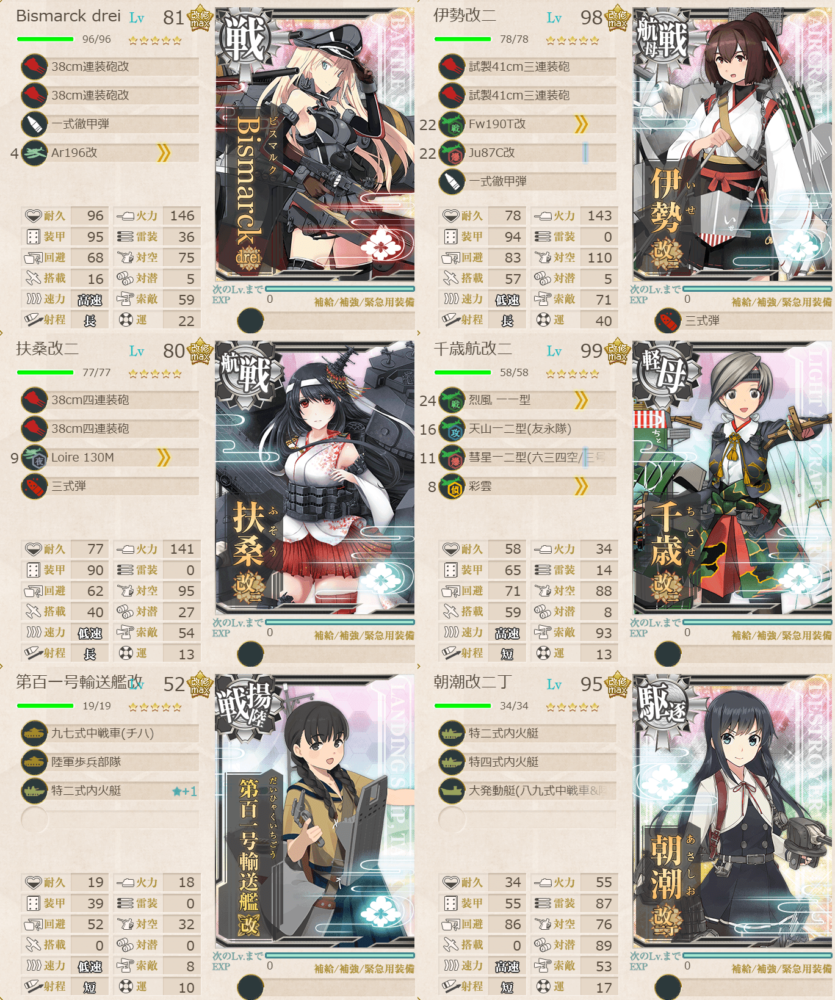
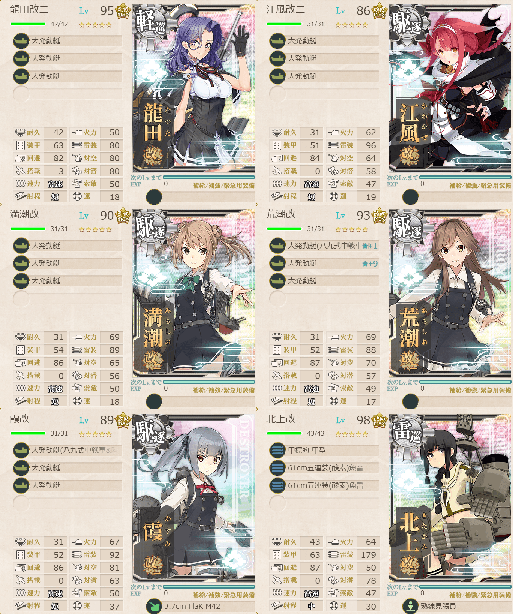

# 2026夏イベE5ゲージ2-輸送

## 目次
<details>
<summary>クリックで展開</summary>

- [2026夏イベE5ゲージ2-輸送](#2026夏イベe5ゲージ2-輸送)
  - [目次](#目次)
  - [E5の順番（短縮リンク）](#e5の順番短縮リンク)
  - [難易度](#難易度)
  - [編成](#編成)
    - [J2](#j2)
      - [艦隊編成](#艦隊編成)
      - [基地航空隊編成](#基地航空隊編成)
      - [所感](#所感)
      - [出撃カウンター(この編成になってからの記録)](#出撃カウンターこの編成になってからの記録)
  - [参考文献(Reference)](#参考文献reference)

</details>

---

## E5の順番（短縮リンク）
- [ギミック1](./[1]ギミック1.md)    
- [ギミック2](./[2]ギミック2.md)
- [ゲージ1-戦力](./[3]ゲージ1-戦力.md)  
- [ゲージ2-輸送](./[4]ゲージ2-輸送.md)  ←今ここ
- [ギミック3]
- [ギミック4]
- [ゲージ3-戦力]
- [ゲージ4-戦力]

---

## 難易度
丙

---

## 編成
### J2
#### 艦隊編成

連合艦隊



- **第1艦隊:**
```yaml
E5ゲージ2-輸送J2第1艦隊:
  - name: Bismarck drei
    level: 81
    equipments:
      - 38cm連装砲改
      - 38cm連装砲改
      - 一式徹甲弾
      - Ar196改

  - name: 伊勢改二
    level: 98
    equipments:
      - 試製41cm三連装砲
      - 試製41cm三連装砲
      - Fw190T改
      - Ju87C改
      - 一式徹甲弾
      - 三式弾

  - name: 扶桑改二
    level: 80
    equipments:
      - 38cm四連装砲
      - 38cm四連装砲
      - Loire 130M
      - 三式弾

  - name: 千歳航改二
    level: 99
    equipments:
      - 烈風 一一型
      - 天山一二型(友永隊)
      - 彗星一二型(六三四空/三号爆弾搭載機)
      - 彩雲

  - name: 第百一号輸送艦改
    level: 52
    equipments:
      - 九七式中戦車(チハ)
      - 陸軍歩兵部隊
      - 特二式内火艇☆1

  - name: 朝潮改二丁
    level: 95
    equipments:
      - 特二式内火艇
      - 特四式内火艇
      - 大発動艇(八九式中戦車&陸戦隊)
```



- **第2艦隊:**
```yaml
E5ゲージ2-輸送J2第2艦隊:
  - name: 龍田改二
    level: 95
    equipments:
      - 大発動艇
      - 大発動艇
      - 大発動艇

  - name: 江風改二
    level: 86
    equipments:
      - 大発動艇
      - 大発動艇
      - 大発動艇

  - name: 満潮改二
    level: 90
    equipments:
      - 大発動艇
      - 大発動艇
      - 大発動艇

  - name: 荒潮改二
    level: 93
    equipments:
      - 大発動艇(八九式中戦車&陸戦隊)☆1
      - 大発動艇☆9
      - 大発動艇

  - name: 霞改二
    level: 89
    equipments:
      - 大発動艇(八九式中戦車&陸戦隊)
      - 大発動艇
      - 大発動艇
      - 3.7cm FlaK M42

  - name: 北上改二
    level: 98
    equipments:
      - 甲標的 甲型
      - 61cm五連装(酸素)魚雷
      - 61cm五連装(酸素)魚雷
      - 熟練見張員
```

- **制空値:** 179
- **33式分岐点係数:**

|番号|係数|
|:---:|---|
|1|17.12|
|2|40.92|
|3|64.71|
|4|88.51|

- **TP(戦車輸送):**

|リザルト|数値|
|:---:|---|
|S勝利|207|
|A勝利|144|

> 【イギリス救援艦隊】水上打撃部隊
>
> - 戦艦2自由4
> - 軽巡1駆逐2自由3
> 
> 【A3IJJ1J2】(A3:通常 I:通常 J:混成(Sボート) J2:ボス)  
> ※要索敵。  
> (戦艦+正空)3以下, (戦艦+空母)4以下, (戦艦+正空)3の場合駆逐5以上

(引用元:四腕『【夏イベ】E5-2 輸送ゲージ1 Au-delà du Destin Cruel -フランス艦隊/欧州連合艦隊の躍動-【L’Élan de la Flotte Française -フランス艦隊の躍動-】』,2026)

#### 基地航空隊編成

```yaml
E5ゲージ2-輸送J2基地航空隊:
  - number: 1
    mode: 出撃
    squadrons:
      - 銀河(江草隊)
      - 銀河
      - Ho229
      - PBY-5A Catalina

  - number: 2
    mode: 出撃
    squadrons:
      - 九六式陸攻
      - 九六式陸攻
      - 一式陸攻
      - 一式陸攻

  - number: 3
    mode: 防空
    squadrons:
      - 試製 秋水
      - 試製 秋水
      - 紫電二一型 紫電改
      - 紫電二一型 紫電改
```

> 戦闘行動半径　A3:通常(2) I:通常(3) J:混成(5) J2:ボス(6)
>
> - 1部隊目：防空(自由)
> - 2部隊目：ボスマスに集中
> - 3部隊目：Iマスに集中

(引用元:四腕『【夏イベ】E5-2 輸送ゲージ1 Au-delà du Destin Cruel -フランス艦隊/欧州連合艦隊の躍動-【L’Élan de la Flotte Française -フランス艦隊の躍動-】』,2026)

#### 所感
ボスマスに基地航空隊飛ばすと枯らされるのでいっそ飛ばさず、私は全部道中に送った。  
そっちのほうが安定度増すと思う。ボス自体はそんなに硬くないので削り切ることは可能。  
第1艦隊で火力はほぼ足りてるのである大発/ドラム缶はなるべく積んだほうが良さそう。

#### 出撃カウンター(この編成になってからの記録)

**合計:** 6

|リザルト|回数|
|:---:|---|
|S勝利|5|
|A勝利||
|道中撤退|1|

**道中撤退内訳:**

|回数|マス|原因|
|:---:|:---:|---|
|1|A3|ト級に扶桑が抜かれて大破|

---

## 参考文献(Reference)
- 四腕[『【夏イベ】E5-2 輸送ゲージ1 Au-delà du Destin Cruel -フランス艦隊/欧州連合艦隊の躍動-【L’Élan de la Flotte Française -フランス艦隊の躍動-】』](https://zekamashi.net/202607-event/furansu-oshu-rengo-4/), 2026年

---

- [△ 一番上に戻る](#2026夏イベe5ゲージ2-輸送)
- [イベントトップ](../../README.md)

|前の記事|次の記事|
|---|---|
|[E5ゲージ1-戦力](./[3]ゲージ1-戦力.md)|   |