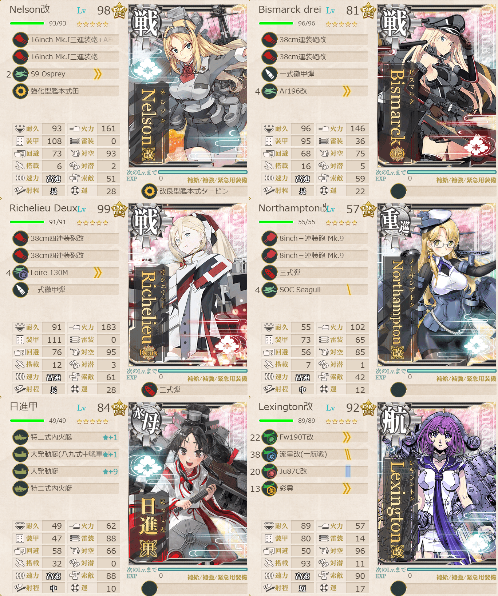
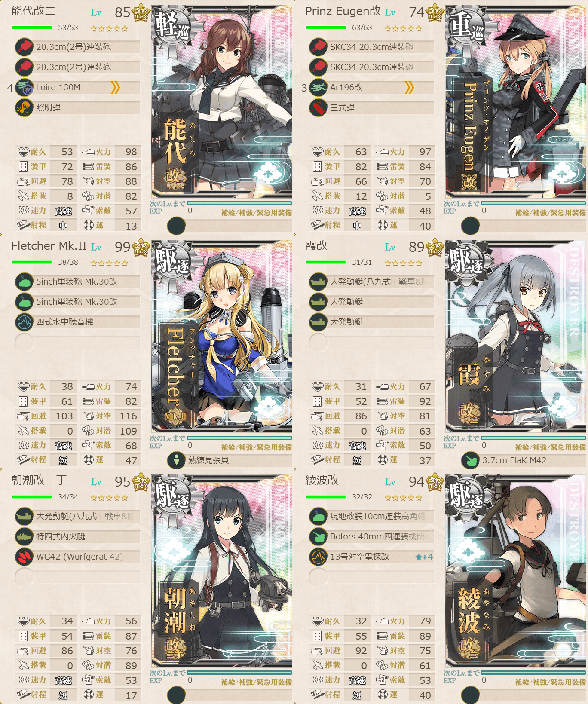

# 2026夏イベE5ギミック3

## 目次
<details>
<summary>クリックで展開</summary>

- [2026夏イベE5ギミック3](#2026夏イベe5ギミック3)
  - [目次](#目次)
  - [E5の順番（短縮リンク）](#e5の順番短縮リンク)
  - [難易度](#難易度)
  - [ギミック](#ギミック)
  - [編成](#編成)
    - [L1/L2](#l1l2)
      - [艦隊編成](#艦隊編成)
      - [基地航空隊編成](#基地航空隊編成)
      - [所感](#所感)
      - [出撃カウンター(この編成になってからの記録)](#出撃カウンターこの編成になってからの記録)
  - [参考文献(Reference)](#参考文献reference)

</details>

---

## E5の順番（短縮リンク）
- [ギミック1](./[1]ギミック1.md)    
- [ギミック2](./[2]ギミック2.md)
- [ゲージ1-戦力](./[3]ゲージ1-戦力.md)  
- [ゲージ2-輸送](./[4]ゲージ2-輸送.md)  
- [ギミック3](./[5]ギミック3.md)    ←今ここ
- [ギミック4](./[6]ギミック4.md) 
- [ゲージ3-戦力]
- [ゲージ4-戦力]

---

## 難易度
丙

---

## ギミック
| マス＼難易度 | 甲        | 乙        | 丙        | 丁        |
| ------------ | --------- | --------- | --------- | --------- |
| L1マス       | A勝利×2回 | A勝利×2回 | A勝利×2回 | A勝利×1回 |
| L2マス       | A勝利×2回 | A勝利×2回 | A勝利×2回 | A勝利×1回 |

(引用元:四腕『【夏イベ】E5 ギミック3 Au-delà du Destin Cruel -フランス艦隊/欧州連合艦隊の躍動-【L’Élan de la Flotte Française -フランス艦隊の躍動-】』,2026)

---

## 編成
### L1/L2
#### 艦隊編成

連合艦隊



- **第1艦隊:**
```yaml
E5ギミック3L1L2-第1艦隊:
  - name: Nelson改
    level: 98
    equipments:
      - 16inch Mk.I三連装砲+AFCT改
      - 16inch Mk.I三連装砲
      - S9 Osprey
      - 強化型艦本式缶
      - 改良型艦本式タービン

  - name: Bismarck drei
    level: 81
    equipments:
      - 38cm連装砲改
      - 38cm連装砲改
      - 一式徹甲弾
      - Ar196改

  - name: Richelieu Deux
    level: 99
    equipments:
      - 38cm四連装砲改
      - 38cm四連装砲改
      - Loire 130M
      - 一式徹甲弾
      - 三式弾

  - name: Northampton改
    level: 57
    equipments:
      - 8inch三連装砲 Mk.9
      - 8inch三連装砲 Mk.9
      - 三式弾
      - SOC Seagull

  - name: 日進甲
    level: 84
    equipments:
      - 特二式内火艇☆1
      - 大発動艇(八九式中戦車&陸戦隊)☆1
      - 大発動艇☆9
      - 特二式内火艇

  - name: Lexington改
    level: 92
    equipments:
      - Fw190T改
      - 流星改(一航戦)
      - Ju87C改
      - 彩雲
```

> 戦艦3空母1重巡1水母1【Force de Raid】水上打撃部隊
> 
> 【KK2K3L1】(K:潜水 K2:通常 L1:陸上)  
> 陣形選択例：第一→第四→第二(特殊攻撃)
> 
> 【KK2K3LL2】(K:潜水 K2:通常 L:通常 L2:陸上)  
> 陣形選択例：第一→第四→第四→第二(特殊攻撃)
> 
> ルート固定：高速統一, 水上打撃部隊, 戦艦3以下, 重巡級2以上, 駆逐4以上

(引用元:四腕『【夏イベ】E5 ギミック3 Au-delà du Destin Cruel -フランス艦隊/欧州連合艦隊の躍動-【L’Élan de la Flotte Française -フランス艦隊の躍動-】』,2026)



- **第2艦隊:**
```yaml
E5ギミック3L1L2-第2艦隊:
  - name: 能代改二
    level: 85
    equipments:
      - 20.3cm(2号)連装砲
      - 20.3cm(2号)連装砲
      - Loire 130M
      - 照明弾

  - name: Prinz Eugen改
    level: 74
    equipments:
      - SKC34 20.3cm連装砲
      - SKC34 20.3cm連装砲
      - Ar196改
      - 三式弾

  - name: Fletcher Mk.II
    level: 99
    equipments:
      - 5inch単装砲 Mk.30改
      - 5inch単装砲 Mk.30改
      - 四式水中聴音機
      - 熟練見張員

  - name: 霞改二
    level: 89
    equipments:
      - 大発動艇(八九式中戦車&陸戦隊)
      - 大発動艇
      - 大発動艇
      - 3.7cm FlaK M42

  - name: 朝潮改二丁
    level: 95
    equipments:
      - 大発動艇(八九式中戦車&陸戦隊)
      - 特四式内火艇
      - WG42 (Wurfgerat 42)

  - name: 綾波改二
    level: 94
    equipments:
      - 現地改装10cm連装高角砲
      - Bofors 40mm四連装機関砲
      - 13号対空電探改☆4
```

- **制空値:** 90
- **33式分岐点係数:**

| 番号  | 係数   |
| :---: | ------ |
|   1   | 45.15  |
|   2   | 91.25  |
|   3   | 137.35 |
|   4   | 183.45 |

> 重巡1軽巡1駆逐4

(引用元:四腕『【夏イベ】E5 ギミック3 Au-delà du Destin Cruel -フランス艦隊/欧州連合艦隊の躍動-【L’Élan de la Flotte Française -フランス艦隊の躍動-】』,2026)

#### 基地航空隊編成

```yaml
E5ギミック3L1L2基地航空隊:
  - number: 1
    mode: 出撃
    squadrons:
      - 銀河(江草隊)
      - 銀河
      - Ho229
      - PBY-5A Catalina

  - number: 2
    mode: 出撃
    squadrons:
      - 九六式陸攻
      - 九六式陸攻
      - 一式陸攻
      - 一式陸攻

  - number: 3
    mode: 防空
    squadrons:
      - 試製 秋水
      - 試製 秋水
      - 紫電二一型 紫電改
      - 紫電二一型 紫電改
```

> 戦闘行動半径　K:潜水(1) K2:通常(2) L1:通常(4)  
> 戦闘行動半径　K:潜水(1) K2:通常(2) L:通常(4) L2:陸上(5)
>
> - 1部隊目：防空/Lマスに集中等
> - 2部隊目：ギミックマスに集中
> - 3部隊目：Kマスに集中

(引用元:四腕『【夏イベ】E5 ギミック3 Au-delà du Destin Cruel -フランス艦隊/欧州連合艦隊の躍動-【L’Élan de la Flotte Française -フランス艦隊の躍動-】』,2026)

#### 所感
特に危なげなく勝利。すんなり行けた。対地揃ってると楽。

#### 出撃カウンター(この編成になってからの記録)

L1

- **合計:** 2

| リザルト | 回数 |
| :------: | ---- |
|  S勝利   | 2    |
|  A勝利   |      |

L2

- **合計:** 2

| リザルト | 回数 |
| :------: | ---- |
|  S勝利   | 2    |
|  A勝利   |      |

---

## 参考文献(Reference)
- 四腕[『【夏イベ】E5 ギミック3 Au-delà du Destin Cruel -フランス艦隊/欧州連合艦隊の躍動-【L’Élan de la Flotte Française -フランス艦隊の躍動-】』](https://zekamashi.net/202607-event/furansu-oshu-rengo-4/), 2026年

---

- [△ 一番上に戻る](#2026夏イベe5ギミック3)
- [イベントトップ](../../README.md)

| 前の記事                               | 次の記事 |
| -------------------------------------- | -------- |
| [E5ゲージ2-輸送](./[4]ゲージ2-輸送.md) |[E5ギミック4](./[6]ギミック4.md)|