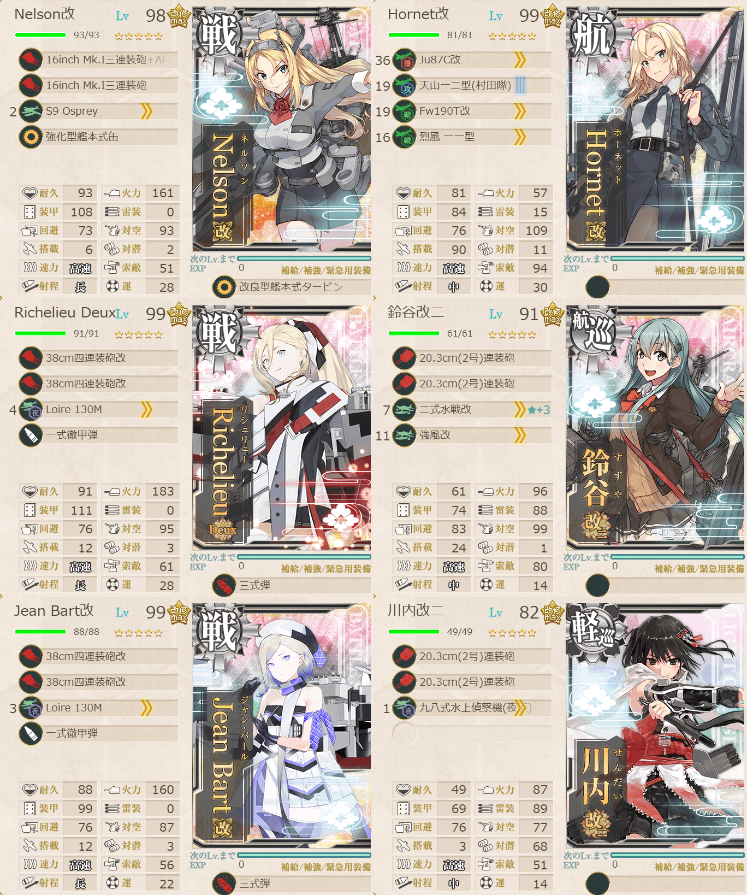
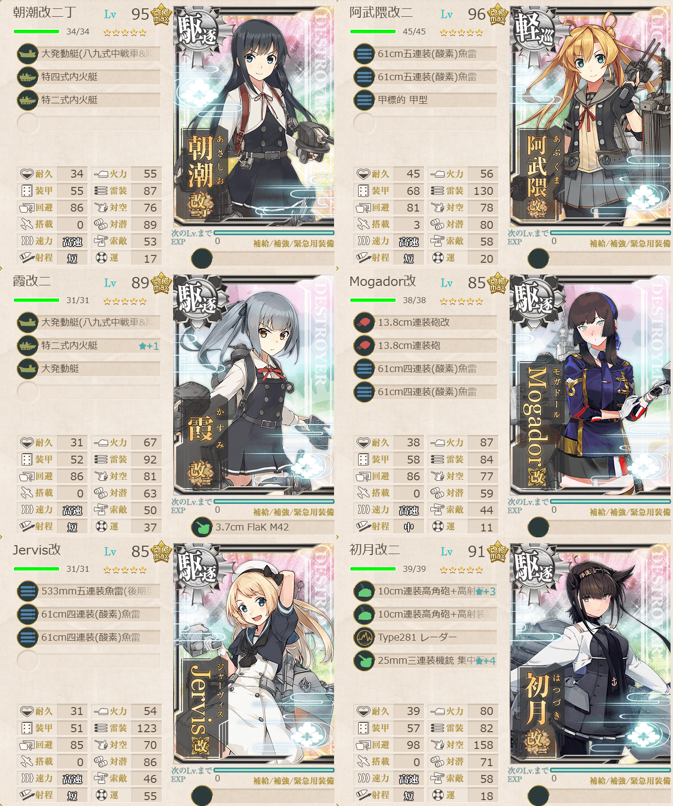

# 2026夏イベE5ギミック4

## 目次
<details>
<summary>クリックで展開</summary>

- [2026夏イベE5ギミック4](#2026夏イベe5ギミック4)
  - [目次](#目次)
  - [E5の順番（短縮リンク）](#e5の順番短縮リンク)
  - [難易度](#難易度)
  - [ギミック](#ギミック)
  - [編成](#編成)
    - [P/P3](#pp3)
      - [艦隊編成](#艦隊編成)
      - [基地航空隊編成](#基地航空隊編成)
      - [所感](#所感)
      - [出撃カウンター(この編成になってからの記録)](#出撃カウンターこの編成になってからの記録)
  - [参考文献(Reference)](#参考文献reference)

</details>

---

## E5の順番（短縮リンク）
- [ギミック1](./[1]ギミック1.md)    
- [ギミック2](./[2]ギミック2.md)
- [ゲージ1-戦力](./[3]ゲージ1-戦力.md)  
- [ゲージ2-輸送](./[4]ゲージ2-輸送.md)  
- [ギミック3](./[5]ギミック3.md)    
- [ギミック4](./[6]ギミック4.md)    ←今ここ
- [ゲージ3-戦力](./[7]ゲージ3-戦力.md)
- [ゲージ4-戦力]

---

## 難易度
丙

---

## ギミック
| マス＼難易度 | 甲        | 乙        | 丙        | 丁        |
| ------------ | --------- | --------- | --------- | --------- |
| P3マス       | A勝利×2回 | A勝利×2回 | A勝利×2回 | A勝利×2回 |
| Pマス        | A勝利×3回 | A勝利×2回 | A勝利×2回 | A勝利×2回 |

(引用元:四腕『【夏イベ】E5 ギミック4 Au-delà du Destin Cruel -フランス艦隊/欧州連合艦隊の躍動-【L’Élan de la Flotte Française -フランス艦隊の躍動-】』,2026)

---

## 編成
### P/P3
#### 艦隊編成

連合艦隊



- **第1艦隊:**
```yaml
E5ギミック3PP3第1艦隊:
  - name: Nelson改
    level: 98
    equipments:
      - 16inch Mk.I三連装砲+AFCT改
      - 16inch Mk.I三連装砲
      - S9 Osprey
      - 強化型艦本式缶
      - 改良型艦本式タービン

  - name: Hornet改
    level: 99
    equipments:
      - Ju87C改
      - 天山一二型(村田隊)
      - Fw190T改
      - 烈風 一一型

  - name: Richelieu Deux
    level: 99
    equipments:
      - 38cm四連装砲改
      - 38cm四連装砲改
      - Loire 130M
      - 一式徹甲弾
      - 三式弾

  - name: 鈴谷改二
    level: 91
    equipments:
      - 20.3cm(2号)連装砲
      - 20.3cm(2号)連装砲
      - 二式水戦改☆3
      - 強風改

  - name: Jean Bart改
    level: 99
    equipments:
      - 38cm四連装砲改
      - 38cm四連装砲改
      - Loire 130M
      - 一式徹甲弾
      - 三式弾

  - name: 川内改二
    level: 82
    equipments:
      - 20.3cm(2号)連装砲
      - 20.3cm(2号)連装砲
      - 九八式水上偵察機(夜偵)
```

> 戦艦3空母1航巡1軽巡1【Force H】
> 
>【MM1OP1P3】(M1:通常 P1:通常 P3:陸上(2回))  
> 陣形選択例：第四→第二(特殊攻撃)→第四
> 
> 【MM1OP】(M1:通常 P:通常(3回))  
> 陣形選択例：第四→第二(特殊攻撃)
> 
> ルート固定：高速統一, 大和型0, 重巡級1以下, 軽巡2, 駆逐4以上, 諸条件

(引用元:四腕『【夏イベ】E5 ギミック4 Au-delà du Destin Cruel -フランス艦隊/欧州連合艦隊の躍動-【L’Élan de la Flotte Française -フランス艦隊の躍動-】』,2026)



- **第2艦隊:**
```yaml
E5ギミック3PP3第2艦隊:
  - name: 朝潮改二丁
    level: 95
    equipments:
      - 大発動艇(八九式中戦車&陸戦隊)
      - 特四式内火艇
      - 特二式内火艇

  - name: 阿武隈改二
    level: 96
    equipments:
      - 61cm五連装(酸素)魚雷
      - 61cm五連装(酸素)魚雷
      - 甲標的 甲型

  - name: 霞改二
    level: 89
    equipments:
      - 大発動艇(八九式中戦車&陸戦隊)
      - 特二式内火艇☆1
      - 大発動艇
      - 3.7cm FlaK M42

  - name: Mogador改
    level: 85
    equipments:
      - 13.8cm連装砲改
      - 13.8cm連装砲
      - 61cm四連装(酸素)魚雷
      - 61cm四連装(酸素)魚雷

  - name: Jervis改
    level: 85
    equipments:
      - 533mm五連装魚雷(後期型)
      - 61cm四連装(酸素)魚雷
      - 61cm四連装(酸素)魚雷

  - name: 初月改二
    level: 91
    equipments:
      - 10cm連装高角砲+高射装置☆3
      - 10cm連装高角砲+高射装置
      - Type281 レーダー
      - 25mm三連装機銃 集中配備☆4
```

- **制空値:** 228
- **33式分岐点係数:**

|番号|係数|
|:---:|---|
|1|24.24|
|2|49.04|
|3|73.84|
|4|98.64|

> 軽巡1駆逐5

(引用元:四腕『【夏イベ】E5 ギミック4 Au-delà du Destin Cruel -フランス艦隊/欧州連合艦隊の躍動-【L’Élan de la Flotte Française -フランス艦隊の躍動-】』,2026)

#### 基地航空隊編成

```yaml
E5ギミック3PP3基地航空隊:
  - number: 1
    mode: 出撃
    squadrons:
      - 銀河(江草隊)
      - 銀河
      - 一式陸攻
      - 一式陸攻

  - number: 2
    mode: 出撃
    squadrons:
      - 九六式陸攻
      - 九六式陸攻
      - 九六式陸攻
      - 九六式陸攻

  - number: 3
    mode: 防空
    squadrons:
      - 試製 秋水
      - 試製 秋水
      - 紫電二一型 紫電改
      - 紫電二一型 紫電改
```

> 戦闘行動半径　M1:通常(7) P1:通常(8) P3:陸上(8)  
> 戦闘行動半径　M1:通常(7) P:通常(6)
> 
> - 1部隊目：防空(自由)
> - 2部隊目：P1マスに集中
> - 3部隊目：P3マスに集中(自由)

(引用元:四腕『【夏イベ】E5 ギミック4 Au-delà du Destin Cruel -フランス艦隊/欧州連合艦隊の躍動-【L’Élan de la Flotte Française -フランス艦隊の躍動-】』,2026)

#### 所感
P3に関してはボス前に基地航空隊を呼ぶのと、タッチを使うならここで使っちゃったほうが安定しそう。Pは簡単だった。

#### 出撃カウンター(この編成になってからの記録)

P

- **合計:** 2

| リザルト | 回数 |
| :------: | ---- |
|  S勝利   |   2   |
|  A勝利   |      |

P3

- **合計:** 2

| リザルト | 回数 |
| :------: | ---- |
|  S勝利   | 2    |
|  A勝利   |      |

---

## 参考文献(Reference)
- 四腕[『【夏イベ】E5 ギミック4 Au-delà du Destin Cruel -フランス艦隊/欧州連合艦隊の躍動-【L’Élan de la Flotte Française -フランス艦隊の躍動-】』](https://zekamashi.net/202607-event/furansu-oshu-rengo-6/), 2026年

---

- [△ 一番上に戻る](#2026夏イベe5ギミック4)
- [イベントトップ](../../README.md)

| 前の記事 | 次の記事 |
| -------- | -------- |
|[E5ギミック3](./[6]ギミック4.md)|[E5ゲージ3-戦力](./[7]ゲージ3-戦力.md)|