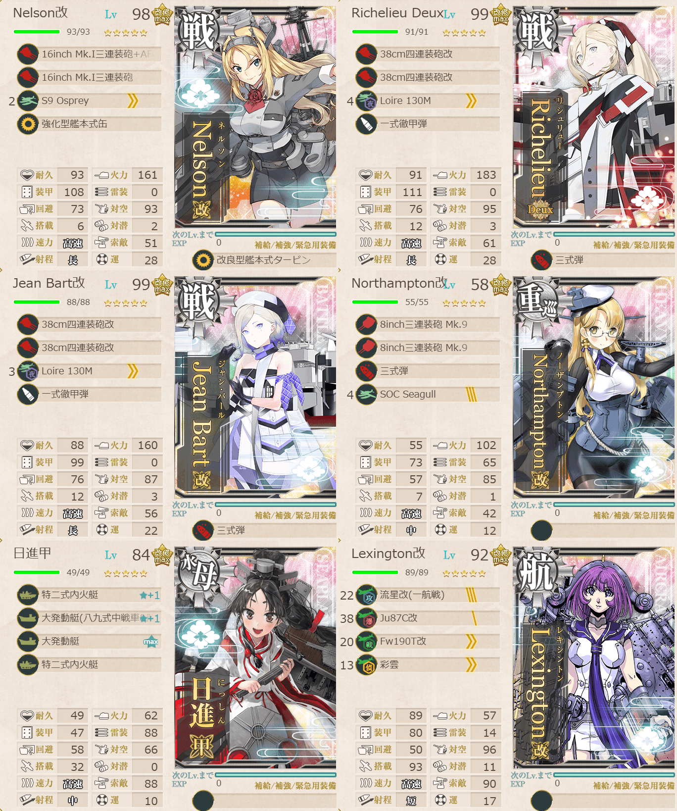
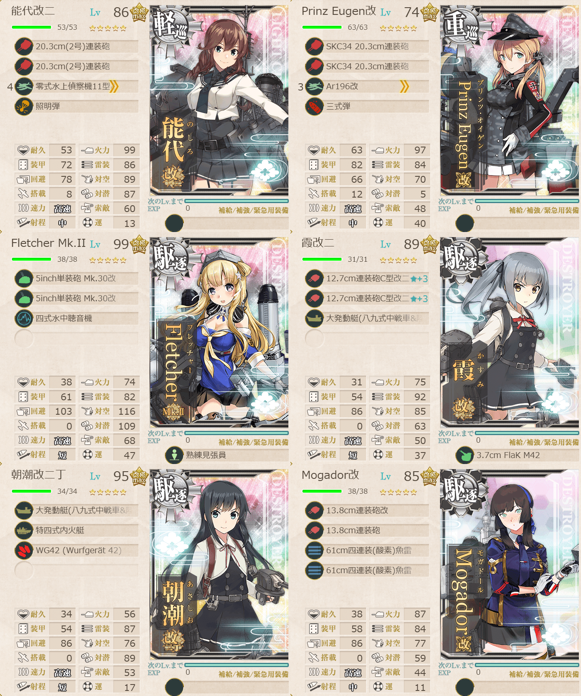

# 2026夏イベE5ゲージ3-戦力

## 目次
<details>
<summary>クリックで展開</summary>

- [2026夏イベE5ゲージ3-戦力](#2026夏イベe5ゲージ3-戦力)
  - [目次](#目次)
  - [E5の順番（短縮リンク）](#e5の順番短縮リンク)
  - [難易度](#難易度)
  - [編成](#編成)
    - [S](#s)
      - [艦隊編成](#艦隊編成)
      - [基地航空隊編成](#基地航空隊編成)
      - [所感](#所感)
      - [出撃カウンター(この編成になってからの記録)](#出撃カウンターこの編成になってからの記録)
  - [参考文献(Reference)](#参考文献reference)

</details>

---

## E5の順番（短縮リンク）
- [ギミック1](./[1]ギミック1.md)    
- [ギミック2](./[2]ギミック2.md)
- [ゲージ1-戦力](./[3]ゲージ1-戦力.md)  
- [ゲージ2-輸送](./[4]ゲージ2-輸送.md)  
- [ギミック3](./[5]ギミック3.md)    
- [ギミック4](./[6]ギミック4.md)    
- [ゲージ3-戦力](./[7]ゲージ3-戦力.md)  ←今ここ
- [ゲージ4-戦力](./[8]ゲージ4-戦力.md)

---

## 難易度
丙

---

## 編成
### S
#### 艦隊編成

連合艦隊



- **第1艦隊:**
```yaml
E5ゲージ3-戦力第1艦隊:
  - name: Nelson改
    level: 98
    equipments:
      - 16inch Mk.I三連装砲+AFCT改
      - 16inch Mk.I三連装砲
      - S9 Osprey
      - 強化型艦本式缶
      - 改良型艦本式タービン

  - name: Richelieu Deux
    level: 99
    equipments:
      - 38cm四連装砲改
      - 38cm四連装砲改
      - Loire 130M
      - 一式徹甲弾
      - 三式弾

  - name: Jean Bart改
    level: 99
    equipments:
      - 38cm四連装砲改
      - 38cm四連装砲改
      - Loire 130M
      - 一式徹甲弾
      - 三式弾

  - name: Northampton改
    level: 58
    equipments:
      - 8inch三連装砲 Mk.9
      - 8inch三連装砲 Mk.9
      - 三式弾
      - SOC Seagull

  - name: 日進甲
    level: 84
    equipments:
      - 特二式内火艇☆1
      - 大発動艇(八九式中戦車&陸戦隊)☆1
      - 大発動艇☆10
      - 特二式内火艇

  - name: Lexington改
    level: 92
    equipments:
      - 流星改(一航戦)
      - Ju87C改
      - Fw190T改
      - 彩雲
```



- **第2艦隊:**
```yaml
E5ゲージ3-戦力第2艦隊:
  - name: 能代改二
    level: 86
    equipments:
      - 20.3cm(2号)連装砲
      - 20.3cm(2号)連装砲
      - 零式水上偵察機11型乙
      - 照明弾

  - name: Prinz Eugen改
    level: 74
    equipments:
      - SKC34 20.3cm連装砲
      - SKC34 20.3cm連装砲
      - Ar196改
      - 三式弾

  - name: Fletcher Mk.II
    level: 99
    equipments:
      - 5inch単装砲 Mk.30改
      - 5inch単装砲 Mk.30改
      - 四式水中聴音機
      - 熟練見張員

  - name: 霞改二
    level: 89
    equipments:
      - 12.7cm連装砲C型改二☆3
      - 12.7cm連装砲C型改二☆3
      - 大発動艇(八九式中戦車&陸戦隊)
      - 3.7cm FlaK M42

  - name: 朝潮改二丁
    level: 95
    equipments:
      - 大発動艇(八九式中戦車&陸戦隊)
      - 特四式内火艇
      - WG42 (Wurfgerat 42)

  - name: Mogador改
    level: 85
    equipments:
      - 13.8cm連装砲改
      - 13.8cm連装砲
      - 61cm四連装(酸素)魚雷
      - 61cm四連装(酸素)魚雷
```

- **制空値:** 85
- **33式分岐点係数:**

|番号|係数|
|:---:|---|
|1|42.16|
|2|85.56|
|3|128.96|
|4|172.36|

> 【Force de Raid】水上打撃部隊
>
> - 戦艦3重巡2自由1
> - 軽巡1駆逐4自由1
>
> 【KK2K3LQS】(K:潜水 K2:通常 L:通常 S:ボス(陸上))   
> ※要高速統一。戦艦3(4☓), 重巡級2以上, (軽巡+練巡)1(2☓), 駆逐4以上
>
> 自由枠に空母, 重巡級, 雷巡, 駆逐, 水母, 揚陸等想定

(引用元:四腕『【夏イベ】E5-3 戦力ゲージ2 Au-delà du Destin Cruel -フランス艦隊/欧州連合艦隊の躍動-【L’Élan de la Flotte Française -フランス艦隊の躍動-】』,2026)

#### 基地航空隊編成

```yaml
E5ゲージ3-戦力S基地航空隊:
  - number: 1
    mode: 出撃
    squadrons:
      - 銀河(江草隊)
      - 銀河
      - Ho229
      - PBY-5A Catalina

  - number: 2
    mode: 出撃
    squadrons:
      - 九六式陸攻
      - 九六式陸攻
      - 九六式陸攻
      - 九六式陸攻

  - number: 3
    mode: 防空
    squadrons:
      - 試製 秋水
      - 試製 秋水
      - 紫電二一型 紫電改
      - 紫電二一型 紫電改
```

> 戦闘行動半径　K:潜水(1) K2:通常(2) L:通常(4) S:ボス(6)
>
> - 1部隊目：Kマスに集中
> - 2部隊目：ボスマスに集中
> - 3部隊目：Lマスに集中(防空等)

(引用元:四腕『【夏イベ】E5-3 戦力ゲージ2 Au-delà du Destin Cruel -フランス艦隊/欧州連合艦隊の躍動-【L’Élan de la Flotte Française -フランス艦隊の躍動-】』,2026)

#### 所感
道中が意外とではあった。特攻艦がいて、なおかつ難易度が低いとほぼ第2艦隊は動かないので、実は対潜厚めにした方が良いかも。  

今回Nelson + Richelieu + Jean Bartと採用したがほとんどこの3人で回ってた。
タッチは発動してもしなくても、という感じ。タッチ発生する前に欧州戦艦の昼戦連撃でボスが逝くこともまあまああった。

次が最終ゲージ。気合い！入れて！逝きますッ！(ﾋｴｰｯ!!)

#### 出撃カウンター(この編成になってからの記録)

- **合計:** 7

| リザルト | 回数 |
| :------: | ---- |
|  S勝利   |  7    |
|  A勝利   |      |
|道中撤退|2|

- **道中撤退内訳:**

| 回数  | マス  | 原因 |
| :---: | :---: | ---- |
|1|L|戦艦ル級にザプトンと日進が抜かれて大破|
|2|L|戦艦ル級にザプトンが抜かれて大破|

---

## 参考文献(Reference)
- 四腕[『【夏イベ】E5-3 戦力ゲージ2 Au-delà du Destin Cruel -フランス艦隊/欧州連合艦隊の躍動-【L’Élan de la Flotte Française -フランス艦隊の躍動-】』](https://zekamashi.net/202607-event/furansu-oshu-rengo-7/), 2026年

---

- [△ 一番上に戻る](#2026夏イベe5ゲージ3-戦力)
- [イベントトップ](../../README.md)

| 前の記事 | 次の記事 |
| -------- | -------- |
|[E5ギミック4](./[6]ギミック4.md)|[E5ゲージ4-戦力](./[8]ゲージ4-戦力.md)|