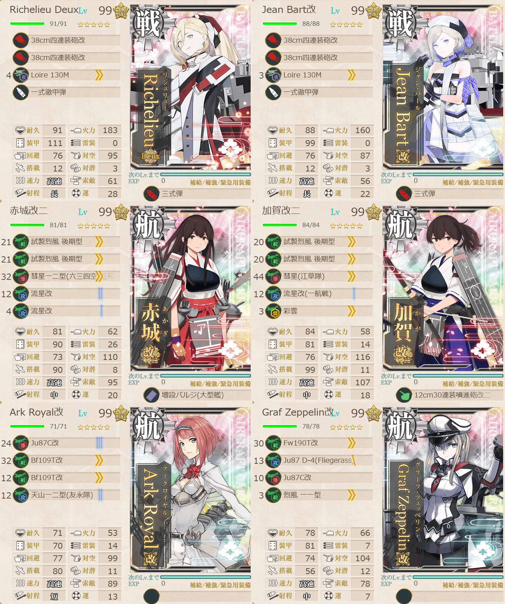
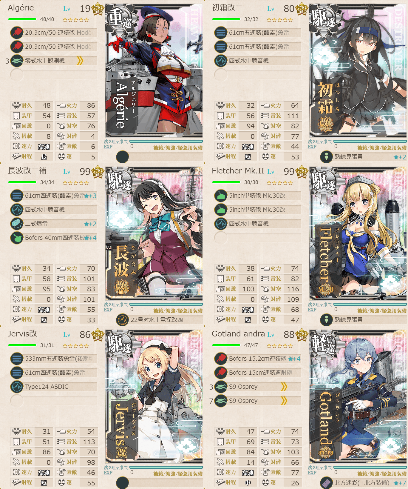
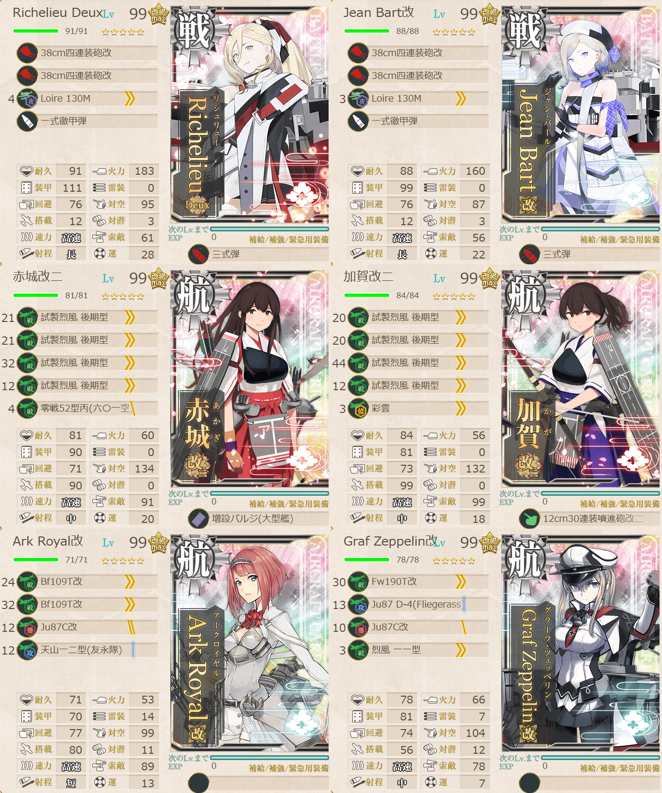
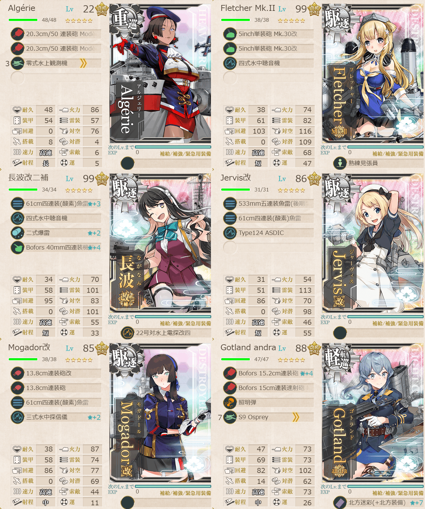
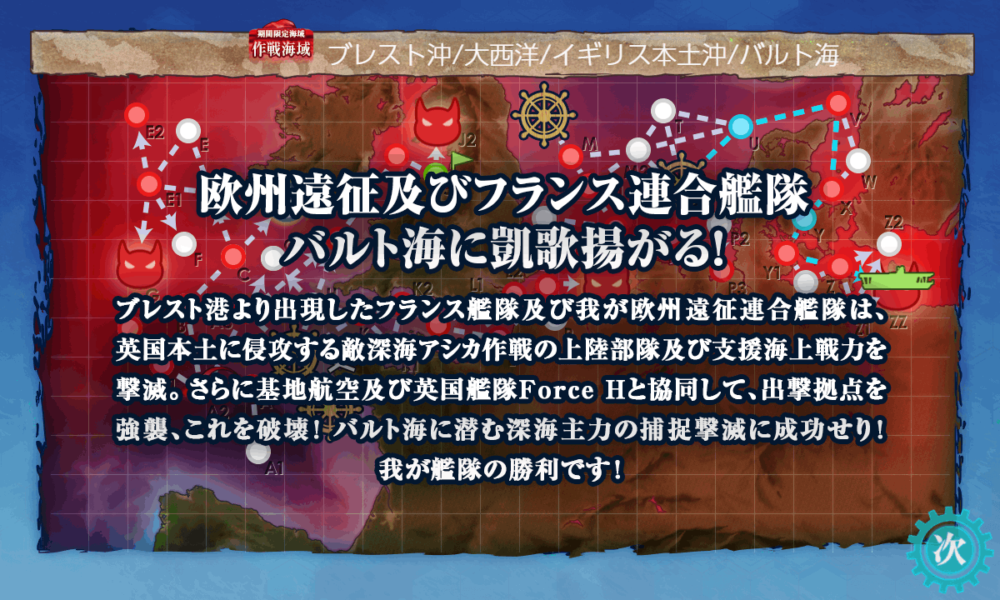

# 2026夏イベE5ゲージ4-戦力

## 目次
<details>
<summary>クリックで展開</summary>

- [2026夏イベE5ゲージ4-戦力](#2026夏イベe5ゲージ4-戦力)
  - [目次](#目次)
  - [E5の順番（短縮リンク）](#e5の順番短縮リンク)
  - [難易度](#難易度)
  - [編成](#編成)
    - [ZZ削り](#zz削り)
      - [艦隊編成](#艦隊編成)
      - [基地航空隊編成](#基地航空隊編成)
      - [所感](#所感)
      - [出撃カウンター(この編成になってからの記録)](#出撃カウンターこの編成になってからの記録)
    - [ZZトドメ](#zzトドメ)
      - [艦隊編成](#艦隊編成-1)
      - [基地航空隊編成](#基地航空隊編成-1)
      - [所感](#所感-1)
      - [出撃カウンター(この編成になってからの記録)](#出撃カウンターこの編成になってからの記録-1)
  - [参考文献(Reference)](#参考文献reference)

</details>

---

## E5の順番（短縮リンク）
- [ギミック1](./[1]ギミック1.md)    
- [ギミック2](./[2]ギミック2.md)
- [ゲージ1-戦力](./[3]ゲージ1-戦力.md)  
- [ゲージ2-輸送](./[4]ゲージ2-輸送.md)  
- [ギミック3](./[5]ギミック3.md)    
- [ギミック4](./[6]ギミック4.md)    
- [ゲージ3-戦力](./[7]ゲージ3-戦力.md)  
- [ゲージ4-戦力](./[8]ゲージ4-戦力.md)  ←今ここ

---

## 難易度
丙

---

## 編成
### ZZ削り
#### 艦隊編成

連合艦隊



- **第1艦隊:**
```yaml
E5ゲージ4-戦力ZZ第1艦隊:
  - name: Richelieu Deux
    level: 99
    equipments:
      - 38cm四連装砲改
      - 38cm四連装砲改
      - Loire 130M
      - 一式徹甲弾
      - 三式弾

  - name: Jean Bart改
    level: 99
    equipments:
      - 38cm四連装砲改
      - 38cm四連装砲改
      - Loire 130M
      - 一式徹甲弾
      - 三式弾

  - name: 赤城改二
    level: 99
    equipments:
      - 試製烈風 後期型
      - 試製烈風 後期型
      - 彗星一二型(六三四空/三号爆弾搭載機)
      - 流星改
      - 流星改
      - 増設バルジ(大型艦)

  - name: 加賀改二
    level: 99
    equipments:
      - 試製烈風 後期型
      - 試製烈風 後期型
      - 彗星(江草隊)
      - 流星改(一航戦)
      - 彩雲
      - 12cm30連装噴進砲改二

  - name: Ark Royal改
    level: 99
    equipments:
      - Ju87C改
      - Bf109T改
      - Bf109T改
      - 天山一二型(友永隊)

  - name: Graf Zeppelin改
    level: 99
    equipments:
      - Fw190T改
      - Ju87 D-4(Fliegerass)
      - Ju87C改
      - 烈風 一一型
```



- **第2艦隊:**
```yaml
E5ゲージ4-戦力ZZ第2艦隊:
  - name: Algerie
    level: 19 # Lv1から始めて削り段階で19まであがった
    equipments:
      - 20.3cm/50 連装砲 Modele 1931
      - 20.3cm/50 連装砲 Modele 1931
      - 零式水上観測機

  - name: 初霜改二
    level: 80
    equipments:
      - 61cm五連装(酸素)魚雷
      - 61cm五連装(酸素)魚雷
      - 四式水中聴音機
      - 熟練見張員☆2

  - name: 長波改二補
    level: 99
    equipments:
      - 61cm四連装(酸素)魚雷☆3
      - 四式水中聴音機
      - 二式爆雷☆2
      - Bofors 40mm四連装機関砲☆4
      - 22号対水上電探改四

  - name: Fletcher Mk.II
    level: 99
    equipments:
      - 5inch単装砲 Mk.30改
      - 5inch単装砲 Mk.30改
      - 四式水中聴音機
      - 熟練見張員

  - name: Jervis改
    level: 86
    equipments:
      - 533mm五連装魚雷(後期型)
      - 61cm四連装(酸素)魚雷
      - Type124 ASDIC

  - name: Gotland andra
    level: 88
    equipments:
      - Bofors 15.2cm連装砲 Model 1930☆4
      - Bofors 15cm連装速射砲 Mk.9 Model 1938
      - S9 Osprey
      - S9 Osprey
      - 北方迷彩(+北方装備)☆7
```

- **制空値:** 599
- **33式分岐点係数:**

|番号|係数|
|:---:|---|
|1|52.02|
|2|105.62|
|3|159.22|
|4|212.82|

> 【欧州連合艦隊】空母機動部隊(仮置き)
>
> - 戦艦2空母4 
> - 重巡1軽巡1駆逐4
> 
> 【UVXYY1ZZZ】(V:潜水 X:通常 Y1:Sボート Z:通常 ZZ:ボス)  
>>※低速可。正空3以上, 駆逐4以上, 大和武蔵0, (Gotland+Visby)1以上, 以下条件一つ以上
>・高速統一
> ・Richelieu, Jean Bart, Algérieから2隻を含む

(引用元:四腕『【夏イベ】E5-4 戦力ゲージ3 Au-delà du Destin Cruel -フランス艦隊/欧州連合艦隊の躍動-【L’Élan de la Flotte Française -フランス艦隊の躍動-】』,2026)

#### 基地航空隊編成

```yaml
E5ゲージ4-戦力ZZ基地航空隊:
  - number: 1 # 全然ボスに届かないのでY1にだけ飛ばす
    mode: 出撃
    squadrons:
      - 銀河(江草隊)
      - 銀河
      - 一式陸攻
      - PBY-5A Catalina

  - number: 2
    mode: 防空
    squadrons:
      - 三式戦 飛燕
      - 三式戦 飛燕
      - 三式戦 飛燕
      - 三式戦 飛燕

  - number: 3
    mode: 防空
    squadrons:
      - 試製 秋水
      - 試製 秋水
      - 紫電二一型 紫電改
      - 紫電二一型 紫電改
```

> 戦闘行動半径　V:潜水(11) X:通常(10) Y1:Sボート(9) Z:通常(10) ZZ:ボス(11)
>
> - 1部隊目：Vマスに集中
> - 2部隊目：ボスマスに集中
> - 3部隊目：Zマスに集中/防空他

(引用元:四腕『【夏イベ】E5-4 戦力ゲージ3 Au-delà du Destin Cruel -フランス艦隊/欧州連合艦隊の躍動-【L’Élan de la Flotte Française -フランス艦隊の躍動-】』,2026)

#### 所感
特攻戦艦の攻撃が当たればS勝利はしやすい。道中のネ級がネックかも。駆逐は対潜厚めのほうが良さそう。

基地航空隊は、もう手持ちの装備だとボスまで届かないので、唯一届くY1マスに集中。  
小型舟艇が相手だが意外と削り取ってくれたので、道中安定性には役立っている。

#### 出撃カウンター(この編成になってからの記録)

- **合計:** 8

| リザルト | 回数 |
| :------: | ---- |
|  S勝利   |   5   |
|  A勝利   |   1   |
|道中撤退|2|

- **道中撤退内訳:**

| 回数  | マス  | 原因 |
| :---: | :---: | ---- |
|1|Z|重巡ネ級に長波が抜かれて大破|
|2|Z|同上|

---

### ZZトドメ
#### 艦隊編成

連合艦隊



- **第1艦隊:**
```yaml
E5ゲージ4-戦力ZZトドメ第1艦隊:
  - name: Richelieu Deux
    level: 99
    equipments:
      - 38cm四連装砲改
      - 38cm四連装砲改
      - Loire 130M
      - 一式徹甲弾
      - 三式弾

  - name: Jean Bart改
    level: 99
    equipments:
      - 38cm四連装砲改
      - 38cm四連装砲改
      - Loire 130M
      - 一式徹甲弾
      - 三式弾

  - name: 赤城改二
    level: 99
    equipments:
      - 試製烈風 後期型
      - 試製烈風 後期型
      - 試製烈風 後期型
      - 試製烈風 後期型
      - 零戦52型丙(六〇一空)
      - 増設バルジ(大型艦)

  - name: 加賀改二
    level: 99
    equipments:
      - 試製烈風 後期型
      - 試製烈風 後期型
      - 試製烈風 後期型
      - 試製烈風 後期型
      - 彩雲
      - 12cm30連装噴進砲改二

  - name: Ark Royal改
    level: 99
    equipments:
      - Bf109T改
      - Bf109T改
      - Ju87C改
      - 天山一二型(友永隊)

  - name: Graf Zeppelin改
    level: 99
    equipments:
      - Fw190T改
      - Ju87 D-4(Fliegerass)
      - Ju87C改
      - 烈風 一一型
```



- **第2艦隊:**
```yaml
E5ゲージ4-戦力ZZトドメ第2艦隊:
  - name: Algerie
    level: 22
    equipments:
      - 20.3cm/50 連装砲 Modele 1931
      - 20.3cm/50 連装砲 Modele 1931
      - 零式水上観測機

  - name: Fletcher Mk.II
    level: 99
    equipments:
      - 5inch単装砲 Mk.30改
      - 5inch単装砲 Mk.30改
      - 四式水中聴音機
      - 熟練見張員

  - name: 長波改二補
    level: 99
    equipments:
      - 61cm四連装(酸素)魚雷☆3
      - 四式水中聴音機
      - 二式爆雷☆2
      - Bofors 40mm四連装機関砲☆4
      - 22号対水上電探改四

  - name: Jervis改
    level: 86
    equipments:
      - 533mm五連装魚雷(後期型)
      - 61cm四連装(酸素)魚雷
      - Type124 ASDIC

  - name: Mogador改
    level: 85
    equipments:
      - 13.8cm連装砲改
      - 13.8cm連装砲
      - 61cm四連装(酸素)魚雷
      - 三式水中探信儀☆2

  - name: Gotland andra
    level: 88
    equipments:
      - Bofors 15.2cm連装砲 Model 1930☆4
      - Bofors 15cm連装速射砲 Mk.9 Model 1938
      - 照明弾
      - S9 Osprey
      - 北方迷彩(+北方装備)☆7
```

- **制空値:** 896
- **33式分岐点係数:**

|番号|係数|
|:---:|---|
|1|37.45|
|2|76.25|
|3|115.05|
|4|153.85|

#### 基地航空隊編成

```yaml
E5ゲージ4-戦力ZZトドメ基地航空隊:
  - number: 1
    mode: 出撃
    squadrons:
      - 銀河(江草隊)
      - 銀河
      - 一式陸攻
      - PBY-5A Catalina

  - number: 3
    mode: 防空
    squadrons:
      - 試製 秋水
      - 試製 秋水
      - 紫電二一型 紫電改
      - 紫電二一型 紫電改

  - number: 2
    mode: 防空
    squadrons:
      - 三式戦 飛燕
      - 三式戦 飛燕
      - 三式戦 飛燕
      - 三式戦 飛燕
```

#### 所感
```
OUT→初霜
IN→Mogador
```

とにかく精神的にキツかった。初戦と2回目が道中撤退。流石に使ったれ、の精神で間宮と伊良湖使った。

◯ 給糧艦: [給糧艦](https://wikiwiki.jp/kancolle/%E7%B5%A6%E7%B3%A7%E8%89%A6)

Argerieさん、レベル1でそのまま編成に入れたがマジで特攻が刺さる。レベル1でもいいから入れよう。どうせ出撃繰り返したらレベルは上がる。  

とりあえず削りきれて良かった。航空優勢のつもりで赤城と加賀には艦戦がん積みしたけど結局互角だった。とはいえ昼戦の火力も大して出せなかったので正直どっちでも良さそう。うちはあんまり装備が揃ってないので優勢は取れなかった。

~~一応支援艦隊飛ばしたけど一切ダメージ与えられなかったので割愛。~~

#### 出撃カウンター(この編成になってからの記録)

- **合計:** 3

| リザルト | 回数 |
| :------: | ---- |
|  S勝利   |  1   |
|  A勝利   |      |
|道中撤退|2|

- **道中撤退内訳:**

| 回数  | マス  | 原因 |
| :---: | :---: | ---- |
|1|V|旗艦にFletcher抜かれて大破|
|2|Z|敵軽空母にAlgerie抜かれて大破|



---

## 参考文献(Reference)
- 四腕[『【夏イベ】E5-4 戦力ゲージ3 Au-delà du Destin Cruel -フランス艦隊/欧州連合艦隊の躍動-【L’Élan de la Flotte Française -フランス艦隊の躍動-】』](https://zekamashi.net/202607-event/furansu-oshu-rengo-8/), 2026年
- [給糧艦](https://wikiwiki.jp/kancolle/%E7%B5%A6%E7%B3%A7%E8%89%A6)

---

- [△ 一番上に戻る](#2026夏イベe5ゲージ4-戦力)
- [イベントトップ](../../README.md)

| 前の記事 | 次の記事 |
| -------- | -------- |
|[ゲージ3-戦力](./[7]ゲージ3-戦力.md)|26夏イベ終わり！|